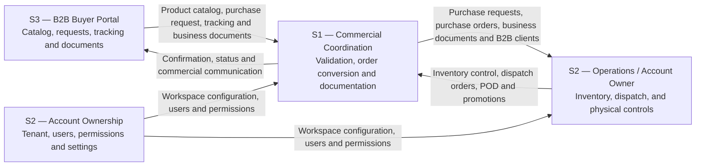
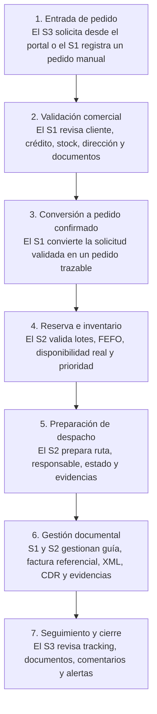
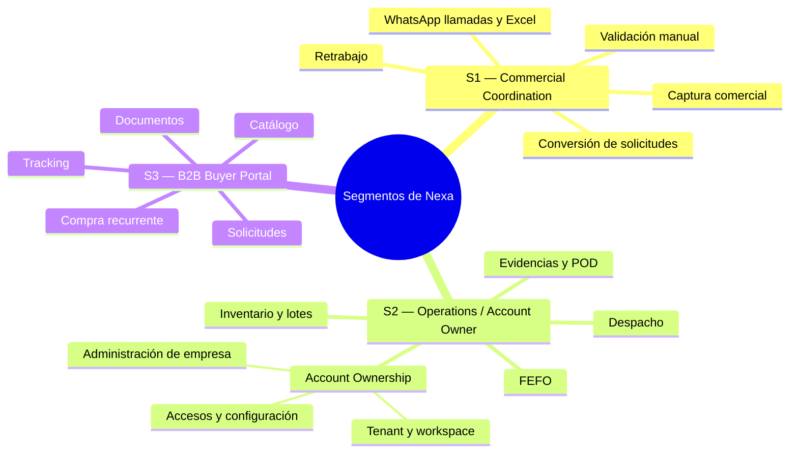
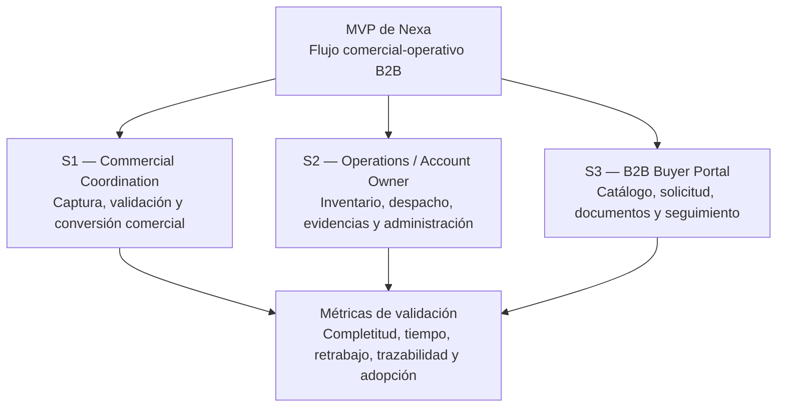

## 1.3. Segmentos Objetivos

La segmentación de Nexa se define a partir del flujo real de coordinación comercial y operativa en empresas importadoras o distribuidoras de productos refrigerados y congelados. Nexa se plantea como una plataforma **Multi tenant SaaS B2B** contratada por una empresa de cadena de frío, la cual habilita distintos perfiles de uso dentro de un mismo ecosistema operacional.

En esta sección, los segmentos objetivo funcionan como la base de investigación y diseño del producto. Por ello, no se presentan como módulos del sistema, sino como actores del dominio que concentran fricciones distintas y complementarias.

#### Modelo Multi tenant SaaS y actores del ecosistema

Nexa funciona bajo un modelo Multi tenant SaaS orientado a empresas B2B de cadena de frío. Dentro de este modelo, **S1 — Commercial Coordination** y **S2 — Operations / Account Owner** son segmentos internos de la empresa contratante dentro del tenant/workspace, mientras que **S3 — B2B Buyer Portal** corresponde al comprador externo habilitado para interactuar con el portal de compra. El S2 asume el account ownership, incluyendo la administración del tenant/workspace, usuarios, permisos, plan de suscripción e información crítica del tenant, garantizando el aislamiento completo de información entre organizaciones. El S1 participa en la validación y conversión comercial del pedido, mientras que el S2 ejecuta el flujo logístico de inventario, preparación, despacho y control físico del pedido refrigerado.

*Reglas de segmentación del modelo Multi tenant SaaS de Nexa*

| Elemento | Definición |
|---|---|
| Empresa contratante | Importadora o distribuidora de cadena de frío que contrata Nexa como sistema de coordinación comercial-operativa. |
| Tenant | Espacio de trabajo o workspace propio de la empresa contratante, donde se gestionan de forma aislada sus usuarios, productos, pedidos, inventario, documentos y configuración. |
| Usuarios internos | S1 — Commercial Coordination y S2 — Operations / Account Owner. Trabajan dentro del tenant de la empresa contratante y participan en el flujo comercial, operativo y de configuración. |
| Comprador externo habilitado | S3 — B2B Buyer Portal. Cliente comercial externo que accede al portal para consultar catálogo, generar solicitudes, revisar pedidos, documentos y seguimiento de despacho. |
| Account ownership | Responsabilidad asumida por S2 — Operations / Account Owner para administrar la empresa, usuarios internos, accesos, permisos, plan de suscripción e información crítica del tenant (account ownership). |
| Alcance inicial | Nexa no reemplaza un ERP completo en su primera versión. Se enfoca en reducir doble digitación, ordenar documentos, mejorar trazabilidad y conectar pedido, validación, inventario y despacho. |

> *Nota:* La tabla aclara cómo se organiza el modelo Multi tenant SaaS de Nexa. Elaboración propia.

A partir de estas reglas, los segmentos se entienden como actores complementarios dentro del flujo comercial-operativo de Nexa. El S3 origina la demanda, el S1 ordena y valida la información comercial, y el S2 asegura la ejecución operativa y asume el account ownership para la administración del workspace, usuarios, permisos y configuración general dentro de la empresa contratante.

*Flujo de interacción entre los segmentos objetivo*

> *Nota:* El gráfico representa la relación transversal entre el comprador B2B, la coordinación comercial y la operación interna de la empresa contratante. Elaboración propia.

### Flujo integrado de Nexa

El flujo base de Nexa inicia cuando un comprador B2B genera una solicitud desde el portal o cuando el equipo comercial registra manualmente un pedido recibido por canales tradicionales. A partir de ese punto, la plataforma permite ordenar la validación comercial, convertir la solicitud en un pedido confirmado, coordinar la reserva de inventario, preparar el despacho, gestionar documentos y ofrecer seguimiento al comprador.

Este flujo permite conectar los segmentos sin tratarlos como experiencias aisladas. El S3 origina o consulta la solicitud, el S1 valida y ordena la información comercial, y el S2 asegura que la operación pueda ejecutarse con inventario, preparación, despacho y documentación, además de asumir el account ownership para la administración del tenant/workspace.

*Recorrido integrado del pedido en Nexa*

> *Nota:* El gráfico resume el recorrido completo del pedido dentro de Nexa, desde la entrada de la solicitud hasta el seguimiento final del comprador. Elaboración propia.

### Sustento demográfico y estadístico

El dominio de Nexa se ubica en la distribución B2B de productos refrigerados y congelados, donde la coordinación entre ventas, logística y compradores comerciales todavía depende de canales informales, validaciones manuales y registros dispersos. Esta situación es especialmente crítica porque el pedido no solo contiene una intención de compra: también activa decisiones de disponibilidad, inventario, rotación, preparación, despacho, documentación y seguimiento.

El sustento estadístico permite justificar por qué los actores del ecosistema son relevantes para el proyecto. Según Lucky-Xplora (2022), el 83% de las bodegas del canal tradicional se encuentra en un nivel principiante de madurez digital, mientras que solo alrededor del 28% utiliza alguna aplicación para gestionar tareas del negocio. Este dato refuerza la importancia de S3 — B2B Buyer Portal, ya que el comprador comercial necesita una experiencia simple, clara y cercana a sus hábitos actuales de compra.

Además, la problemática de cadena de frío exige control operativo y trazabilidad. Bravo De la Cruz et al. (2025) reportan 64 incidentes de ruptura de cadena de frío en establecimientos de una microred de salud durante un año, lo que evidencia que la falta de control, trazabilidad y coordinación puede convertirse en un riesgo operativo recurrente. Este punto refuerza la importancia de S2 — Operations / Account Owner, porque la operación debe convertir la solicitud comercial en una operación viable, controlada y trazable.

En paralelo, la captura comercial sigue siendo un punto sensible del flujo. Cuando los pedidos llegan por WhatsApp, llamada, audio, Excel o listas informales, la vendedora o coordinadora comercial debe interpretar información incompleta y trasladarla hacia operación. Por ello, el S1 — Commercial Coordination es crítico: si el pedido nace desordenado, el error se propaga hacia inventario, preparación, despacho, documentos y atención posterior. Por último, para sostener esta interacción multi-tenant con seguridad, el S2 asume el account ownership para centralizar la administración de empresa, usuarios y configuración.

*Lectura visual del sustento de segmentación*

> *Nota:* El gráfico resume los focos de fricción que justifican cada segmento dentro del dominio comercial-operativo de Nexa. Elaboración propia.

### Análisis detallado por segmento

#### S1 — Commercial Coordination

El segmento S1 — Commercial Coordination está conformado por personal de ventas, ejecutivos de cuenta y asistentes comerciales de la importadora o distribuidora. Este segmento representa el punto donde muchas solicitudes de compra ingresan al flujo interno de Nexa, ya sea desde el portal del comprador o desde canales tradicionales como WhatsApp, llamada, Excel o mensajes directos.

Su importancia radica en que una parte significativa de los errores posteriores puede originarse en esta etapa. Si la solicitud se registra con datos incompletos, productos mal interpretados, cantidades ambiguas, condiciones comerciales no verificadas o documentos comerciales de compra pendientes, el problema se traslada hacia inventario, preparación, despacho y atención posterior.

En Nexa, el S1 no solo registra información. También valida datos comerciales, revisa clientes, consulta disponibilidad visible, documenta observaciones y convierte solicitudes en pedidos confirmados. Por ello, se relaciona con funcionalidades orientadas a capturar solicitudes, validar información comercial, gestionar clientes B2B, ordenar documentos y mantener trazabilidad entre la solicitud inicial y el pedido confirmado.

##### Ficha rápida de S1 — Commercial Coordination

- **Actor principal:** personal de ventas, ejecutivos de cuenta y asistentes comerciales.
- **Contexto dominante:** atención rápida a compradores B2B mediante portal, llamadas, WhatsApp, listas de productos, notas de voz, Excel o mensajes dispersos.
- **Responsabilidad principal:** recibir, interpretar, validar, ordenar y canalizar solicitudes hacia operación.
- **Dolor principal:** pedidos dispersos, doble digitación, validaciones manuales y baja visibilidad inmediata de stock o condiciones.
- **Valor esperado:** capturar solicitudes de forma estructurada, reducir errores, validar información comercial y responder al comprador con mayor seguridad.

##### Plano demográfico y ocupacional de S1 — Commercial Coordination

El S1 suele ubicarse en roles comerciales u operativos de primera línea. Su trabajo exige comunicación constante, rapidez para responder y capacidad para coordinar con compradores y áreas internas. Puede tratar directamente con clientes recurrentes, compradores de alto volumen o negocios pequeños que esperan atención inmediata.

A nivel ocupacional, el S1 no necesariamente cuenta con poder de decisión estratégico sobre la empresa, pero sí influye directamente en la calidad del pedido. Su desempeño afecta el tiempo de respuesta, la satisfacción del comprador y la cantidad de errores que llegan a operación.

*Caracterización ocupacional de S1 — Commercial Coordination*

| Variable | Caracterización esperada |
|---|---|
| Rango ocupacional | Personal comercial, ventas internas, mercaderistas, coordinadoras comerciales o asistentes de pedidos. |
| Relación con el comprador | Alta: mantiene contacto frecuente con compradores mayoristas, minoristas y negocios B2B. |
| Nivel de decisión | Medio u operativo: puede registrar, canalizar y consultar, pero no siempre aprobar excepciones. |
| Presión del rol | Alta: debe responder rápido sin perder precisión. |
| Entorno de trabajo | Oficina, punto de venta, almacén administrativo o trabajo móvil mediante celular. |

> *Nota:* Caracteriza la distribución ocupacional del segmento S1 — Commercial Coordination para ubicarlo dentro del proceso de captura, validación y conversión comercial. Elaboración propia.

##### Plano conductual de S1 — Commercial Coordination

El comportamiento del S1 está marcado por la necesidad de resolver solicitudes con rapidez. En la práctica, esto suele implicar alternar entre conversaciones, hojas de cálculo, catálogos, consultas internas y validaciones con logística o almacén. Esta fragmentación genera dependencia de memoria, experiencia personal y coordinación informal.

El S1 debe responder rápido al comprador, pero la información que necesita para responder correctamente no siempre está centralizada. Por ello, Nexa debe permitirle trabajar con una solicitud más ordenada desde el inicio, reduciendo la necesidad de reconstruir información desde mensajes o archivos dispersos.

*Comportamientos actuales de S1 — Commercial Coordination y sus consecuencias*

| Comportamiento actual | Consecuencia |
|---|---|
| Recibe pedidos por WhatsApp, llamada, audio, Excel o listas escritas. | El pedido puede llegar incompleto, desordenado o difícil de interpretar. |
| Consulta stock, precios o condiciones en más de una fuente. | Aumenta el tiempo de respuesta y el riesgo de información desactualizada. |
| Reenvía información a logística o almacén. | Aparece doble digitación o pérdida de detalle. |
| Aclara dudas con el comprador durante el proceso. | Se generan interrupciones, retrasos y mayor dependencia de comunicación manual. |
| Convierte solicitudes en pedidos confirmados. | Si la validación previa es débil, el error se traslada al flujo operativo. |

> *Nota:* Resume las prácticas actuales de S1 — Commercial Coordination y las consecuencias que justifican una captura más estructurada. Elaboración propia.

##### Plano tecnológico de S1 — Commercial Coordination

El S1 suele tener familiaridad práctica con herramientas digitales básicas, especialmente mensajería instantánea, llamadas, hojas de cálculo y sistemas internos simples. Sin embargo, esa familiaridad no significa que trabaje en un flujo integrado. El problema no es la ausencia total de tecnología, sino el uso de herramientas dispersas que no aseguran trazabilidad.

Para el S1, Nexa debe sentirse más rápido y confiable que el proceso informal. Si el sistema añade pasos innecesarios, formularios extensos o validaciones lentas, la adopción puede verse afectada. Por ello, la experiencia debe priorizar rapidez, claridad y continuidad entre solicitud, validación y conversión a pedido.

*Implicancias tecnológicas para S1 — Commercial Coordination*

| Aspecto tecnológico | Implicancia para Nexa |
|---|---|
| Uso frecuente de celular, WhatsApp y archivos compartidos. | La experiencia debe ser responsive y permitir acciones rápidas. |
| Alternancia entre varias fuentes de información. | El sistema debe centralizar comprador, catálogo, disponibilidad, solicitud y pedido. |
| Baja tolerancia a flujos lentos. | La captura debe ser guiada, pero no rígida. |
| Necesidad de historial y trazabilidad. | Cada solicitud debe conservar información clara para seguimiento posterior. |
| Conversión de solicitudes en pedidos. | La plataforma debe permitir que una solicitud validada se convierta en pedido confirmado. |

> *Nota:* Relaciona el uso actual de herramientas digitales de S1 — Commercial Coordination con decisiones de diseño para Nexa. Elaboración propia.

##### Plano de valor esperado de S1 — Commercial Coordination

El valor esperado para el S1 se concentra en reducir retrabajo y aumentar seguridad al responder. Nexa debe permitir que el personal comercial registre solicitudes de manera estructurada, consulte información relevante, visualice condiciones comerciales y evite depender de conversaciones dispersas para reconstruir lo solicitado.

*Dolores, respuesta esperada y métricas sugeridas para S1 — Commercial Coordination*

| Dolor del segmento | Respuesta esperada de Nexa | Métrica de validación sugerida |
|---|---|---|
| El pedido llega incompleto o ambiguo. | Flujo de captura con productos, cantidades, comprador, observaciones y condiciones registradas. | Porcentaje de solicitudes registradas con información completa. |
| El stock o las condiciones no se confirman con rapidez. | Consulta de disponibilidad y datos comerciales desde el flujo de validación. | Tiempo promedio para confirmar disponibilidad al comprador. |
| Hay doble digitación entre ventas y operación. | Solicitud estructurada que puede convertirse en pedido confirmado. | Número de pasos manuales entre captura y conversión a pedido. |
| Se repiten aclaraciones por WhatsApp o llamada. | Historial y detalle de la solicitud disponible para seguimiento. | Cantidad de aclaraciones por solicitud antes de confirmación. |
| La documentación queda dispersa. | Registro de documentos y observaciones asociadas al pedido. | Porcentaje de pedidos con documentos u observaciones registradas correctamente. |

> *Nota:* Conecta los principales dolores de S1 — Commercial Coordination con respuestas funcionales y métricas futuras de validación. Elaboración propia.

#### S2 — Operations / Account Owner

El segmento S2 — Operations / Account Owner está conformado por dos perfiles complementarios de la empresa contratante dentro de su tenant/workspace: el perfil operativo (personal de logística, responsables de almacén, encargadas de inventario, despacho, coordinadoras operativas y transportistas) y el perfil administrativo (dueños, gerentes o administradores generales que asumen el account ownership). Este segmento representa la capacidad de la empresa contratante para dar viabilidad física a lo vendido —asegurando que las condiciones del inventario, la rotación (FEFO) y el transporte cumplan con las exigencias de la cadena de frío—, así como la propiedad, seguridad, control y configuración administrativa de la cuenta y el workspace.

Su importancia radica en salvaguardar la cadena de frío, la rotación adecuada y la entrega a tiempo de los productos, además de garantizar la administración del tenant/workspace (usuarios, permisos, plan y configuración general) para asegurar el aislamiento completo de información entre organizaciones. Sin una coordinación adecuada entre la información comercial del pedido y la disponibilidad real de stock, lotes y rutas, o sin un control de accesos centralizado, la operación sufre de ineficiencias, riesgos de seguridad y pérdidas de confianza.

En Nexa, el S2 se relaciona con las vistas operativas de control de stock por lotes, control de vencimientos, priorización y preparación de pedidos, programación de despachos, control de incidencias, registro de pruebas de entrega (POD), y con el módulo de Company Administration para la administración del tenant/workspace, invitaciones de usuarios, asignación de permisos y configuración base de la distribuidora.

##### Ficha rápida de S2 — Operations / Account Owner

- **Actores principales:** responsables de almacén, encargadas de inventario, despacho, coordinadoras operativas, transportistas y administradores/gerentes generales.
- **Contexto dominante:** control físico y operativo de stock refrigerado, lotes, despachos y evidencias en ruta; control comercial, configuración, usuarios y administración del workspace.
- **Responsabilidad principal:** validar stock físico, asignar lotes según FEFO, preparar pedidos, programar despachos, dar de alta la organización, invitar usuarios, configurar permisos y definir el plan.
- **Dolor principal:** desalineación entre stock físico y teórico, mermas por vencimientos, incidencias en ruta, descontrol en accesos de personal y riesgo de fuga de información.
- **Valor esperado:** inventario por lotes centralizado, alertas de vencimiento automáticas, despacho ordenado, captura de POD, panel de usuarios centralizado y aislamiento multi-tenant seguro.

##### Plano demográfico y ocupacional de S2 — Operations / Account Owner

Este segmento está compuesto por personal técnico y operativo encargado de las actividades del almacén y reparto, y por socios fundadores o responsables administrativos con capacidad de toma de decisión comercial y estratégica en la distribuidora. Tienen responsabilidad sobre la rentabilidad, seguridad, eficiencia del workspace y el cumplimiento logístico y normativo.

*Caracterización ocupacional de S2 — Operations / Account Owner*

| Variable | Caracterización operativa | Caracterización administrativa (Account Ownership) |
|---|---|---|
| Rango ocupacional | Responsables de almacén, auxiliares de inventario, despachadores, programadores de ruta y transportistas. | Dueños, gerentes generales y administradores de la distribuidora B2B. |
| Relación con el comprador | Media-Baja: contacto principalmente al momento de la entrega o coordinación de incidencias logísticas. | Estratégica: define condiciones comerciales globales, precios y límites crediticios por cuenta. |
| Nivel de decisión | Operativo y de control: determina lotes a despachar, prioridades físicas de preparación y rutas de reparto. | Alto: decide la adopción del software, la configuración del tenant y los accesos del equipo. |
| Presión del rol | Alta: debe cumplir tiempos de entrega y mantener la cadena de frío del producto perecedero. | Alta: velar por la seguridad de la información, el cumplimiento normativo y el control operativo. |
| Entorno de trabajo | Almacenes de refrigeración, cámaras de frío y vehículos de reparto logístico. | Oficina administrativa o control gerencial remoto. |

> *Nota:* Caracteriza la distribución ocupacional del segmento S2 — Operations / Account Owner en sus vertientes operativa y de account ownership. Elaboración propia.

##### Plano conductual de S2 — Operations / Account Owner

El comportamiento de este segmento está enfocado tanto en la ejecución física de las tareas cotidianas como en la administración del control y delegación de tareas. Actualmente depende de listas físicas, conteos manuales, revisiones verbales y auditorías manuales, lo que incrementa el riesgo operacional.

*Comportamientos actuales de S2 — Operations / Account Owner y sus consecuencias*

| Comportamiento actual | Consecuencia |
|---|---|
| Revisa la disponibilidad de lotes de forma física o mediante hojas de cálculo manuales. | Retrasos en preparación y quiebres de stock no anticipados en catálogo. |
| Organiza el despacho por prioridades urgentes o llamadas de ventas. | Desorden logístico e ineficiencia en las rutas de entrega. |
| Registra incidentes o problemas térmicos en notas o chats informales. | Pérdida de trazabilidad y desprotección documental ante reclamos del comprador. |
| Recopila pruebas de entrega físicas (firmas y fotos) en papel o WhatsApp. | Pérdida de evidencias de entrega conforme y reclamos de cobro posteriores. |
| Otorga accesos sin control granular a sistemas o planillas de la empresa. | Riesgo de alteración de datos críticos o acceso a información confidencial. |
| Define límites comerciales de clientes por acuerdos directos no registrados. | Ventas internas pueden aprobar pedidos a clientes sin línea de crédito disponible. |
| Revisa la facturación o cobros cruzando datos de múltiples archivos. | Lentitud en la toma de decisiones financieras y riesgo de morosidad. |

> *Nota:* Resume los comportamientos de gestión logística y administrativa del segmento S2 y sus consecuencias. Elaboración propia.

##### Plano tecnológico de S2 — Operations / Account Owner

Este segmento utiliza herramientas cotidianas y demanda soluciones que garanticen seguridad y simplicidad. El sistema Nexa debe ofrecer un panel operativo amigable e intuitivo para la acción rápida en almacén o ruta, y un módulo administrativo amigable para gestionar el workspace.

*Implicancias tecnológicas para S2 — Operations / Account Owner*

| Aspecto tecnológico | Implicancia para Nexa |
|---|---|
| Uso constante de dispositivos móviles en ruta y almacén. | La vista operativa de despacho y POD debe ser altamente responsive. |
| Control manual de fechas de vencimiento. | El sistema debe sugerir lotes bajo criterio FEFO de forma visual e intuitiva. |
| Registro de evidencias mediante fotos. | La plataforma debe permitir capturar firmas o fotos de entrega directamente. |
| Exigencia de aislamiento multi-tenant. | Los datos de su workspace deben estar estrictamente protegidos frente a otros tenants. |
| Control centralizado de usuarios. | Debe contar con una vista administrativa para invitar, editar o revocar accesos. |
| Necesidad de configuración flexible. | El sistema debe permitir parametrizar límites crediticios y datos de facturación de la distribuidora. |

> *Nota:* Relaciona los requerimientos tecnológicos logísticos y administrativos con el diseño del workspace en Nexa. Elaboración propia.

##### Plano de valor esperado de S2 — Operations / Account Owner

El valor esperado radica en simplificar su coordinación diaria mediante la centralización de tareas de preparación, asignación de lotes FEFO, despacho, incidencias, y el control y seguridad administrativa de su cuenta en un entorno SaaS.

*Dolores, respuesta esperada y métricas sugeridas para S2 — Operations / Account Owner*

| Dolor del segmento | Respuesta esperada de Nexa | Métrica de validación sugerida |
|---|---|---|
| Diferencias entre stock físico y teórico. | Desglose de lotes y alertas de disponibilidad integradas. | Porcentaje de pedidos completados sin quiebre de stock físico. |
| Mermas por productos vencidos. | Priorización automática FEFO por lote en el pedido. | Reducción de mermas mensuales por fecha de caducidad. |
| Falta de evidencias de entrega. | Registro digital de proof of delivery (POD) con firmas/fotos. | Porcentaje de despachos con POD asociado y accesible. |
| Descontrol de permisos de usuarios. | Módulo de gestión de usuarios con asignación de roles predefinidos. | Tiempo para invitar o modificar permisos de un usuario en el workspace. |
| Falta de seguridad en la información. | Workspace aislado (multi-tenant) con control de accesos. | Número de incidentes de acceso no autorizado registrados. |
| Políticas comerciales no aplicadas. | Configuración de límites de crédito y datos del tenant centralizados. | Porcentaje de pedidos capturados que respetan el límite crediticio configurado. |

> *Nota:* Relaciona los dolores del segmento S2 con las soluciones operativas, administrativas y métricas de validación en Nexa. Elaboración propia.

#### S3 — B2B Buyer Portal

El segmento S3 — B2B Buyer Portal está conformado por compradores B2B externos habilitados por la empresa contratante, como restaurantes, supermercados, negocios retail, compradores mayoristas, compradores minoristas y negocios HORECA. Este segmento representa el origen de la demanda y participa en el flujo mediante la consulta de catálogo, creación de solicitudes, revisión de pedidos, descarga de documentos y seguimiento del despacho.

Su interés principal no es usar una plataforma por novedad tecnológica, sino abastecerse con menor incertidumbre. Para el S3, la utilidad de Nexa depende de que pueda consultar productos, armar solicitudes, revisar el estado de sus pedidos y acceder a información clara sin perder la sensación de respaldo humano.

En Nexa, el S3 se relaciona con funcionalidades orientadas a consulta de catálogo, creación de solicitudes, revisión de pedidos, acceso a documentos, seguimiento del despacho, perfil del comprador y soporte durante el flujo de compra.

##### Ficha rápida de S3 — B2B Buyer Portal

- **Actor principal:** compradores B2B, encargados de compras de restaurantes, supermercados, negocios retail, compradores mayoristas y negocios HORECA.
- **Contexto dominante:** compra recurrente de productos refrigerados o congelados para mantener stock, ventas y continuidad operativa.
- **Responsabilidad principal:** consultar catálogo, solicitar productos, revisar pedidos, descargar documentos y coordinar la recepción.
- **Dolor principal:** incertidumbre sobre disponibilidad, precios, confirmación, cambios de último minuto, documentos y estado de entrega.
- **Valor esperado:** catálogo claro, solicitud autónoma, confirmación confiable, documentos visibles y seguimiento comprensible.

##### Plano demográfico y ocupacional de S3 — B2B Buyer Portal

El S3 agrupa a personas que compran para sostener una actividad comercial. Pueden ser dueños de negocio, encargados de compras, administradores de local, responsables de reposición o compradores frecuentes de una empresa cliente. Su toma de decisión suele estar asociada a continuidad de stock, margen, confianza en el proveedor y rapidez de atención.

A diferencia de un consumidor final, este comprador no adquiere productos para consumo personal, sino para mantener la operación de su propio negocio. Por ello, la falta de confirmación, los cambios inesperados, la ausencia de documentos o la demora en entrega pueden afectar sus ventas, su flujo de caja y su relación con clientes finales.

*Caracterización ocupacional de S3 — B2B Buyer Portal*

| Variable | Caracterización esperada |
|---|---|
| Rango ocupacional | Dueños de negocio, compradores, encargados de tienda, administradores o responsables de reposición. |
| Relación con el proveedor | Alta: depende de proveedores recurrentes para mantener inventario y continuidad comercial. |
| Nivel de decisión | Medio o alto en su negocio: decide qué comprar, cuándo comprar y a quién comprar. |
| Presión del rol | Alta: debe evitar quiebres de stock y responder a la demanda de sus clientes. |
| Entorno de trabajo | Restaurante, supermercado, retail, bodega, minimarket, local comercial, pequeño almacén u operación HORECA. |

> *Nota:* Caracteriza la distribución ocupacional del segmento S3 — B2B Buyer Portal para ubicarlo dentro de la demanda recurrente B2B. Elaboración propia.

##### Plano conductual de S3 — B2B Buyer Portal

El comportamiento del S3 está determinado por la necesidad de abastecerse a tiempo, conseguir productos disponibles y evitar faltantes que afecten sus ventas. Actualmente puede depender de llamadas, mensajes de WhatsApp, listas enviadas por vendedores o acuerdos informales con proveedores conocidos.

No busca digitalizarse por sí mismo; busca comprar con menos incertidumbre y mantener su negocio abastecido. Por ello, el portal debe funcionar como una extensión clara del vínculo comercial existente, no como una barrera adicional.

*Comportamientos actuales de S3 — B2B Buyer Portal y sus consecuencias*

| Comportamiento actual | Consecuencia |
|---|---|
| Solicita productos por WhatsApp, llamada, Excel o contacto directo con la vendedora. | La información del pedido puede quedar dispersa o incompleta. |
| Consulta disponibilidad antes de decidir. | Si la respuesta demora, puede buscar otro proveedor o modificar su compra. |
| Espera confirmación manual del pedido. | Se genera incertidumbre hasta que alguien responde. |
| Solicita documentos o comprobantes después del pedido. | La información puede quedar repartida entre correos, mensajes o archivos separados. |
| Consulta el estado de entrega por canales informales. | Aumenta la carga de comunicación para ventas y operación. |
| Mantiene confianza en proveedores conocidos. | La adopción digital depende de que el portal no elimine el respaldo humano. |

> *Nota:* Resume las prácticas actuales de S3 — B2B Buyer Portal y las consecuencias que justifican un portal de compra más claro y trazable. Elaboración propia.

##### Plano tecnológico de S3 — B2B Buyer Portal

El S3 puede usar herramientas digitales cotidianas, pero su nivel de madurez digital puede variar bastante. Algunos compradores pueden estar familiarizados con aplicaciones móviles, pagos digitales o catálogos en línea; otros pueden seguir dependiendo casi por completo de WhatsApp, llamadas y listas enviadas por el proveedor.

Por ello, Nexa debe ofrecer una experiencia clara, con bajo esfuerzo de aprendizaje y con información útil desde el primer uso. El portal no debe sentirse como una carga administrativa adicional, sino como una forma más ordenada de hacer algo que el comprador ya realiza: consultar, pedir, confirmar, revisar documentos y seguir el estado de entrega.

*Implicancias tecnológicas para S3 — B2B Buyer Portal*

| Aspecto tecnológico | Implicancia para Nexa |
|---|---|
| Uso habitual de celular. | El portal debe funcionar correctamente en pantallas pequeñas y permitir consulta rápida. |
| Familiaridad variable con aplicaciones. | La navegación debe ser simple, directa y tolerante a errores. |
| Dependencia de WhatsApp o llamadas. | El sistema debe ofrecer claridad sin eliminar soporte humano. |
| Necesidad de catálogo claro. | El comprador debe poder revisar productos, disponibilidad o información comercial relevante. |
| Necesidad de seguimiento. | Los pedidos deben mostrar estados comprensibles y trazables. |
| Necesidad de documentos. | Los documentos visibles deben estar asociados al pedido correspondiente. |

> *Nota:* Relaciona la madurez digital variable de S3 — B2B Buyer Portal con decisiones de diseño orientadas a simplicidad, confianza y seguimiento. Elaboración propia.

##### Plano de valor esperado de S3 — B2B Buyer Portal

El valor esperado para el S3 se relaciona con autonomía y confianza. Nexa debe permitir que el comprador revise productos, arme solicitudes, confirme información relevante, consulte documentos y siga el estado de sus pedidos sin depender completamente de conversaciones informales.

De esta manera, el S3 valida que Nexa no solo ordena el trabajo interno de la empresa contratante, sino que también mejora la experiencia externa del comprador (S3).

*Dolores, respuesta esperada y métricas sugeridas para S3 — B2B Buyer Portal*

| Dolor del segmento | Respuesta esperada de Nexa | Métrica de validación sugerida |
|---|---|---|
| No sabe con certeza qué productos están disponibles. | Catálogo con productos, información comercial y disponibilidad o confirmación clara. | Porcentaje de productos consultados antes de generar una solicitud. |
| Debe esperar respuesta manual. | Solicitud autónoma con confirmación posterior visible. | Tiempo entre solicitud y confirmación. |
| No tiene seguimiento claro. | Estado del pedido entendible para el comprador. | Número de consultas de estado realizadas desde el portal. |
| Los documentos están dispersos. | Documentos visibles y asociados al pedido correspondiente. | Porcentaje de pedidos con documentos consultados desde el portal. |
| Puede desconfiar de un canal impersonal. | Soporte o contacto humano complementario durante el flujo. | Porcentaje de pedidos digitales que no requieren llamada adicional. |

> *Nota:* Conecta los principales dolores de S3 — B2B Buyer Portal con respuestas funcionales y métricas futuras de validación. Elaboración propia.

### Impacto en el MVP y Métricas de Validación

Los tres segmentos validan el núcleo inicial del producto porque cubren el recorrido mínimo que Nexa necesita ordenar: entrada de pedido, validación comercial, conversión a pedido confirmado, control de inventario, preparación, despacho, documentos, administración del workspace y seguimiento. En consecuencia, el MVP no debe evaluarse solo por la cantidad de pantallas implementadas, sino por su capacidad para reducir fricción entre estos segmentos.

La relación entre segmentos y funcionalidades permite sostener que Nexa no funciona como un ERP completo, sino como una solución SaaS operacional enfocada en conectar el flujo comercial con la ejecución logística, la administración segura del tenant y la experiencia de autogestión en el portal de compras. Las métricas descritas en cada segmento permiten validar esta relación sin duplicar conclusiones ni extender el apartado con tablas redundantes.

*Relación entre segmentos, MVP y validación*

> *Nota:* El gráfico muestra cómo el MVP se valida a través de la interacción entre la captura comercial (S1), la coordinación operativa y de account ownership (S2) y la experiencia del comprador (S3). Elaboración propia.
