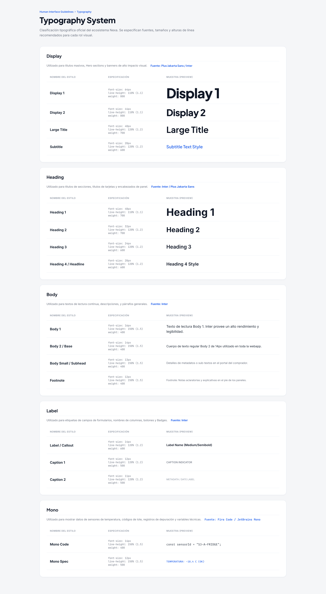
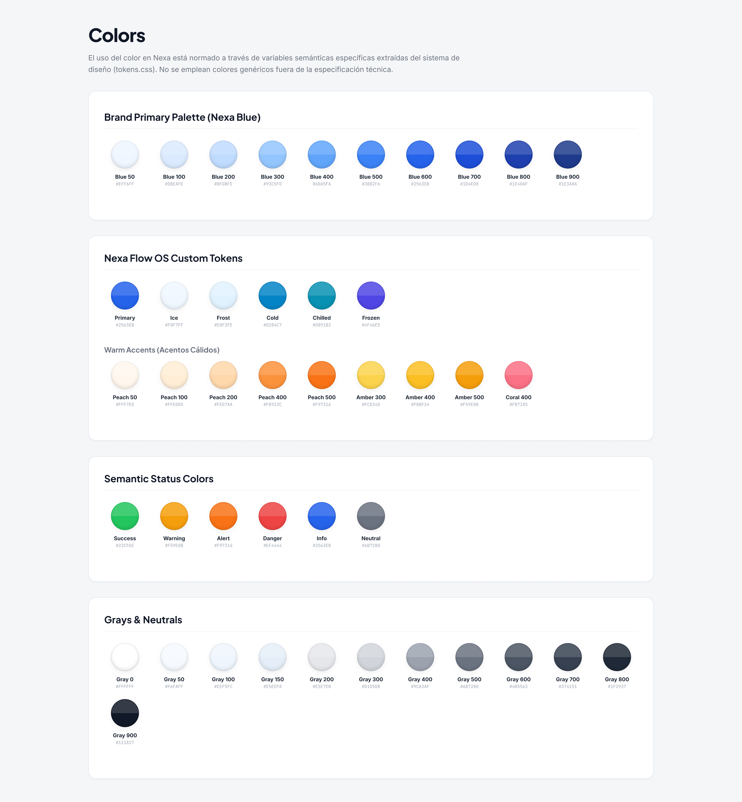
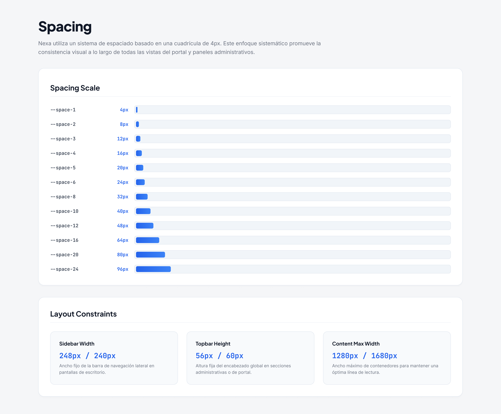
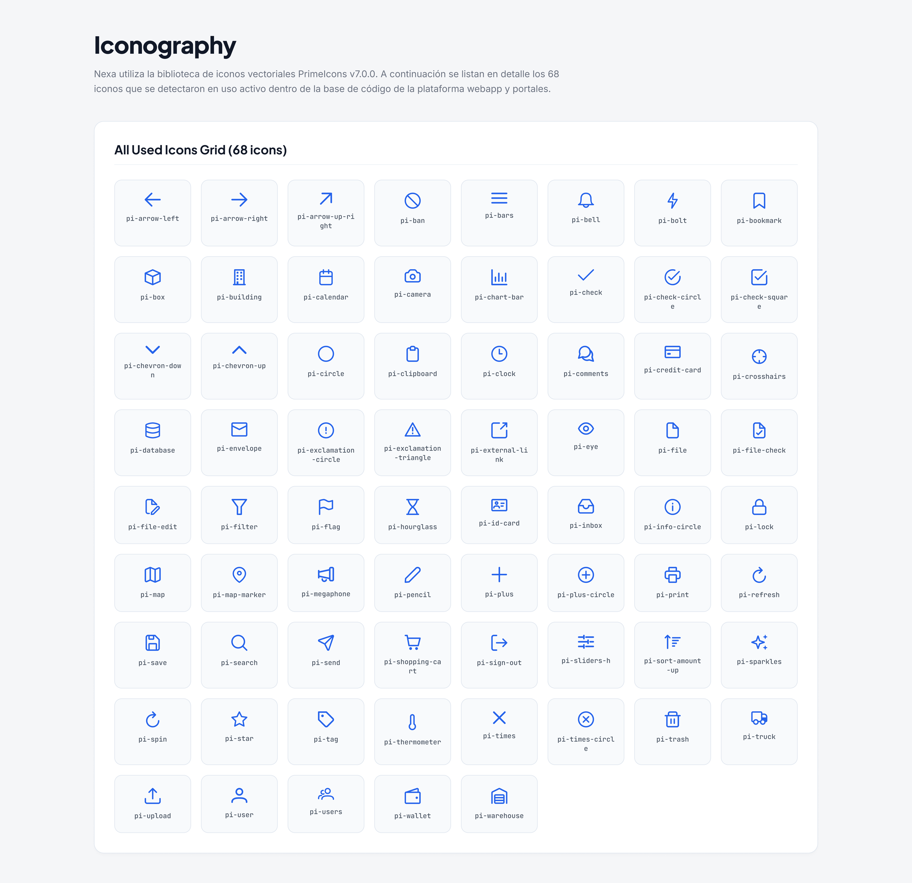
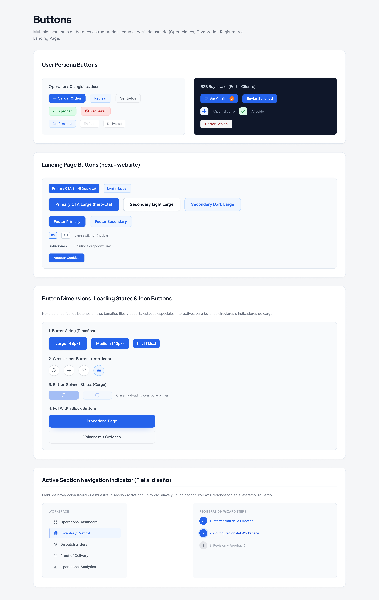
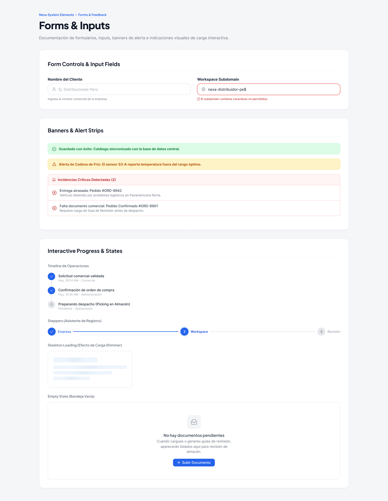
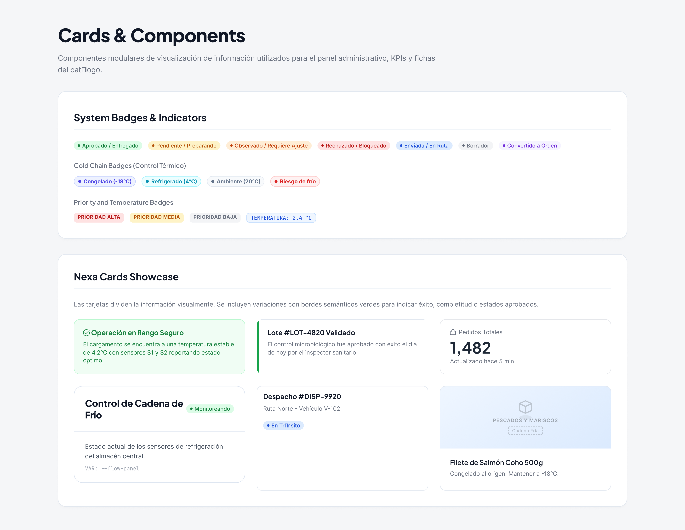
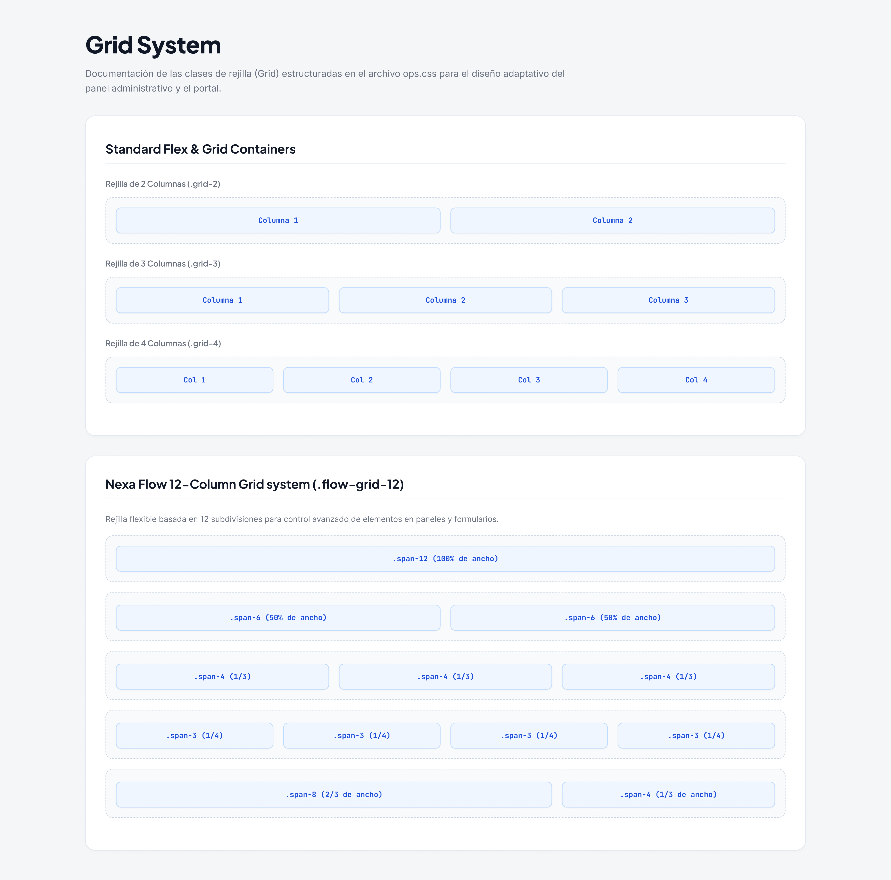

## 4.1. Style Guidelines

El sistema visual de Nexa centraliza las directrices estéticas y funcionales que rigen el ecosistema digital, abarcando la identidad de marca, tipografía, paletas de colores, escalas de espaciado, iconografía, componentes de interfaz de usuario, design tokens, plantillas de maquetación y estándares de interacción. Este conjunto unificado sirve como un repositorio central y marco de referencia común para el equipo de diseño y desarrollo, garantizando consistencia y coherencia en la presentación de datos tanto en la consola operativa interna (ERP) como en el Portal de Compradores (Buyer Portal).

El diseño del ecosistema se organiza en torno a decisiones visuales modulares y reutilizables:
- **Design tokens:** Abstracción de propiedades de diseño atómicas (valores de color, familias y tamaños tipográficos, escalas de espaciado, radios de curvatura, elevación y tiempos de animación).
- **Component patterns:** Patrones de interacción comunes y autónomos (cards métricas, barras de navegación, botones y cabeceras de página).
- **Layouts:** Estructuras organizativas de la pantalla adaptadas a cada tipo de usuario de la plataforma.
- **Forms:** Controles para la entrada y validación de datos del negocio.
- **Badges:** Identificadores gráficos de estados transaccionales y de negocio.
- **States:** Indicadores visuales de carga, errores, estados vacíos y restricciones de seguridad.
- **Navigation:** Barras de menú fijas y laterales que organizan las rutas del sistema.
- **Responsive web behavior:** Adaptación responsiva del contenido y los controles según las dimensiones del dispositivo.

### 4.1.1. General Style Guidelines

#### Branding

Nexa se define como un ecosistema SaaS B2B especializado en la coordinación comercial, autogestión de compradores B2B, control de inventarios logísticos, monitoreo de despachos, administración de documentos comerciales, simulaciones de pago, gestión de catálogos de producto y configuración multi-inquilino (tenant/workspace). 

La identidad visual de Nexa está diseñada para comunicar confianza, control operativo, trazabilidad transaccional, claridad comercial y solidez técnica. Asimismo, debido al contexto operativo del producto en la cadena de frío, la marca transmite precisión operacional en la gestión y distribución de productos bajo condiciones de temperatura controlada (FEFO). Se evita rigurosamente proyectar la imagen de un ERP genérico o de un sitio puramente promocional (landing page), enfocándose en cambio en la continuidad lógica de los procesos que vinculan desde el catálogo y la solicitud comercial inicial hasta la entrega final del producto y su posterior registro de facturación.

#### Communication Tone and Language

El tono de Nexa se rige por la seriedad, la formalidad, el respeto y la serenidad confiable. Las comunicaciones dentro del sistema están orientadas a reducir la carga cognitiva y mitigar la incertidumbre en flujos operacionales críticos, tales como solicitudes y órdenes de compra, reservas de inventario, despachos en ruta y control de accesos de la organización.

Las dimensiones de tono aplicadas se definen de la siguiente manera:

| Dimension | Nexa decision | Application |
|---|---|---|
| Funny / Serious | Serious (Serio) | Comunicación sobria y centrada en la precisión operativa; se omiten bromas, lenguaje figurado o informalidad en interfaces transaccionales y de configuración empresarial. |
| Formal / Casual | Formal | Estructuras gramaticales profesionales que refuerzan la confianza corporativa entre compradores B2B, coordinadoras comerciales y operadores logísticos. |
| Respectful / Irreverent | Respectful (Respetuoso) | Mensajes y alertas que valoran el tiempo y las decisiones del usuario, manteniendo la cortesía en estados críticos o de error. |
| Enthusiastic / Calm | Calm and reliable (Sereno y confiable) | Transmisión de tranquilidad y estabilidad; las notificaciones y alertas guían al usuario hacia soluciones sin alarmismos ni entusiasmo artificial. |

> *Nota:* Aplicación de las dimensiones del tono en las notificaciones del sistema y el flujo transaccional. Elaboración propia.

El lenguaje y tono se aplican de manera uniforme en la Web Application interna, el Buyer Portal, las pantallas de autenticación, las alertas operativas, la validación de formularios y los estados vacíos, de carga o de error del sistema.

#### Typography

Nexa utiliza una jerarquía tipográfica unificada para optimizar la legibilidad y la lectura rápida de datos comerciales y técnicos.
Las fuentes principales son:
- **Display / Titulares:** `'Plus Jakarta Sans', sans-serif` para títulos de páginas y encabezados principales.
- **Cuerpo y Controles:** `'Inter', sans-serif` para textos generales, descripciones, formularios, etiquetas y navegación.
- **Monospaciada / Datos Técnicos:** `'Firacode / JetBrains Mono', monospace` para códigos de lote, identificadores de pedidos, timestamps de despacho, lecturas de temperatura y datos técnicos.

La escala tipográfica se compone de tokens establecidos: desde `--text-xs` (12px) hasta `--text-6xl` (48px), con grosores que varían desde regular (400) hasta extrabold (800).

| Typographic level | Purpose | Recommended use |
|---|---|---|
| Display / Page title | Títulos hero y titulares de gran tamaño (32px a 48px, Plus Jakarta Sans, bold) | Títulos principales de páginas de inicio, portadas o vistas de bienvenida principales. |
| Section heading | Encabezados de paneles, cards y subsecciones (18px a 28px, Plus Jakarta Sans, semibold) | Encabezados de módulos operativos, títulos de contenedores de formularios y secciones de cards. |
| Body | Texto de lectura, párrafos y formularios (14px a 16px, Inter, regular) | Descripciones de productos, entradas de formularios, texto de ayuda y contenido general de lectura. |
| Label | Etiquetas de formularios y navegación (13px, Inter, medium/semibold) | Títulos de campos de formulario, elementos del sidebar, botones y tabs. |
| Caption / metadata | Microcopia e información secundaria (12px, Inter, regular) | Notas descriptivas al pie, timestamps de estado, metadata de tablas y texto aclaratorio secundario. |
| Technical text | Códigos y datos técnicos (13px, Firacode / JetBrains Mono, regular) | Identificadores únicos de pedido, números de lote, códigos SKU, valores de sensores y datos numéricos densos. |

> *Nota:* Jerarquía tipográfica y especificaciones de uso por nivel de interfaz. Elaboración propia.

*Sistema Tipográfico Nexa*

> *Nota:* Definición de jerarquías para Display, Headings, Body y Mono. Elaboración propia.

#### Color System

La paleta cromática se organiza por grupos funcionales para facilitar la navegación y resaltar de manera clara las condiciones de negocio e indicadores de cadena de frío:

- **Primary Blue:** Azul primario de marca (`--nexa-blue-600` / `#2563EB`) para acciones interactivas principales y enlaces activos, con hover en oscuro (`--nexa-blue-700` / `#1D4ED8`) y un azul profundo (`--nexa-blue-900` / `#1E3A8A`) para la estructura de la aplicación.
- **Escala cromática de cadena de frío (Cold-Chain):** Tonos específicos para la categorización del almacenamiento y transporte refrigerado:
  - `ice`: Fondo de zona fría (`#f0f7ff`).
  - `frost`: Fondo de categoría chilled (`#e0f2fe`).
  - `cold`: Indicador de transporte refrigerado (`#0284c7`).
  - `chilled`: Transportador de frío medio (`#0891b2`).
  - `frozen`: Identificador de zona de congelado profundo (`#4f46e5`).
- **Semantic Status:** Colores dedicados a la retroalimentación de estados del negocio:
  - `success`: Confirmaciones y operaciones estables (`default` `#22C55E`, `light` `#DCFCE7`, `dark` `#15803D`).
  - `warning`: Atención o riesgo moderado (`default` `#F59E0B`, `light` `#FEF3C7`, `dark` `#B45309`).
  - `alert`: Alertas de acción requerida (`default` `#F97316`, `light` `#FFEDD5`, `dark` `#C2410C`).
  - `danger`: Bloqueos o incidencias críticas (`default` `#EF4444`, `light` `#FEE2E2`, `dark` `#B91C1C`).
  - `info`: Información neutral y progreso (`default` `#2563EB`, `light` `#DBEAFE`, `dark` `#1D4ED8`).
  - `neutral`: Estados inactivos o borradores (`default` `#6B7280`, `light` `#F3F4F6`, `dark` `#374151`).
- **Neutrals and Surfaces:** Grados de gris para el contraste visual y la estructuración de la interfaz:
  - Base de aplicación (`--surface-base` / `#F6FAFF`).
  - Fondo de cards y sidebar (`--surface-card` o `--surface-sidebar` / `#FFFFFF`).
  - Insets y separadores (`--surface-inset` / `#EEF5FC` o `--gray-200` / `#E5E7EB`).
  - Texto principal (`--text-primary` / `#111827`) y secundario (`--text-secondary` / `#6B7280`).

| Color group | Role | Interface usage |
|---|---|---|
| Primary | Identidad de marca, enlaces activos y botones principales | Botones de llamado a la acción (`#2563EB`), estados de navegación seleccionados y acentos interactivos. |
| Surface | Contenedores base, cards principales y barras de navegación | Fondos de módulos de control, formularios (`#FFFFFF`) y fondo general del workspace (`#F6FAFF`). |
| Neutral | Bordes, textos de apoyo, placeholders e indicadores inactivos | Líneas divisorias (`#E5E7EB`), texto descriptivo secundario (`#6B7280`) y textos deshabilitados (`#D1D5DB`). |
| Success | Confirmación de transacciones y estados operativos estables | Badges de pedidos entregados (`#15803D` sobre `#DCFCE7`) e inventario confirmado. |
| Warning | Indicación de advertencias preventivas o límites operacionales | Indicadores de stock bajo (`#B45309` sobre `#FEF3C7`) o límites de crédito próximos a vencer. |
| Danger / Error | Notificación de bloqueos, fallas de validación y cancelaciones | Errores en inputs (`#EF4444`), stock agotado o incidencias de temperatura crítica. |
| Info | Progreso de actividades e información general de seguimiento | Estados en tránsito (`#1D4ED8` sobre `#DBEAFE`) y códigos informativos. |

> *Nota:* Clasificación de grupos cromáticos y su aplicación funcional en las interfaces del sistema. Elaboración propia.

*Sistema de Colorimetría Nexa*

> *Nota:* Especificación de Brand Colors, Text Colors y Status Colors. Elaboración propia.

#### Spacing and Layout Principles

Nexa utiliza una escala de espaciado basada en una cuadrícula de 4px. Esto garantiza una alineación uniforme entre cards, listas, formularios y paneles, promoviendo la consistencia en el uso de márgenes internos y externos.
Los tokens de espaciado abarcan desde `--space-1` (4px) hasta `--space-24` (96px). Además, se incorporan tokens de dimensión fija como el ancho del sidebar (`240px`), la altura del topbar (`56px`) y el ancho máximo de contenido (`1280px`).

| Spacing purpose | Application |
|---|---|
| Compact spacing | Márgenes internos de celdas de tablas densas, espaciado entre campos de filtros y micro-metadatos (4px a 8px, `--space-1` a `--space-2`). |
| Medium spacing | Relleno de cards operativas, separación entre inputs de formularios y gaps entre elementos de listas (12px a 20px, `--space-3` a `--space-5`). |
| Large spacing | Márgenes externos de páginas completas, espacios de separación entre secciones mayores y hero blocks (24px a 48px, `--space-6` a `--space-12`). |
| Responsive spacing | Márgenes dinámicos escalables con clamp en layouts fluidos, adaptándose automáticamente a pantallas más estrechas. |

> *Nota:* Definición de la escala de espaciados y aplicaciones de layout. Elaboración propia.

*Escala de Espaciado*

> *Nota:* Escala basada en múltiplos de 4px, desde 4px hasta 96px. Elaboración propia.

#### Assets, Icons and Visual Resources

El ecosistema Nexa comparte recursos visuales consistentes para asegurar la coherencia estética de las aplicaciones:
- **Isotipo y Logotipos:** Diseñados para una visualización clara en fondos claros y oscuros.
- **Iconografía:** Se utiliza un sistema de iconos de trazo lineal (apoyado en PrimeIcons y recursos vectoriales SVG propios) con grosores uniformes.
- **Recursos gráficos de soporte:** Ilustraciones estilizadas en colores neutros para estados vacíos y representaciones del flujo operativo.

*Regla de uso:* Los iconos siempre actúan como soporte visual. Por motivos de usabilidad y accesibilidad, las acciones críticas deben ir acompañadas de etiquetas de texto explicativas y no depender únicamente de un icono abstracto.

*Iconografía Nexa*

> *Nota:* Biblioteca de iconos vectoriales para navegación y soporte. Elaboración propia.

#### Design Tokens

Las decisiones de diseño visual se centralizan a través de design tokens, traduciendo directrices estéticas en variables de desarrollo reutilizables que configuran colores, tipografía, espaciado, radios de curvatura, elevación/sombras y comportamiento de movimiento.

- **Color:** Define la paleta de marca (`--nexa-blue-50` a `--nexa-blue-900`), tonos logísticos de la escala cromática de cadena de frío (`--nexa-ice`, `--nexa-frost`, `--nexa-cold`, `--nexa-chilled`, `--nexa-frozen`), estados semánticos (`--color-success`, `--color-warning`, `--color-alert`, `--color-danger`, `--color-info`, `--color-neutral`) y escala de grises neutros (`--gray-0` a `--gray-900`).
- **Typography:** Configura las familias tipográficas de titulares (`--font-display` para `'Plus Jakarta Sans'`), lectura general (`--font-body` para `'Inter'`) e identificadores y datos técnicos (`--font-mono` para `'Firacode / JetBrains Mono'`), grosores desde regular (`400`) a extrabold (`800`) y tamaños desde `--text-xs` (`12px`) hasta `--text-6xl` (`48px`).
- **Spacing:** Rige dimensiones base bajo grilla de 4px desde `--space-1` (`4px`) hasta `--space-24` (`96px`), además de anchos de maquetación estructural (`--sidebar-width: 240px`, `--topbar-height: 56px`, `--content-max: 1280px`).
- **Radius:** Regula la curvatura de elementos gráficos de la interfaz desde esquinas pequeñas (`--radius-xs: 4px`, `--radius-sm: 6px`) hasta componentes estándar (`--radius-md: 8px` para botones, `--radius-lg: 12px` para cards/inputs, `--radius-xl: 16px` para modales y contenedores principales) y formas circulares completas (`--radius-full: 9999px`).
- **Shadows / Elevation:** Define efectos de relieve visual y niveles de elevación visual desde sombras de foco (`--shadow-xs`, `--shadow-sm`, `--shadow-md` para selectores, `--shadow-lg` para cards, `--shadow-xl` para modales) hasta escalas de elevación de capas (`--elevation-0: none` para cards estándar hasta `--elevation-5` para superposiciones).
- **Motion:** Configura la suavidad de las transiciones operacionales del sistema mediante tiempos específicos (`--duration-micro: 150ms`, `--duration-standard: 250ms`, `--duration-page: 400ms`, `--duration-slow: 600ms`) aplicados a curvas de aceleración fluida (`--ease-out-expo: cubic-bezier(0.16, 1, 0.3, 1)` y `--ease-in-out`).

| Token category | Purpose | Example use |
|---|---|---|
| Color | Define la paleta de marca, neutros y semánticos. | `--nexa-blue-600` (`#2563EB`) para interactivos primarios; `--gray-50` (`#F6FAFF`) para fondos base. |
| Typography | Configura familias de fuentes, pesos, tamaños y alturas de línea. | `--font-display` (`Plus Jakarta Sans`); `--text-base` (`14px`) para cuerpos generales. |
| Spacing | Rige el padding, márgenes, grillas y dimensiones estructurales. | `--space-4` (`16px`) para relleno estándar de contenedores. |
| Radius | Controla la curvatura de esquinas de botones, inputs y cards. | `--radius-md` (`8px`) para botones; `--radius-lg` (`12px`) para cards y modales. |
| Shadows | Aplica sombras y niveles de elevación visual. | `--shadow-md` para menús desplegables; `--elevation-1` para headers fijos. |
| Motion | Establece duraciones de transición y funciones de atenuación. | `--duration-standard` (`250ms`) con curva `--ease-out-expo` para efectos de hover. |

> *Nota:* Categorías del sistema de tokens y ejemplos de su aplicación técnica. Elaboración propia.

### 4.1.2. Web Style Guidelines

#### Web Application Surfaces

El ecosistema web de Nexa se despliega en tres superficies con propósitos distintos pero con una base de diseño unificada:
1. **Web Application interna (Ops Portal):** Consola operativa para coordinadoras comerciales y operadores logísticos. Presenta información altamente densa mediante tablas, filtros y resúmenes de control.
2. **Buyer Portal (Portal de Compradores):** Interfaz ágil que permite a los clientes consultar catálogos, generar solicitudes, revisar estados de pedido, tracking y descargar facturas con facilidad.
3. **Páginas de Acceso (Auth screens):** Vistas de autenticación simplificadas que resuelven el acceso de usuarios, recuperación de credenciales y avisos de bloqueo o restricción de permisos.
4. **Vistas de Administración (Tenant Management):** Pantallas diseñadas para la inscripción de organizaciones, perfiles corporativos y la configuración de múltiples inquilinos.

#### Layout System

Las interfaces web emplean plantillas de maquetación específicas según el contexto de uso:

- **Ops Layout (`ops-layout`):** Diseñado para pantallas operativas internas. Contiene un sidebar lateral de ancho fijo `--sidebar-width` (`240px`) para navegación de módulos, un header superior pegajoso de `56px` para notificaciones y selección de cuenta, y un espacio de trabajo central con relleno dinámico `clamp(18px, 2.2vw, 34px)`. En resoluciones reducidas, el sidebar colapsa y se despliega un menú móvil inferior.
- **Portal Layout (`portal-layout`):** Diseñado para compradores B2B. Presenta una barra de navegación superior horizontal fija de `60px` que organiza secciones clave (catálogo, solicitudes, órdenes y soporte) y un contenedor central que restringe el ancho de página a un máximo de `1680px` para asegurar la legibilidad tipográfica. En pantallas móviles, se despliega una barra de navegación inferior adaptada.
- **Auth Layout (`auth-layout`):** Estructura de pantalla dividida al 50%. En pantallas anchas, muestra un banner de marca a la izquierda con degradados radiales y el formulario de ingreso a la derecha (`width: 420px`). En pantallas reducidas, el diseño se apila verticalmente de forma fluida.

#### Components and UI Patterns

El comportamiento y presentación de los componentes clave de la interfaz se derivan de las siguientes directrices de uso:

| Component / pattern | Purpose | Usage in Nexa |
|---|---|---|
| Page header | Define el contexto del módulo, breadcrumbs y acciones globales. | Encabezado superior con breadcrumbs en vistas de órdenes de despacho e inventario. |
| Metric card | Muestra indicadores clave de rendimiento (KPIs). | Tarjeta informativa con icono de soporte, número grande de 32px y variación de estado. |
| Status badge | Etiqueta semántica para comunicar el estado de un registro. | Pills con esquinas totalmente redondeadas (`--radius-full`) y un punto cromático indicador. |
| Empty state | Ilustración e indicación cuando no existen registros cargados. | Panel centralizado que orienta al usuario a realizar una acción inicial para poblar la vista. |
| Product card | Muestra información esencial de un artículo en el catálogo. | Imagen del producto, precio B2B, badge de temperatura y botón directo de selección. |
| Dispatch card | Resume los detalles de un envío en el panel logístico. | Tarjeta con ID monospaciado, estado de entrega, alertas de temperatura y transportista. |
| Tenant management panel | Centraliza la configuración de inquilinos y accesos. | Formularios organizados con un checklist interactivo de onboarding y branding de empresa. |

> *Nota:* Catálogo de componentes de interfaz y su integración en las vistas del ecosistema. Elaboración propia.

En las aplicaciones se incorporan otros componentes clave como selectores de referencia, checklists de onboarding para espacios de trabajo, tarjetas de marca de inquilino (tenant branding cards), pasos de registro de organización (registration steppers), tarjetas de opciones de pago (payment option cards), tarjetas de límites de funcionalidad (feature gate cards) e indicadores de estado de espera del servidor (pending backend states).

#### Buttons and Actions

Los elementos de acción se definen a través de estilos consistentes de botones:
- **Botón Primario (`.btn-primary`):** Fondo azul primario (`#2563EB`), texto en blanco y hover en azul oscuro (`#1D4ED8`). Indica la acción principal.
- **Botón Secundario (`.btn-secondary`):** Fondo azul claro (`#EFF6FF`), borde azul suave (`#BFDBFE`) y texto azul. Para opciones alternativas.
- **Botón Fantasma (`.btn-ghost`):** Fondo transparente, borde gris suave y texto neutro. Para acciones secundarias o de descarte.
- **Botón de Peligro (`.btn-danger`):** Fondo rojo claro (`#FEE2E2`), borde en rojo suave y texto rojo oscuro (`#B91C1C`). Utilizado para acciones destructivas.
- **Microinteracciones:** Al interactuar con botones y elementos interactivos, se aplican transiciones breves y fluidas de cambio de color, foco o escala visual sutil para confirmar la interacción del usuario y mejorar el feedback táctil o visual.

*Reglas de jerarquía:* La acción principal debe dominar visualmente. Las acciones destructivas o irreversibles requieren confirmación contextual previa para evitar pérdidas accidentales de información.

*Botones y Componentes Nexa*

> *Nota:* Variantes de botones primarios, secundarios y estados. Elaboración propia.

#### Forms and Inputs

Los formularios de Nexa priorizan la claridad en el ingreso de datos:
- **Campos de Texto e Inputs:** Borde neutro (`#D7DEEA`) y esquinas redondeadas (`--radius-lg`). El estado de foco activa un borde azul y una sombra suave para guiar la atención del usuario.
- **Validaciones:** Ante errores de captura, el borde del campo cambia a color rojo (`#EF4444`) con mensajes aclaratorios inmediatos bajo el input.
- **Elementos Adicionales:** Labels siempre visibles para evitar pérdida de contexto, y placeholders descriptivos breves.

*Formularios y Feedback Nexa*

> *Nota:* Documentación de formularios, inputs, banners de alerta e indicaciones visuales de carga interactiva. Elaboración propia.

#### Visual Components

Las interfaces operativas de Nexa muestran volúmenes densos de datos estructurados:
- **Cabeceras:** Fondo gris-azul muy claro (`#F6FAFF`), tipografía en mayúsculas de tamaño compacto (11px), espaciado extendido y color gris secundario.
- **Celdas:** Padding vertical y horizontal optimizado (12px por 14px), texto claro de 13px y bordes inferiores finos (`#EEF5FC`).
- **Comportamiento:** Resaltado de fila al hacer hover con cambio sutil de fondo (`#F6FAFF`). Las tablas se desplazan de manera horizontal en pantallas pequeñas para proteger la integridad del dato técnico.

*Componentes visuales Nexa*

> *Nota:* Componentes modulares de visualización de información utilizados para el panel administrativo, KPIs y fichas del catálogo, como tablas y listas. Elaboración propia.

#### Status and Feedback States

La interfaz comunica de forma inequívoca el estado de los flujos de negocio utilizando la paleta semántica.
*Regla de diseño:* Ningún estado crítico debe comunicarse únicamente a través de variaciones de color. Las alertas y badges deben incluir etiquetas textuales, iconos informativos o descripciones adjuntas.
- **Borrador / Neutral:** Gris (`#6B7280`), indicando que una acción está por iniciarse.
- **Pendiente / Aprobación comercial:** Color ámbar (`#F59E0B`), requiriendo revisión de coordinadores.
- **En tránsito / Preparación:** Azul de información (`#2563EB`), que denota actividad operativa.
- **Entrega cerrada / Reservado:** Verde de éxito (`#16A34A`), indicando éxito operativo.
- **Incidencia de temperatura / Cancelado:** Rojo de error o peligro (`#EF4444`), alertando desvíos operativos inmediatos.

#### Bounded Context Visual Organization

El ecosistema modular de Nexa adapta los patrones visuales generales a la naturaleza operativa de cada contexto acotado:

| Bounded context | Visual emphasis | Main UI patterns |
|---|---|---|
| IAM | Concentración de formularios de acceso y seguridad; alta legibilidad de errores y restricciones. | Layout de autenticación centrado en card (`960px`), campos de formulario con foco azul e indicador de carga de sesión. |
| Sales | Flujos comerciales fluidos; visibilidad de solicitudes de compra y validación de clientes. | Tablas de solicitudes comerciales, badges de estado transaccional, modales de detalle de pedido y formularios de validación. |
| Logistics | Trazabilidad del reparto; monitoreo de despachos y recolección de evidencias. | Tablero Kanban de despachos, timeline lineal para seguimiento del estado de ruta, indicadores de temperatura y visualizador de POD. |
| Warehouse | Control físico; densidad en niveles de stock y reservas. | Cards con indicadores de lotes (FEFO), etiquetas de temperatura de zona (`ice`, `frost`, `frozen`) y tablas densas de movimiento. |
| Invoicing | Rigor documental; visualización clara de pagos y comprobantes. | Listados de facturas y documentos de pago, badges de estado de cobro y componentes con enlaces para descarga de PDFs comerciales. |
| Catalog Management | Presentación visual limpia del portafolio comercial y promociones aplicables. | Grilla de tarjetas de producto con badges de oferta, filtros por categoría y selectores de catálogo interactivos. |
| Tenant Management | Incorporación fluida de organizaciones y perfiles de espacio de trabajo. | Stepper interactivo de registro de cuenta, previsualizador de dominio/slug de workspace y cards para carga de branding institucional. |

> *Nota:* Organización visual y patrones de interfaz predominantes por contexto acotado. Elaboración propia.

#### Responsive Web Behavior

Nexa está desarrollado como un ecosistema web responsivo que se adapta a navegadores de escritorio, tabletas y dispositivos móviles. No se requiere el uso de aplicaciones móviles nativas dedicadas.

- **Escritorio (Primary workspace):** Diseñado para la interacción de alta densidad de S1 (Commercial Coordination) y S2 (Operations). Permite la visualización de paneles con múltiples columnas, tablas operativas expandidas y controles interactivos simultáneos.
- **Tableta (Secondary review surface):** Conserva la densidad visual de las tablas de datos, pero adapta el padding general y oculta sidebars extensos en menús laterales colapsables para proteger el área útil de lectura.
- **Dispositivo Móvil (Simplified access surface):** Orientado principalmente para la autogestión en el Buyer Portal (S3) y consultas rápidas del estado de despachos. Las cuadrículas y paneles se apilan verticalmente, las tablas de datos operacionales incorporan scrolls horizontales y la navegación principal colapsa bajo un menú de tipo cajón (drawer) accesible mediante un botón superior o una barra inferior simplificada.

*Regla táctil:* Los elementos interactivos (botones, selectores y entradas de formulario) se ajustan para mantener una altura de interacción recomendada de aproximadamente 44px, facilitando el uso táctil directo en almacenes, vehículos de despacho o puntos de venta.

*Sistema de Rejilla y Breakpoints*

> *Nota:* Dimensionamiento para Desktop HD, Desktop y Tablet. Elaboración propia.

#### Accessibility and Consistency Criteria

Para asegurar que las interfaces sean accesibles y de uso uniforme para todos los usuarios involucrados en la cadena operativa, se incorporan criterios de diseño alineados con las recomendaciones generales de la WCAG 2.1 nivel AA:

- **Contraste Mínimo (1.4.3):** Las combinaciones de texto y color de fondo respetan las relaciones de contraste necesarias (usando textos oscuros `#111827` sobre fondos claros e inversos `#FFFFFF` sobre fondos oscuros).
- **Acceso por Teclado (2.1.1):** Todos los botones, enlaces y entradas de formulario cuentan con focus rings perceptibles (`2px solid #2563EB`) que permiten completar flujos sin el uso del mouse.
- **Propósito de Enlaces (2.4.4):** Los enlaces transaccionales y los botones con iconos presentan etiquetas explicativas integradas para evitar ambigüedades en lectores de pantalla u operaciones de ritmo acelerado.
- **Independencia del Color (1.4.1):** Las alertas operativas críticas no confían exclusivamente en el color para transmitir significado, utilizando siempre descripciones textuales explicitas (por ejemplo: "Aprobación pendiente", "Lote vencido" o "Desvío de temperatura registrado").

> *Nota:* Criterios WCAG y su implementación práctica en los componentes transaccionales de la aplicación. Elaboración propia.

*Iconografía Nexa*

> *Nota:* Biblioteca de iconos vectoriales para navegación y soporte. Elaboración propia.
