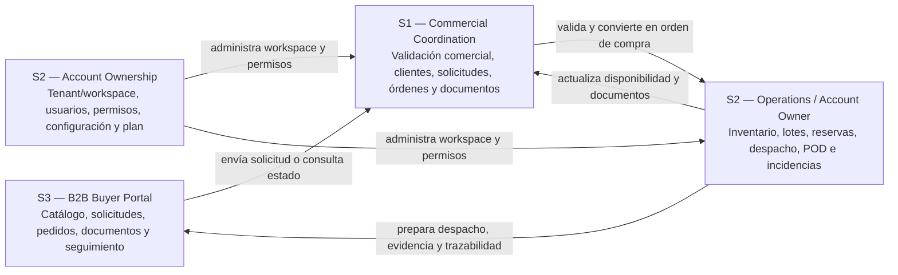
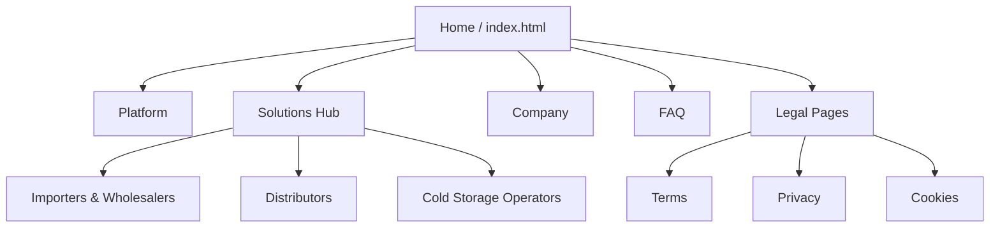
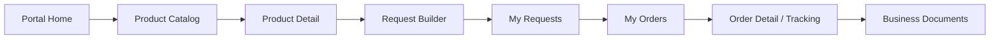

## 4.2. Information Architecture

La arquitectura de información de Nexa organiza el contenido y los flujos de interacción alrededor de tres superficies complementarias: el sitio público o Landing Page, la Web Application interna y el Buyer Portal. Esta organización responde al modelo SaaS B2B del producto: una empresa importadora o distribuidora de cadena de frío contrata Nexa y habilita usuarios internos y externos dentro de un mismo ecosistema operacional.

Para mantener consistencia con la taxonomía formal de segmentos definida en el proyecto, la información no se organiza únicamente por pantallas, sino por responsabilidades de negocio. El **S1 — Commercial Coordination** utiliza la consola interna para recibir solicitudes, validar clientes, revisar condiciones comerciales, convertir solicitudes en órdenes de compra y gestionar documentos comerciales. El **S2 — Operations / Account Owner** utiliza la consola interna para controlar inventario, lotes, reservas, despacho, evidencias, incidencias y trazabilidad operativa. Además, el **account ownership del S2** cubre la administración de la empresa contratante, el tenant/workspace, usuarios, permisos, configuración y plan. El **S3 — B2B Buyer Portal** utiliza el Buyer Portal para consultar catálogo, construir solicitudes, revisar pedidos, acceder a documentos y seguir el estado de entrega.

*Flujo conceptual entre segmentos de Nexa*

> *Nota:* El diagrama representa la relación conceptual entre los segmentos principales del ecosistema Nexa. Elaboración propia.

La administración del tenant/workspace se documenta como parte del account ownership del S2, separada de las tareas operativas de inventario, despacho y trazabilidad. Esta separación permite distinguir configuración, accesos y permisos de las actividades de inventario, despacho y trazabilidad.

### 4.2.1. Organization Systems

La arquitectura de información de Nexa combina distintos sistemas de organización para responder a la naturaleza del producto. La Landing Page necesita una estructura clara para comunicar valor; la Web Application interna requiere vistas densas y filtrables para el S1 y el S2, incluyendo el account ownership; y el Buyer Portal necesita un flujo secuencial que permita al comprador B2B avanzar desde el catálogo hasta el seguimiento de su orden.

*Sistemas de organización aplicados en Nexa*

| Sistema de organización | Uso en Nexa | Superficie |
|---|---|---|
| Jerárquico | Landing Page: Home > Solutions > página específica | Landing Page |
| Secuencial | Catálogo > detalle > request builder > solicitud > orden > tracking | Buyer Portal |
| Matricial | Filtros por estado, cliente, fecha, lote, documento o responsable | Web Application interna |
| Por audiencia | S1 — Commercial Coordination, S2 — Operations / Account Owner (con su account ownership) y S3 — B2B Buyer Portal según responsabilidad de negocio | Todas |
| Por tópicos | Platform, Solutions, Company, FAQ | Landing Page |
| Cronológico | Solicitudes, órdenes, despachos y documentos por fecha | Web Application / Buyer Portal |
| Alfabético | Clientes B2B, productos y documentos cuando aplique | Web Application / Buyer Portal |

> *Nota:* La tabla resume los sistemas de organización combinados para estructurar el contenido de Nexa. Elaboración propia.

Estos sistemas no compiten entre sí. Se combinan para que cada superficie mantenga una lógica de navegación coherente con su propósito: descubrimiento comercial, operación interna o autoservicio del comprador.

#### Landing Page — Organización jerárquica con apoyo matricial

El sitio público presenta una arquitectura jerárquica de dos niveles. El punto de entrada es la página principal, desde la cual el visitante accede a las áreas troncales **Platform**, **Solutions**, **Company** y **FAQ**. Dentro de **Solutions**, la navegación se orienta por tipo de operador de cadena de frío: **Importers & Wholesalers**, **Distributors** y **Cold Storage Operators**.

Estas páginas de Solutions no sustituyen a los segmentos de uso del producto. Funcionan como páginas comerciales para explicar la propuesta de valor a empresas potencialmente contratantes, mientras que el S1, el S2 (incluyendo el account ownership) y el S3 representan responsabilidades dentro del ecosistema operacional de Nexa.

*Arquitectura jerárquica de la Landing Page*

> *Nota:* El diagrama representa el mapa del sitio público y la profundidad de navegación. Elaboración propia.

La profundidad máxima de navegación comercial es de dos niveles (`Home > Solutions > Distributors`), lo que favorece rapidez de acceso y reduce carga cognitiva. Las páginas legales se ubican como soporte desde el footer y no forman parte del flujo principal de conversión. Las llamadas a la acción conectan el descubrimiento del producto con la solicitud de demostración o el ingreso a la Web Application.

#### Web Application interna — Organización funcional por capacidades de negocio

La Web Application interna se organiza mediante un sidebar persistente y rutas agrupadas por responsabilidad de negocio. Esta estructura permite que el S1 y el S2 (incluyendo el account ownership) trabajen sobre el mismo tenant/workspace sin mezclar sus responsabilidades principales.

*Organización funcional de la Web Application interna*

| Segmento / subalcance | Grupo funcional | Módulos principales | Propósito |
|---|---|---|---|
| S1 — Commercial Coordination | Commercial | Commercial Dashboard, Product Catalog, Purchase Requests, Purchase Orders, Manual Order Entry, B2B Clients, Business Documents | Recibir, validar, convertir y documentar pedidos B2B |
| S2 — Operations / Account Owner | Operations | Operations Dashboard, Inventory Control, Inventory Lots, Dispatch Orders, Proof of Delivery, Operational Analytics, Business Documents | Controlar inventario, lotes, reservas, despacho, evidencias, incidencias y trazabilidad operativa |
| S2 — Account Ownership | Administration | Company Administration, Customer Portals, Promotions, Profile | Administrar empresa, tenant/workspace, usuarios, permisos, configuración, plan y alcance de acceso |
| S1 / S2 | Shared account area | Profile | Mantener información del usuario autenticado dentro del tenant/workspace |

> *Nota:* La tabla detalla los grupos funcionales y módulos que componen la consola de administración interna. Elaboración propia.

La separación por grupos no implica aplicaciones distintas. Los segmentos internos utilizan la misma consola dentro del tenant/workspace de la empresa contratante, pero la navegación se filtra según segmento, responsabilidad y scope operativo.

#### Buyer Portal — Organización transaccional orientada al comprador

El Buyer Portal se organiza alrededor del flujo de abastecimiento del comprador B2B. La estructura prioriza la autonomía del comprador para consultar productos, armar una solicitud, revisar su historial, acceder a documentos y seguir el estado de sus pedidos.

*Organización transaccional del Buyer Portal*

| Etapa | Módulo del portal | Propósito para S3 — B2B Buyer Portal |
|---|---|---|
| Descubrimiento | Home, Product Catalog, Premium | Revisar productos disponibles, promociones y catálogo visible |
| Solicitud | Request Builder, My Requests | Construir y consultar solicitudes enviadas |
| Pedido confirmado | My Orders | Revisar órdenes de compra y estado operativo |
| Documentación | Business Documents | Consultar documentos visibles asociados al pedido |
| Cuenta | Profile | Revisar datos de comprador y relación con la empresa contratante |

> *Nota:* La tabla describe la secuencia funcional que sigue el S3 para abastecerse. Elaboración propia.

#### Route Architecture and Navigation Storytelling

La arquitectura de rutas se organiza por experiencia y capacidad de negocio, agrupando autenticación, consola interna y portal comprador. Las rutas principales se documentan como rutas canónicas porque comunican mejor las capacidades actuales del producto, no como pantallas aisladas.

*Arquitectura de rutas y navegación*

| Superficie | Ruta principal | Segmento / subalcance | Significado | Propósito |
|---|---|---|---|---|
| Auth | `/auth/login` | S1, S2, S3 | Acceso autenticado | Entrada al sistema y selección de experiencia según scope |
| Auth | `/auth/recover` | S1, S2, S3 | Recuperación de acceso | Soporte para credenciales |
| Auth | `/auth/blocked` | S1, S2, S3 | Acceso bloqueado | Informar bloqueo de cuenta o acceso restringido |
| Auth | `/auth/forbidden` | S1, S2, S3 | Acceso no autorizado | Informar que el usuario no tiene permisos para la vista solicitada |
| Ops | `/ops/commercial/dashboard` | S1 | Dashboard comercial | Lectura rápida de solicitudes, órdenes bloqueadas y documentos por revisar |
| Ops | `/ops/product-catalog` | S1 | Catálogo operativo | Consulta de productos visibles para operación comercial |
| Ops | `/ops/commercial/purchase-requests` | S1 | Solicitudes B2B | Bandeja de solicitudes recibidas desde el portal |
| Ops | `/ops/commercial/purchase-requests/:id` | S1 | Validación de solicitud | Revisión comercial antes de conversión |
| Ops | `/ops/commercial/purchase-orders` | S1 | Órdenes de compra | Seguimiento de pedidos confirmados |
| Ops | `/ops/commercial/purchase-orders/:id` | S1 | Detalle de orden | Trazabilidad comercial del pedido |
| Ops | `/ops/commercial/manual-order-entry` | S1 | Registro manual | Captura de pedidos recibidos fuera del portal |
| Ops | `/ops/commercial/client-accounts` | S1 | Clientes B2B | Gestión de cuentas, crédito e historial |
| Ops | `/ops/commercial/business-documents` | S1 | Documentos comerciales | Revisión de documentos requeridos para venta y despacho |
| Ops | `/ops/operations/dashboard` | S2 | Dashboard operativo | Lectura rápida de inventario, despacho, POD e incidentes |
| Ops | `/ops/operations/inventory-control` | S2 | Control de inventario | Stock, lotes, FEFO, vencimientos y disponibilidad |
| Ops | `/ops/operations/inventory-lots` | S2 | Lotes de inventario | Revisión de lotes, vencimientos y trazabilidad |
| Ops | `/ops/operations/dispatch-orders` | S2 | Órdenes de despacho | Preparación y asignación de salidas |
| Ops | `/ops/operations/dispatch-orders/:id` | S2 | Detalle de despacho | Seguimiento operativo de ruta, estado y evidencia |
| Ops | `/ops/operations/proof-of-delivery` | S2 | Evidencias de entrega | Control de POD y cierre de entrega |
| Ops | `/ops/operations/operational-analytics` | S2 | Analítica operativa | Indicadores de pedidos, inventario y despacho |
| Ops | `/ops/operations/business-documents` | S2 | Documentos operativos | Soporte documental para despacho y cumplimiento |
| Ops | `/ops/operations/promotions` | S2 (account ownership) | Promociones | Configuración de comunicación comercial visible al comprador |
| Ops | `/ops/operations/customer-portals` | S2 (account ownership) | Portales externos | Gestión de tareas vinculadas a portales de clientes |
| Ops | `/ops/operations/company-administration` | S2 (account ownership) | Administración de empresa | Configuración de empresa, cuenta, tenant y suscripción |
| Ops | `/ops/profile` | S1 / S2 | Perfil interno | Datos de usuario y cuenta autenticada |
| Portal | `/portal/home` | S3 | Inicio comprador | Resumen de pedidos, solicitudes y productos destacados |
| Portal | `/portal/product-catalog` | S3 | Catálogo de productos | Exploración y selección de productos disponibles |
| Portal | `/portal/product-catalog/:id` | S3 | Detalle de producto | Revisión de información antes de agregar al pedido |
| Portal | `/portal/request-builder` | S3 | Constructor de solicitud | Confirmación de ítems y envío de solicitud |
| Portal | `/portal/purchase-requests` | S3 | Mis solicitudes | Seguimiento de solicitudes enviadas |
| Portal | `/portal/purchase-requests/:id` | S3 | Detalle de solicitud | Revisión de estado, comentarios y trazabilidad inicial |
| Portal | `/portal/purchase-orders` | S3 | Mis pedidos | Revisión de órdenes confirmadas |
| Portal | `/portal/purchase-orders/success` | S3 | Confirmación de pedido | Confirmar resultado luego de enviar una solicitud u orden |
| Portal | `/portal/purchase-orders/:id` | S3 | Detalle de pedido | Tracking, documentos y estado operativo |
| Portal | `/portal/business-documents` | S3 | Documentos | Consulta de documentos visibles para el comprador |
| Portal | `/portal/payment-methods` | S3 | Métodos de pago | Selección de método de pago y simulador de estado de pago |
| Portal | `/portal/premium` | S3 | Premium preview | Vista de valor comercial y promociones destacadas |
| Portal | `/portal/profile` | S3 | Perfil comprador | Datos de cuenta y comprador asociado |
| Portal soporte | `/portal/legal/terms` | S3 | Términos legales | Soporte legal/comunicacional del portal; no forma parte del happy path de compra |
| Portal soporte | `/portal/legal/privacy` | S3 | Privacidad | Soporte legal/comunicacional del portal; no forma parte del happy path de compra |
| Portal soporte | `/portal/support` | S3 | Soporte | Canal de ayuda y comunicación del comprador; no forma parte del happy path de compra |

> *Nota:* La tabla presenta las rutas canónicas implementadas en el enrutador del sistema por segmento y superficie. Elaboración propia.

La documentación principal utiliza únicamente rutas canónicas implementadas porque son las que comunican mejor las capacidades del producto y su organización por experiencia.

#### Aliases y Redirecciones del Router (Legacy Redirects)
Para mantener la compatibilidad con enlaces y menús antiguos, el router de la aplicación maneja redirecciones automáticas hacia las rutas canónicas listadas anteriormente:
*   **Aliases del S1**:
    *   `/ops/commercial/orders` y `/ops/orders` $\rightarrow$ redireccionan a `/ops/commercial/purchase-orders`
    *   `/ops/commercial/orders/create` y `/ops/orders/new` $\rightarrow$ redireccionan a `/ops/commercial/manual-order-entry`
    *   `/ops/commercial/orders/:id` y `/ops/orders/:id` $\rightarrow$ redireccionan a `/ops/commercial/purchase-orders/:id`
    *   `/ops/commercial/requests` $\rightarrow$ redirecciona a `/ops/commercial/purchase-requests`
    *   `/ops/commercial/requests/:id` $\rightarrow$ redirecciona a `/ops/commercial/purchase-requests/:id`
    *   `/ops/commercial/manual-order` $\rightarrow$ redirecciona a `/ops/commercial/manual-order-entry`
    *   `/ops/clients` $\rightarrow$ redirecciona a `/ops/commercial/client-accounts`
    *   `/ops/catalog` $\rightarrow$ redirecciona a `/ops/product-catalog`
    *   `/ops/commercial/promotions` $\rightarrow$ redirecciona a `/ops/operations/promotions`
    *   `/ops/commercial/documents` $\rightarrow$ redirecciona a `/ops/commercial/business-documents`
*   **Aliases del S2 y account ownership**:
    *   `/ops/settings` y `/ops/company-administration` $\rightarrow$ redireccionan a `/ops/operations/company-administration`
    *   `/ops/inventory` $\rightarrow$ redirecciona a `/ops/operations/inventory-control`
    *   `/ops/dispatch` $\rightarrow$ redirecciona a `/ops/operations/dispatch-orders`
    *   `/ops/dispatch/:id` $\rightarrow$ redirecciona a `/ops/operations/dispatch-orders/:id`
    *   `/ops/evidence` $\rightarrow$ redirecciona a `/ops/operations/proof-of-delivery`
    *   `/ops/commercial/customer-portals` y `/ops/customer-portals` $\rightarrow$ redireccionan a `/ops/operations/customer-portals`
    *   `/ops/reports` $\rightarrow$ redirecciona a `/ops/operations/operational-analytics`
*   **Aliases del Buyer Portal / S3**:
    *   `/portal/requests` $\rightarrow$ redirecciona a `/portal/purchase-requests`
    *   `/portal/requests/:id` $\rightarrow$ redirecciona a `/portal/purchase-requests/:id`
    *   `/portal/orders` $\rightarrow$ redirecciona a `/portal/purchase-orders`
    *   `/portal/orders/success` $\rightarrow$ redirecciona a `/portal/purchase-orders/success`
    *   `/portal/orders/:id` $\rightarrow$ redirecciona a `/portal/purchase-orders/:id`
    *   `/portal/documents` $\rightarrow$ redirecciona a `/portal/business-documents`
    *   `/portal/catalog` $\rightarrow$ redirecciona a `/portal/product-catalog`
    *   `/portal/catalog/:id` $\rightarrow$ redirecciona a `/portal/product-catalog/:id`

### 4.2.2. Labeling Systems

El sistema de etiquetado mantiene consistencia entre superficies y usa vocabulario de dominio alineado al flujo comercial-operativo de Nexa. Las etiquetas deben comunicar acciones de negocio, no nombres técnicos internos. Cuando se usan nombres canónicos en inglés, estos se reservan para rutas, módulos o capacidades reconocibles dentro de la arquitectura del producto.

**Landing — etiquetas de navegación y conversión:**

*Etiquetas de navegación y conversión de la Landing Page*

| Tipo | Ejemplos | Función |
|---|---|---|
| Navegación global | Inicio, Plataforma, Soluciones, Empresa, FAQ | Orientar al visitante entre áreas troncales |
| Segmentación comercial | Importadores y mayoristas, Distribuidores, Operadores de cámaras frías | Presentar casos de uso por tipo de empresa contratante |
| CTA principales | Solicitar una demostración, Ingresar | Conectar descubrimiento con conversión o acceso |
| Vocabulario de dominio | Inventario, pedidos B2B, FEFO, despacho, trazabilidad, cadena de frío | Mantener coherencia con la propuesta de valor |

> *Nota:* La tabla describe las etiquetas públicas orientadas a la captación de clientes. Elaboración propia.

**Web Application interna — etiquetas por responsabilidad interna:**

*Etiquetas por responsabilidad interna*

| Segmento / subalcance | Etiquetas de navegación | Acciones principales | Estados y datos clave |
|---|---|---|---|
| S1 | Dashboard comercial, Catálogo, Solicitudes B2B, Órdenes de compra, Registro manual, Clientes B2B, Documentos comerciales | Validar solicitud, convertir a orden, registrar pedido, revisar cliente, observar documento | Solicitud enviada, En revisión comercial, Requiere ajuste, En validación, Bloqueada, Documento por revisar |
| S2 | Dashboard operaciones, Control de inventario, Lotes, Órdenes de despacho, Evidencias de entrega, Analítica operativa, Documentos operativos | Reservar stock, revisar FEFO, preparar despacho, cerrar POD, registrar incidencia, actualizar trazabilidad | Stock bajo, Stock agotado, Lote próximo a vencer, En preparación, En tránsito, Entrega cerrada, Incidencia registrada |
| S2 (account ownership) | Administración de empresa, Usuarios, Permisos, Configuración, Plan, Perfil | Configurar empresa, administrar usuarios, asignar permisos, revisar plan, mantener datos del workspace | Rol, empresa, tenant/workspace, permisos, plan activo, acceso restringido |
| Shared authenticated area | Perfil | Actualizar datos de usuario | Rol, empresa, tenant/workspace, scope |

> *Nota:* La tabla clasifica las etiquetas internas por segmento y su estado operativo en la consola. Elaboración propia.

**Buyer Portal — etiquetas de compra y seguimiento:**

*Etiquetas de compra y seguimiento del Buyer Portal*

| Tipo | Ejemplos | Función |
|---|---|---|
| Navegación | Home, Product Catalog, Request Builder, My Requests, My Orders, Business Documents, Premium, Profile | Guiar al comprador por su flujo de abastecimiento |
| Acciones | Add to cart, Submit Request, View detail, Back to catalog, View my orders | Convertir exploración en solicitud y seguimiento |
| Estados | Solicitud enviada, En revisión comercial, Orden confirmada, En preparación, En tránsito, Entrega cerrada | Comunicar avance sin exponer complejidad interna |
| Datos visibles | Producto, código interno, categoría, temperatura, cantidad, total, documentos, tracking | Aumentar confianza y trazabilidad para S3 |

> *Nota:* La tabla muestra las etiquetas orientadas a la autonomía en el portal comprador. Elaboración propia.

### 4.2.3. SEO Tags and Meta Tags

La implementación SEO y metadata de Nexa distingue entre el sitio público y la Web Application autenticada. La Landing Page busca descubrimiento, comunicación de valor y conversión pública. La Web Application y el Buyer Portal, al operar detrás de autenticación, incluyen metadata descriptiva y configuración `noindex, nofollow` para evitar indexación de rutas internas.

**Landing Page pública:**

*Metadata pública de la Landing Page*

| Página | Title | Meta description / OG description | Keywords | Observación |
|---|---|---|---|---|
| Home | Nexa — Tu operación de charcutería y lácteos, por fin visible | Presenta la propuesta de valor principal para operaciones de charcutería, quesos y lácteos | Nexa, cold chain, charcutería, lácteos, inventario, pedidos B2B, FEFO | Entrada principal de conversión |
| Platform | Nexa — What the Platform Does | Explica las áreas funcionales de la plataforma | Nexa, plataforma, catálogo, inventario, pedidos, despacho, FEFO | Vista de explicación funcional |
| Solutions Hub | Nexa Solutions — Built for the Nodes That Matter Most | Agrupa casos de uso por tipo de operador | Nexa, soluciones, importadores, distribuidores, cámaras frías, cold chain | Hub de segmentación comercial |
| Importers & Wholesalers | Nexa Solutions — Importers & Wholesalers | Presenta valor para importadores y mayoristas | Nexa, importadores, mayoristas, inventario, cold chain, lotes | Página comercial de Solution |
| Distributors | Nexa Solutions — Charcuterie & Dairy Distribution | Presenta valor para distribución, FEFO, despacho y portal B2B | Nexa, distribuidores, portal B2B, FEFO, despacho, pedidos | Página más cercana al flujo principal de Nexa |
| Cold Storage Operators | Nexa Solutions — Cold Storage Operators | Presenta valor para cámaras frías y monitoreo operativo | Nexa, cámaras frías, cold storage, lácteos, auditoría, monitoreo operativo | Página comercial orientada a gestión operativa |
| Company | Nexa — Who We Are | Presenta al equipo y contexto del proyecto | Nexa, equipo, Lima, cold chain, distribución refrigerada | Soporte de confianza |
| FAQ | Nexa FAQ — Everything You Need to Know Before You Decide | Responde dudas frecuentes sobre implementación, seguridad, precios e integraciones operativas | Nexa, FAQ, implementación, seguridad, precios, integraciones operativas | Soporte para decisión antes de demo |

> *Nota:* La tabla resume los metadatos SEO optimizados para los motores de búsqueda públicos. Elaboración propia.

**Web Application y Buyer Portal autenticados:**

*Metadata de superficies autenticadas*

| Superficie | Title | Meta description | Keywords | Propósito |
|---|---|---|---|---|
| Web Application / Ops / Portal | Nexa — Operaciones refrigeradas | Plataforma de operaciones para distribuidoras refrigeradas: catálogo, inventario, pedidos y despacho en un solo lugar | operaciones refrigeradas, distribución cold chain, inventario, pedidos, despacho | Describir la aplicación sin indexar contenido privado |

> *Nota:* La tabla detalla la metadata interna no indexable para las superficies autenticadas. Elaboración propia.

La metadata pública se define con `title`, `description`, `keywords` y descripciones Open Graph coherentes con cada página. Las rutas autenticadas se documentan con metadata descriptiva y política `noindex, nofollow` para proteger contenido privado y evitar indexación de vistas internas.

### 4.2.4. Searching Systems

El sistema de búsqueda de Nexa se plantea como búsqueda contextual por módulo. Cada superficie presenta criterios, filtros y resultados alineados con el tipo de tarea que el usuario necesita resolver. Esta decisión reduce complejidad cognitiva y protege la visibilidad por scope: el S1 consulta información comercial, el S2 consulta información operativa, el S2 (account ownership) consulta información administrativa del workspace y el S3 consulta únicamente información asociada a su cuenta compradora.

*Sistemas de búsqueda por superficie*

| Superficie / módulo | Búsqueda | Filtros | Resultado mostrado | Segmento / subalcance |
|---|---|---|---|---|
| Landing Page | Navegación directa, dropdown de Solutions y FAQ por tema | Tópico, tipo de solución, sección de contenido | Enlaces de navegación, bloques de contenido y respuestas agrupadas | Visitante / empresa interesada |
| Web Application — S1 | Solicitudes, órdenes, catálogo, clientes B2B y documentos comerciales | Estado, cliente, fecha, categoría, disponibilidad, promoción, tipo de documento, estado de pago | Tablas operativas, badges de estado, drawers de detalle y estados vacíos con siguiente acción | S1 |
| Web Application — S2 | Inventario, lotes, reservas, órdenes de despacho, evidencias y documentos operativos | Lote, vencimiento, stock, responsable, fecha, estado de despacho, incidencia, tipo de documento | Tablas densas, cards de stock, listas compactas, badges de alerta y detalle operativo | S2 |
| Web Application — S2 (account ownership) | Empresa, usuarios, permisos, configuración, plan y portales asociados | Rol, estado de usuario, permiso, módulo, estado de plan, relación comercial | Tablas administrativas, formularios de configuración, estados de acceso y mensajes de restricción | S2 (account ownership) |
| Buyer Portal — S3 | Catálogo por nombre comercial o código interno, solicitudes, órdenes, documentos y tracking | Categoría, disponibilidad, promoción, fecha, estado de solicitud, estado de pago, tipo de documento | Cards de producto, listas compactas, timelines de tracking, documentos visibles y estados vacíos con mensaje claro | S3 |

> *Nota:* La tabla describe el comportamiento de búsqueda contextual por segmento y módulo. Elaboración propia.

Cuando una búsqueda no devuelve resultados, la interfaz debe comunicar el estado vacío con un mensaje específico y una acción viable. Por ejemplo, el S3 puede volver al catálogo, el S1 puede limpiar filtros o el S2 puede revisar otro rango de fechas.

### 4.2.5. Navigation Systems

#### Landing — navegación global + contextual

El sitio público utiliza navegación global persistente con logo, enlaces troncales, dropdown de Solutions, selector de idioma y CTAs. Las páginas de Solutions funcionan como navegación contextual para visitantes que desean entender la propuesta según su tipo de operación. FAQ utiliza agrupación por temas para facilitar la exploración de preguntas frecuentes. En móvil, el menú colapsado mantiene acceso a las rutas principales sin alterar la jerarquía del sitio.

*Capas de navegación de la Landing Page*

| Capa | Componente | Función |
|---|---|---|
| Global | Navbar principal | Acceso a Inicio, Plataforma, Soluciones, Empresa, FAQ y CTAs |
| Contextual | Dropdown de Solutions | Acceso a páginas por tipo de operador |
| Local | Categorías internas de FAQ | Exploración rápida de preguntas y respuestas |
| Soporte | Footer y páginas legales | Acceso a términos, privacidad y cookies |
| Móvil | Menú colapsado | Adaptación de la navegación principal a pantallas pequeñas |

> *Nota:* La tabla detalla los componentes del sistema de navegación del sitio público. Elaboración propia.

#### Web Application interna — navegación por segmento y responsabilidad

La consola interna utiliza sidebar persistente y top bar. El sidebar organiza módulos por grupo funcional y filtra opciones según el perfil autenticado. El top bar mantiene el contexto de empresa activa, idioma, notificaciones y cuenta.

*Navegación interna por segmento*

| Segmento / subalcance | Navegación principal | Criterio de organización |
|---|---|---|
| S1 | Dashboard comercial, Catálogo, Solicitudes B2B, Órdenes de compra, Registro manual, Clientes B2B, Documentos comerciales, Perfil | Validación y conversión comercial del pedido |
| S2 | Dashboard operaciones, Control de inventario, Lotes, Órdenes de despacho, Evidencias de entrega, Analítica operativa, Documentos operativos, Perfil | Ejecución operativa, inventario, despacho y trazabilidad |
| S2 (account ownership) | Administración de empresa, Usuarios, Permisos, Configuración, Plan, Perfil | Administración del tenant/workspace, usuarios, permisos y configuración |
| S1 / S2 | Top bar de empresa, tenant/workspace y cuenta | Mantener contexto de empresa activa, usuario autenticado y scope de permisos |

> *Nota:* La tabla resume el sidebar y menú de navegación según el segmento autenticado. Elaboración propia.

Los módulos internos utilizan tarjetas, tablas, tabs, estados visuales y vistas de detalle para permitir movimiento lateral sin perder el contexto de negocio, empresa activa, tenant/workspace y perfil autenticado. Por ejemplo, una solicitud de compra (`Purchase Request`) puede revisarse desde el flujo comercial, convertirse en orden de compra (`Purchase Order`) y luego continuar en operaciones como orden de despacho (`Dispatch Order`).

#### Buyer Portal — navegación lineal de compra y seguimiento

El portal del comprador B2B prioriza una navegación lineal y transaccional. El comprador empieza en el catálogo, revisa productos, construye una solicitud, consulta su estado y revisa pedidos o documentos asociados.

*Flujo de navegación del Buyer Portal*

> *Nota:* El diagrama representa la secuencia de pasos que el S3 sigue para completar una orden. Elaboración propia.

*Navegación lineal del Buyer Portal*

| Paso | Vista | Decisión de navegación |
|---|---|---|
| 1 | Home | Presentar resumen y accesos frecuentes |
| 2 | Product Catalog | Permitir búsqueda y filtrado de productos |
| 3 | Product Detail | Revisar información del producto antes de solicitar |
| 4 | Request Builder | Confirmar cantidades, datos de entrega y solicitud |
| 5 | My Requests | Revisar solicitudes enviadas y su estado |
| 6 | My Orders | Consultar órdenes confirmadas |
| 7 | Order Detail / Business Documents | Revisar tracking, documentos visibles y cierre |

> *Nota:* La tabla detalla los pasos secuenciales de navegación para el S3. Elaboración propia.

Esta navegación refuerza el flujo transversal de Nexa: **el S3 solicita**, **el S1 valida y convierte**, **el S2 ejecuta despacho y evidencia**, y **el S3 obtiene visibilidad del estado final**. El **S2 — Account Ownership** sostiene la configuración del tenant/workspace, usuarios, permisos y alcance de acceso que permiten operar el ecosistema de forma controlada.
