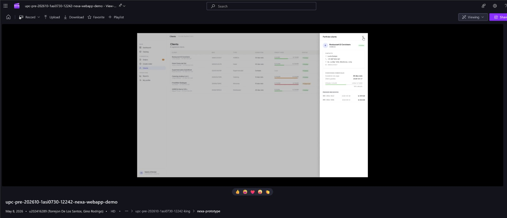

## 4.5. Web Applications Prototyping.

El prototipado de las aplicaciones web de Nexa permite validar navegación, interacción y continuidad visual de las superficies autenticadas antes de analizar su implementación. Esta sección documenta el prototipo de la **Web Application interna** para los segmentos **S1 — Commercial Coordination** y **S2 — Operations / Account Owner**, incluyendo el account ownership del S2, así como el recorrido funcional del **Buyer Portal** para **S3 — B2B Buyer Portal**.

El prototipo se relaciona directamente con la arquitectura de información definida en la sección 4.2 y con los user flows documentados en la sección 4.4. Por ello, la navegación no se organiza solo por pantallas, sino por responsabilidades de negocio dentro del modelo multi-tenant SaaS B2B, utilizando el tenant/workspace para separar empresa, usuarios, permisos y alcance de acceso. Así, el **S3 — B2B Buyer Portal** consulta catálogo y envía solicitudes; el **S1 — Commercial Coordination** valida comercialmente y convierte solicitudes en órdenes de compra; el **S2 — Operations / Account Owner** ejecuta inventario, lotes, FEFO, reservas, despacho y evidencias; y el **S2 — Account Ownership** gestiona la administración del tenant/workspace y el plan comercial.

El prototipado constituye **evidencia de diseño interactivo**. La evidencia de implementación, ejecución, despliegue y servicios simulados se documenta en el Capítulo V.

La evidencia visual y audiovisual incluida cubre los recorridos principales del **S1 — Commercial Coordination**, el **S2 — Operations / Account Owner** y el **S3 — B2B Buyer Portal** en las superficies autenticadas de Nexa. Los flujos de **S1** y **S2** se documentan con soporte interactivo de la consola interna, mientras que el **S3** (Buyer Portal) incorpora mockups desktop y mobile de alta fidelidad en la sección 4.4. El alcance de **S2 — Account Ownership** se reconoce como parte administrativa de la Web Application interna asociada al tenant/workspace, pero no se presenta como recorrido audiovisual independiente en esta sección. La cobertura mobile se documenta mediante mockups responsive incorporados en el reporte.

*Criterios aplicados para las decisiones de interacción del prototipo*

| Criterio | Aplicación en Nexa | Relación con arquitectura de información |
|---|---|---|
| Navegación por responsabilidad | S1, S2 y S3 acceden a módulos distintos según su segmento, alcance operativo y account ownership | Refuerza la separación de módulos de negocio y el portal definidos en 4.2 |
| Continuidad de flujo | Los recorridos conectan login, dashboard, entidades de negocio, detalle y confirmación | Evita que las pantallas funcionen como vistas aisladas |
| Progressive disclosure | Los detalles se muestran mediante drawers, modales, pasos guiados o vistas de detalle | Reduce carga cognitiva y mantiene contexto operativo |
| Feedback de estado | Badges, confirmaciones y mensajes permiten entender el avance de solicitudes, pedidos y despachos | Comunica trazabilidad sin depender solo del color |
| Densidad adaptada | La Web Application interna prioriza desktop/tablet por volumen operativo; el Buyer Portal prioriza claridad y autoservicio en desktop y mobile | Responde a diferencias de uso entre usuarios internos y compradores B2B |
| Consistencia visual | Se mantienen colores, tipografía, botones, tablas, cards y estados definidos en 4.1 | Asegura continuidad entre diseño visual y prototipo interactivo |

> *Nota:* La tabla resume los criterios aplicados para validar navegación, interacción y continuidad visual en el prototipo de Nexa. Elaboración propia.

*Cobertura de prototipado por flujo y segmento*

| Flujo | Segmento / subalcance | Cobertura en prototipo | Representación en esta sección |
|---|---|---|---|
| Validación y pedido asistido | S1 — Commercial Coordination | Dashboard comercial, client accounts, client detail, manual order entry, product selection, order summary, purchase order detail y commercial reports | Figma, FigJam, captura audiovisual y user flow del S1 |
| Inventario, despacho y cierre operativo | S2 — Operations / Account Owner | Operations dashboard, inventory control, inventory lots, lot detail, dispatch orders, proof of delivery y operational analytics | Figma, FigJam, wireflow, captura audiovisual y user flow del S2 |
| Administración de empresa y workspace | S2 — Account Ownership | Company administration, usuarios, permisos, configuración, plan, promociones y alcance de acceso | Alcance administrativo documentado como parte de la Web Application interna y alineado con 4.2 y 4.4, sin recorrido audiovisual independiente |
| Catálogo, solicitud, pedido y seguimiento | S3 — B2B Buyer Portal | Home, product catalog, product detail, request builder, my requests, my orders, business documents y profile | Cobertura funcional mediante rutas canónicas, mockups desktop/mobile y user flow definido en 4.4 |

> *Nota:* La tabla presenta el nivel de cobertura del prototipado interactivo para cada segmento dentro del ecosistema Nexa. Elaboración propia.

*Captura referencial del prototipo de la Web Application interna*

> *Nota:* La imagen muestra una captura referencial del prototipo navegable de la Web Application interna. Elaboración propia.

### Video de prototyping WebApp Sprint 3

El video inicia con el flujo del S1 y luego incorpora los cambios hacia el S2 y el S3. La grabación permite evidenciar la navegación integrada del prototipo WebApp y su comportamiento de interacción para los segmentos principales.

*Captura del video de prototipado de la Web Application*

> *Nota:* La captura muestra la evidencia audiovisual del prototipo navegable, incluyendo recorridos de S1, S2 y S3 según el video registrado. Elaboración propia.

*Detalle audiovisual del prototipo de la Web Application*

| Elemento | Detalle |
|---|---|
| Video | `upc-pre-202610-1asi0730-12242-nexa-webapp-prototype-sprint-3` |
| Plataforma | Microsoft Stream / SharePoint |
| URL | **Microsoft Stream / SharePoint:** [https://upcedupe-my.sharepoint.com/personal/u202416289_upc_edu_pe/_layouts/15/stream.aspx?id=%2Fpersonal%2Fu202416289%5Fupc%5Fedu%5Fpe%2FDocuments%2Fupc%2Dpre%2D202610%2D%201asi0730%2D12242%2Dking%2Fnexa%2Dprototype%2Fupc%2Dpre%2D202610%2D1asi0730%2D12242%2Dnexa%2Dwebbapp%2Emp4&referrer=StreamWebApp%2EWeb&referrerScenario=AddressBarCopied%2Eview%2E739e15be%2D2efd%2D49c4%2Da343%2D4cb5d8cab16a](https://upcedupe-my.sharepoint.com/personal/u202416289_upc_edu_pe/_layouts/15/stream.aspx?id=%2Fpersonal%2Fu202416289%5Fupc%5Fedu%5Fpe%2FDocuments%2Fupc%2Dpre%2D202610%2D%201asi0730%2D12242%2Dking%2Fnexa%2Dprototype%2Fupc%2Dpre%2D202610%2D1asi0730%2D12242%2Dnexa%2Dwebbapp%2Emp4&referrer=StreamWebApp%2EWeb&referrerScenario=AddressBarCopied%2Eview%2E739e15be%2D2efd%2D49c4%2Da343%2D4cb5d8cab16a) |
| Duración | `6:46` |
| Recorrido de S1 — Commercial Coordination | Inicio del recorrido |
| Cambio al recorrido de S2 — Operations / Account Owner | `1:44` |
| Cambio al recorrido de S3 — B2B Buyer Portal | `3:49` |
| Evidencia visual | `prototyping-webapp-sprint-3-video.png` |

> *Nota:* La tabla resume la evidencia audiovisual disponible para el prototipo navegable de Nexa. Elaboración propia.

Esta evidencia se registra como prototyping porque documenta una simulación de navegación de la WebApp, la interacción entre flujos principales, la transición entre recorridos y la cobertura de **S1**, **S2** y **S3**. Si durante el recorrido se observa adaptación de layout o navegación en distintos anchos, dicha observación respalda el comportamiento responsive del prototipo sin reemplazar los mockups responsive documentados en 4.4.

### 4.5.1. Sistema de navegación aplicado al prototipo

El prototipo aplica un sistema de navegación diferenciado por superficie y responsabilidad de negocio. La **Web Application interna** utiliza navegación lateral persistente, top bar y vistas de detalle para que **el S1** y **el S2** puedan trabajar con información operativa sin perder contexto. El **Buyer Portal** utiliza una navegación más simple, orientada a catálogo, solicitudes, pedidos, documentos y perfil del comprador.

*Navegación aplicada en el prototipo por segmento*

| Superficie | Segmento / subalcance | Navegación principal | Propósito |
|---|---|---|---|
| Web Application interna | S1 — Commercial Coordination | Dashboard comercial, catálogo, solicitudes de compra (`Purchase Requests`), órdenes de compra (`Purchase Orders`), registro manual de pedido (`Manual Order Entry`), cuentas de cliente (`Client Accounts`) y documentos comerciales (`Business Documents`) | Validar solicitudes, revisar clientes, crear o convertir pedidos y gestionar documentos comerciales |
| Web Application interna | S2 — Operations / Account Owner | Dashboard operativo, control de inventario (`Inventory Control`), lotes de inventario (`Inventory Lots`), órdenes de despacho (`Dispatch Orders`), evidencia de entrega (`Proof of Delivery` / POD), analítica operativa (`Operational Analytics`), documentos operativos y perfil | Controlar inventario, lotes, reservas, despacho, evidencias, incidencias, trazabilidad y analítica operativa |
| Web Application interna | S2 — Account Ownership | Company administration, usuarios, permisos, configuración, plan, promociones, portales de cliente (`Customer Portals`) y perfil | Administrar empresa, tenant/workspace, usuarios, permisos, configuración, plan y alcance de acceso |
| Buyer Portal | S3 — B2B Buyer Portal | Home, catálogo de productos (`Product Catalog`), constructor de solicitud (`Request Builder`), mis solicitudes (`My Requests`), mis órdenes (`My Orders`), documentos comerciales (`Business Documents`), beneficios premium y perfil (`Profile`) | Permitir autoservicio del comprador para solicitar productos, revisar pedidos, documentos y tracking |

> *Nota:* La tabla presenta los componentes del sistema de navegación implementados en el prototipo interactivo para cada segmento. Elaboración propia.

La navegación es **role-aware**: el usuario autenticado accede a una experiencia según su perfil y alcance operativo. El **S1**, el **S2** y el **S2 — Account Ownership** comparten la Web Application interna, pero no necesariamente comparten la misma prioridad de módulos. El **S3** utiliza el Buyer Portal como superficie separada para evitar exposición innecesaria de información operativa interna.

### 4.5.2. Interacciones principales del prototipo

El prototipo utiliza patrones de interacción consistentes con la arquitectura de información y los user flows. Las interacciones no se plantean como animaciones decorativas, sino como respuestas a decisiones del negocio: validar un cliente, confirmar productos, revisar disponibilidad, despachar una orden o consultar un estado.

*Interacciones principales del prototipo*

| Patrón de interacción | Uso en el prototipo | Segmento / subalcance |
|---|---|---|
| Login con selección de experiencia | Permite entrar a la superficie correspondiente según usuario autenticado | S1, S2, S3 |
| Dashboard inicial | Resume actividad relevante y accesos frecuentes | S1, S2, S3 |
| Tablas con filtros | Permiten revisar solicitudes, clientes, pedidos, lotes y despachos | S1, S2 |
| Drawers de detalle | Muestran información contextual sin abandonar la vista principal | S1, S2 |
| Flujo guiado por pasos | Permite construir o revisar una solicitud/pedido antes de confirmar | S1, S3 |
| Estados visuales | Comunican avance de solicitud, pedido, inventario o despacho | S1, S2, S3 |
| Confirmaciones | Reducen errores antes de registrar cambios importantes | S1, S2, S3 |
| Configuración de permisos y accesos | Configurar alcances de cuenta, usuarios y plan | S2 (account ownership) |
| Tracking y documentos visibles | Permiten al comprador consultar avance y soporte documental | S3 |

> *Nota:* La tabla clasifica las interacciones y patrones UX probados en el prototipo navegable. Elaboración propia.

### 4.5.3. Paths de prototipo por user goal

Los paths del prototipo siguen los user flows definidos en 4.4. Cada recorrido cubre un objetivo de usuario y una secuencia de interacción esperada.

*Paths de prototipo por user goal*

| Segmento / subalcance | User goal | Path de prototipo | Cobertura documentada |
|---|---|---|---|
| S1 | Registrar o asistir un pedido B2B validando cliente, condición comercial y disponibilidad | Login → Commercial Dashboard → Client Accounts → Client Detail → Manual Order Entry → Product Selection → Order Summary → Purchase Order Detail → Commercial Reports | Recorrido visual y audiovisual de pedido asistido |
| S2 | Supervisar inventario, lotes, despacho, evidencia de entrega simulada (`Proof of Delivery` / POD) y reportes operativos | Login → Operations Dashboard → Inventory Control → Inventory Lots → Lot Detail → Dispatch Orders → Dispatch Detail → Proof of Delivery → Operational Analytics | Recorrido visual y audiovisual de control operativo |
| S3 | Consultar catálogo, enviar solicitud, revisar pedidos, documentos y tracking | Login → Portal Home → Product Catalog → Product Detail → Request Builder → My Requests → My Orders → Order Detail / Tracking → Business Documents | Cobertura funcional mediante rutas canónicas, paths de navegación y user flow definido en 4.4 |

> *Nota:* La tabla describe la secuencia exacta de pantallas recorridas en el prototipo interactivo para cada objetivo de usuario. Elaboración propia.

El alcance administrativo de S2 — Account Ownership se reconoce como soporte de configuración del tenant/workspace, usuarios, permisos y plan, pero no se representa como un path audiovisual independiente dentro de esta evidencia de prototipado.

### 4.5.4. Evidencia audiovisual del prototipo por aplicación

La evidencia de prototipado se presenta diferenciando la experiencia en pantallas grandes y dispositivos móviles. Esto permite validar la consistencia visual y la adaptabilidad de la interfaz en sus distintas superficies de uso.

*   **Desktop Web Browser**:
    *   **S1 y S2 (Web Application interna)**: Prototipo navegable interactivo de la consola interna, complementado con un video descriptivo de recorrido y una captura referencial en esta sección.
    *   **S3 (Buyer Portal)**: Prototipo de autoservicio para el comprador, representado visualmente por el set de 8 mockups de escritorio incorporados en la sección 4.4.
    *   **S2 — Account Ownership**: Se considera dentro del alcance administrativo de la Web Application interna, asociado a tenant/workspace, usuarios, permisos y configuración, sin video independiente en esta sección.
*   **Mobile Web Browser**:
    *   **S1 y S2 (Web Application interna)**: Adaptación responsive de pantallas operativas densas descrita mediante criterios de adaptabilidad y mostrada en el video de recorrido enlazado.
    *   **S3 (Buyer Portal)**: La adaptación móvil del Buyer Portal se documenta mediante mockups responsive incorporados en la sección 4.4.

**Diferenciación de Fases de Diseño**:
Es importante destacar que las capturas de wireframes (sección 4.4.1) y los mockups interactivos finales representan etapas metodológicas distintas. Los wireframes de baja/media fidelidad sirvieron para validar la distribución de elementos e interacción básica con el usuario comercial, mientras que los mockups de alta fidelidad y el prototipo final navegable representan la definición visual terminada e integrada de Nexa.

*Evidencia audiovisual del prototipo por superficie*

| Aplicación / superficie | Desktop Web Browser | Mobile Web Browser | Tipo de artefacto | Enlace audiovisual / representación |
|---|---|---|---|---|
| Web Application interna — S1 y S2 | Prototipo navegable de consola interna | Adaptación responsive descrita por criterios de prototipo y video enlazado | Screenshot incluido y video de recorrido | **Video del prototipo — Web y Móvil:** [https://upcedupe-my.sharepoint.com/:v:/g/personal/u202323040_upc_edu_pe/IQAOXrLcl2ziRpTDa5QgX__QARetYOg71_XS5G2YR84vlVs?nav=eyJyZWZlcnJhbEluZm8iOnsicmVmZXJyYWxBcHAiOiJPbmVEcml2ZUZvckJ1c2luZXNzIiwicmVmZXJyYWxBcHBQbGF0Zm9ybSI6IldlYiIsInJlZmVycmFsTW9kZSI6InZpZXciLCJyZWZlcnJhbFZpZXciOiJNeUZpbGVzTGlua0NvcHkifX0&e=MTgzyN](https://upcedupe-my.sharepoint.com/:v:/g/personal/u202323040_upc_edu_pe/IQAOXrLcl2ziRpTDa5QgX__QARetYOg71_XS5G2YR84vlVs?nav=eyJyZWZlcnJhbEluZm8iOnsicmVmZXJyYWxBcHAiOiJPbmVEcml2ZUZvckJ1c2luZXNzIiwicmVmZXJyYWxBcHBQbGF0Zm9ybSI6IldlYiIsInJlZmVycmFsTW9kZSI6InZpZXciLCJyZWZlcnJhbFZpZXciOiJNeUZpbGVzTGlua0NvcHkifX0&e=MTgzyN) |
| Buyer Portal — S3 | Mockups de alta fidelidad del portal B2B incorporados en 4.4 | Adaptación móvil del Buyer Portal documentada mediante mockups responsive | Mockups desktop y mobile incorporados | Cobertura responsive documentada en 4.4 |

> *Nota:* La tabla detalla los accesos a los prototipos navegables y recursos visuales asociados. Elaboración propia.

### 4.5.5. Relación entre prototipo, user flows e implementación

El prototipo se usa como puente entre diseño e implementación. Su función es demostrar que las rutas de navegación, módulos y decisiones de interacción son coherentes con los user goals definidos para cada segmento.

*Relación entre prototipo, user flows e implementación*

| Relación | Aplicación en Nexa |
|---|---|
| Information Architecture → Prototyping | Las rutas y módulos del prototipo siguen la organización por S1, S2 y S3 definida en 4.2, considerando el account ownership como subalcance administrativo del S2 |
| User Flow → Prototyping | Los recorridos interactivos siguen los paths definidos en 4.4 |
| Design System → Prototyping | Las pantallas aplican colores, tipografía, componentes, estados y espaciado documentados en 4.1 |
| Prototyping → Implementation | El prototipo guía la implementación en navegación, estados y tareas, sin que esta sección funcione como evidencia de despliegue |
| Prototyping → Validation | Los recorridos definidos permiten evaluar claridad, navegación, accesibilidad e intención de uso |

> *Nota:* La tabla detalla la correspondencia conceptual y metodológica entre las fases de diseño y desarrollo en Nexa. Elaboración propia.

La evidencia de implementación, ejecución, despliegue y servicios simulados se documenta en el Capítulo V. En esta sección, el énfasis permanece en la validación del prototipo, la trazabilidad con los user flows y la consistencia de la experiencia entre Web Application interna y Buyer Portal.
