### 5.2.4. Sprint 4

El Sprint 4 corresponde al incremento de **Cierre del Roadmap Backend e Integración Total** y al hito final de cierre técnico frontend/backend de Nexa. La evidencia de cierre definitivo registra "nexa-platform v2.0.0" como el release final de Web Services,"nexa-website v4.0.0" como la versión consolidada de la Landing Page y "nexa-webapp v3.0.0" como el release productivo y completamente integrado de la Web Application. Este alcance marca la culminación exitosa de la transición tecnológica, consolidando la sustitución absoluta de servicios simulados por endpoints de producción reales, el despliegue definitivo de la infraestructura en Render y la operación estable de la capa de persistencia sobre PostgreSQL, declarando formalmente el cierre e integración del 100% de las evidencias técnicas y no técnicas del proyecto.

La versión final de referencia del backend para este cierre es la "v2.0.0", construida de forma integral sobre ASP.NET Core Web API, C#, .NET 10, y gobernada por los principios de Domain-Driven Design (DDD) bajo una arquitectura de monolito modular. Se ha completado la implementación de todos los Bounded Contexts y el Shared Kernel a través de EF Core, controladores REST y la segregación completa de Commands y Queries en la capa de Infrastructure, incluyendo la suite final de autenticación y políticas IAM totalmente operativas a lo largo de toda la plataforma. Este incremento declara el estado de operación productiva y el despliegue de la totalidad del roadmap, logrando la cobertura total de los flujos core (Catalog Management, Warehouse, Sales, Logistics e Invoicing) y los módulos complementarios, el reemplazo absoluto de los mocks previos, y la validación definitiva para la entrega del sistema.

#### 5.2.4.1. Sprint Planning 4
La planificación del Sprint 4 organizó el cierre definitivo del hito TB2 por segmento, integrando la versión productiva de la Landing Page, la versión final y totalmente integrada de la Web Application y la versión consolidada de los Web Services de Nexa Platform. El sprint priorizó la culminación completa del roadmap del backend organizado por bounded contexts, junto con el reemplazo absoluto de servicios simulados (mocks), el despliegue final y estable en Render, la optimización de la persistencia en PostgreSQL y la entrega de la suite completa de documentación interactiva en Swagger/OpenAPI. Este alcance asegura la cobertura total e interconexión de todos los flujos de negocio para el Segmento 1, Segmento 2 y Segmento 3, declarando formalmente el estado de operación lista para producción y la validación académica final del ecosistema.

| Campo | Registro |
|---|---|
| Sprint # | Sprint 4 |
| **Sprint Planning Background** |Cuarto e incremento final del proyecto orientado a consolidar el cierre definitivo e integración total de Nexa Platform con ASP.NET Core Web API, completando la totalidad de los bounded contexts y desplegando la suite completa de recursos REST para Catalog Management, Sales, Warehouse, Logistics e Invoicing, asegurando la trazabilidad absoluta con el cierre TB2 de la Landing Page (v4.0.0) y la Web Application (v3.0.0). |
| Date | 2026-06-29 |
| Time | 08:00 PM |
| Location | Reunión virtual del equipo |
| Prepared By | Yucra Sandoval, Diego Sebastian |
| Attendees (to planning meeting) | Yucra Sandoval, Diego Sebastian / Verde Bueno, Joaquín / Marín Cueva, César / Rojas Mancilla, Gerard / Torrejón, Gino |
| Sprint 3 Review Summary | El Sprint 3 dejó como base la arquitectura foundation del backend (v1.0.0), el despliegue inicial controlado en Render y PostgreSQL, junto con la documentación Swagger/OpenAPI preliminar para los flujos principales de los tres segmentos, manteniendo operación parcial con servicios simulados. |
| Sprint 3 Retrospective Summary | El equipo identificó la necesidad de acelerar la migración definitiva del frontend hacia los endpoints reales, eliminando los mocks remanentes y optimizando las políticas IAM para garantizar la consistencia en el entorno de producción.|
| **Sprint Goal & User Stories** | Sprint 4 planning summary |
| Sprint 4 Goal |
Nuestro foco está en culminar el roadmap completo del backend mediante la implementación final de los recursos REST de logística y facturación, logrando la integración total y la conexión de extremo a extremo de todo el ecosistema de Nexa sobre el entorno productivo. Creemos que esto entrega una experiencia de conversión optimizada a los nuevos visitantes de la Landing Page, autonomía transaccional y financiera real a los compradores B2B, automatización de despachos y comprobantes al personal operativo y, fundamentalmente, la consolidación técnica a nuestros ingenieros frontend al permitirles operar con un entorno 100% libre de mocks e integrado a los servicios reales definitivos. Esto será confirmado cuando los visitantes interactúen de forma fluida con la Landing Page final; los compradores B2B ejecuten flujos comerciales completos visualizando el estado de sus pedidos y descargando facturas reales; el personal operativo administre la cadena de distribución con total integridad de datos en Render y PostgreSQL; y, finalmente, los desarrolladores frontend validen el consumo exitoso de la totalidad de la API expuesta bajo políticas de seguridad IAM completamente operativas, logrando el hito de cierre técnico definitivo.
| 
| Sprint 4 Velocity | 241 horas completadas |
| Sum of Hours | 241 horas |

> *Nota:* El dato se obtiene del Sprint Backlog 4 en Jira, donde la estimación visible del sprint registra `213 de 213`. Para mantener consistencia con la métrica solicitada para Sprint 4 y con la columna `Estimation (Hours)` del Sprint Backlog, el valor se expresa como `213 horas`.

Para evitar ambigüedad de alcance, se distingue entre endpoint HTTP, REST resource y core endpoint group o core flow. Un endpoint HTTP corresponde a una operación concreta expuesta por la API, por ejemplo una ruta con un método específico. Un REST resource agrupa operaciones asociadas a una entidad o aggregate, como /api/v1/orders. Un core endpoint group representa una capacidad funcional priorizada para validar conexión frontend/backend. Por ello, Catalog, Warehouse, Sales, Logistics e Invoicing se documentan ahora como los cinco flujos core consolidados del sistema, mientras que el backend final registra la totalidad de las operaciones HTTP estructuradas que cubren el 100% del roadmap de producción, cerrando de esta manera las coordinaciones técnicas ilustradas en la Figura, la cual registra la reunión virtual del equipo para la planificación del Sprint 4.

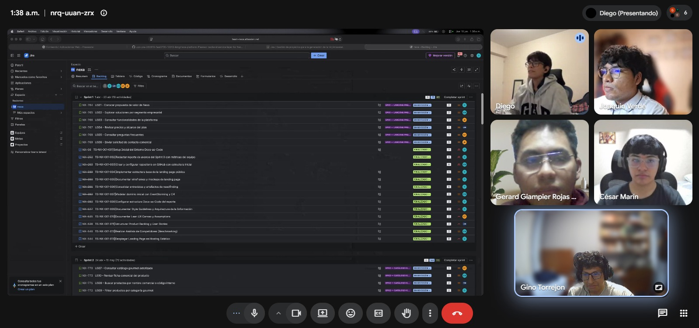

CAMBIAR IMAGEN PENDIENTEEEEEEEEEEEEEEEEE

Figura. Reunión virtual del equipo para coordinación de Sprint 4.

#### 5.2.4.2. Aspect Leaders and Collaborators

La ejecución del Sprint 4 se organizó por bounded contexts, porque el incremento final TB2 priorizó la culminación absoluta de los Web Services de nexa-platform y su integración total con los frentes frontend. Por ello, la matriz de liderazgo y colaboración usa como columnas los contextos consolidados y validados durante el sprint, en lugar de frentes genéricos como project management, architecture o documentation. La marca L identifica al responsable principal del contexto y la marca C identifica participación de soporte, integración total o revisión técnica final del ecosistema productivo.

*Distribución de liderazgos y colaboradores por bounded context en el Sprint 4*

| Team Member | GitHub Username | Catalog Management | Sales | Warehouse | IAM | Invoicing | Logistics | Shared Kernel |
|---|---|:---:|:---:|:---:|:---:|:---:|:---:|:---:|
| Yucra Sandoval, Diego Sebastian | DiegoS284 | C | L | C | L | C | C | C |
| Verde Bueno, Joaquín Francisco | JoaquinVerde115 | C | C | L | - | C | C | C |
| Marín Cueva, César Fernando | Cmarin2802 | - | C | - | C | C | L | L |
| Torrejón De Los Santos, Gino Rodrigo | R0obxdnt-bit | L | C | C | - | - | - | C |
| Rojas Mancilla, Gerard Gianpier | GerardRojasMancilla | - | - | C | C | L | C | C |

La matriz refleja que el avance del sprint no se distribuyó por tareas aisladas, sino por módulos del dominio. `Catalog Management` concentra el catálogo de productos refrigerados, `Sales` soporta solicitudes y órdenes B2B, `Warehouse` cubre disponibilidad e inventario, `IAM` permite la base de autenticación, `Invoicing` prepara la trazabilidad documental y de pagos, `Logistics` organiza el soporte para despacho, y `Shared Kernel` agrupa elementos comunes requeridos por los bounded contexts.

#### 5.2.4.3. Sprint Backlog 4

El Sprint Backlog 4 concentra el trabajo asociado al hito de cierre definitivo TB2 y a la integración total del ecosistema de Nexa Platform. Su objetivo principal fue establecer la culminación absoluta de los Web Services completando el mapa total de la API por bounded contexts, eliminando de forma íntegra los servicios simulados mediante la conexión de los controladores de producción, y consolidando la seguridad con políticas IAM operativas, la optimización de la persistencia en PostgreSQL y el despliegue final estable en Render para la sustentación del proyecto. Este alcance se encuentra registrado formalmente en la herramienta de gestión mediante el Sprint Backlog 4 en Jira, cuya función dentro del informe es sustentar la planificación del incremento final, la estimación total del sprint, la distribución de actividades y el cierre absoluto de los work-items vinculados con la interconexión de la Web Application, la Landing Page y los Web Services listos para producción.

**Sprint Backlog 4 en Jira.**

La imagen presenta el backlog del Sprint 4 registrado en Jira, cuya función dentro del informe es sustentar la planificación del incremento final TB2, la estimación total del sprint, la distribución de actividades y el cierre definitivo de los work-items vinculados con la Web Application, los Web Services, la documentación en Swagger/OpenAPI, la persistencia en PostgreSQL y los releases de producción.

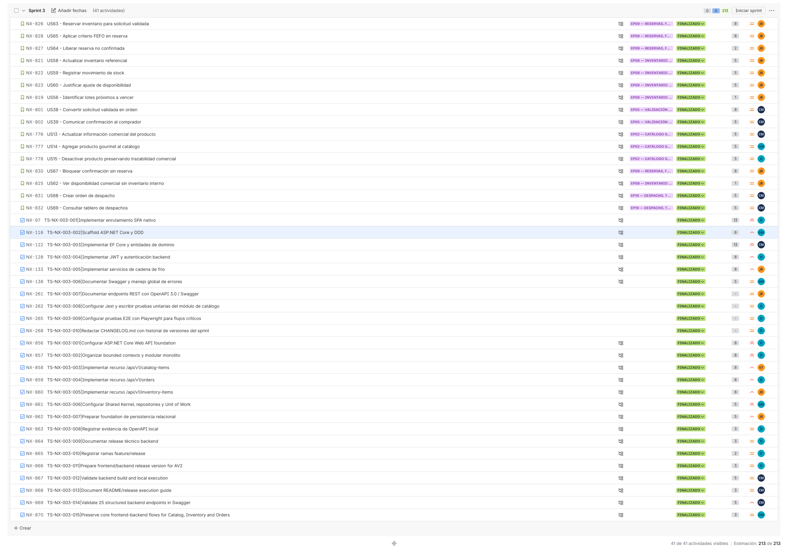

> *Nota:* La captura evidencia la planificación actualizada del Sprint 4, con actividades visibles, estimación total del sprint, responsables, estados y work-items orientados al cierre TB2 de WebApp, Web Services, Swagger/OpenAPI, PostgreSQL y release. Elaboración propia.

**URL del board/backlog:** [https://team-nexa.atlassian.net/jira/software/projects/NX/boards/1/backlog](https://team-nexa.atlassian.net/jira/software/projects/NX/boards/1/backlog)

La siguiente tabla presenta todas las historias y tareas registradas en Jira para el Sprint 4. Los identificadores, responsables y estimaciones se mantienen como trazabilidad documental del cierre TB2.

| Sprint # | User Story Id | User Story Title | Work-Item / Task Id | Task Title | Description | Estimation (Hours) | Assigned To | Status |
|---|---|---|---|---|---|---:|---|---|
| Sprint 3 | US13 | Actualizar información comercial del producto | NX-776 | Actualizar información comercial del producto | Actualizar precio, presentación, unidad de venta y visibilidad de productos activos, conservando la coherencia comercial del catálogo. | 5.0 | César Marín | Finalizado |
| Sprint 3 | US14 | Agregar producto gourmet al catálogo | NX-777 | Agregar producto gourmet al catálogo | Registrar productos gourmet refrigerados con nombre, categoría, presentación, unidad de venta, conservación y visibilidad comercial. | 5.0 | Gerard Gianpier Rojas Mancilla | Finalizado |
| Sprint 3 | US15 | Desactivar producto preservando trazabilidad comercial | NX-778 | Desactivar producto preservando trazabilidad comercial | Retirar productos de nuevas solicitudes sin eliminar su presencia en órdenes y registros históricos. | 5.0 | Diego Yucra Sandoval | Finalizado |
| Sprint 3 | US38 | Convertir solicitud validada en orden | NX-801 | Convertir solicitud validada en orden | Generar una orden de compra confirmada cuando la solicitud cuenta con cliente validado e inventario reservado. | 8.0 | César Marín | Finalizado |
| Sprint 3 | US39 | Comunicar confirmación al comprador | NX-802 | Comunicar confirmación al comprador | Reflejar en el portal del comprador la confirmación y la orden asociada a la solicitud original. | 5.0 | César Marín | Finalizado |
| Sprint 3 | US56 | Identificar lotes próximos a vencer | NX-819 | Identificar lotes próximos a vencer | Mostrar alertas con producto, lote y fecha de vencimiento para priorizar la rotación y reducir merma. | 1.0 | Joaquín Francisco Verde Bueno | Finalizado |
| Sprint 3 | US58 | Actualizar inventario referencial | NX-821 | Actualizar inventario referencial | Actualizar la disponibilidad referencial y conservar el valor anterior cuando la operación no pueda confirmarse. | 5.0 | Joaquín Francisco Verde Bueno | Finalizado |
| Sprint 3 | US59 | Registrar movimiento de stock | NX-822 | Registrar movimiento de stock | Registrar ingresos, salidas, reservas y ajustes por producto y lote, validando cantidad, motivo y disponibilidad. | 5.0 | Joaquín Francisco Verde Bueno | Finalizado |
| Sprint 3 | US60 | Justificar ajuste de disponibilidad | NX-823 | Justificar ajuste de disponibilidad | Asociar cada ajuste manual de disponibilidad con producto, lote, motivo y responsable. | 5.0 | Joaquín Francisco Verde Bueno | Finalizado |
| Sprint 3 | US62 | Ver disponibilidad comercial sin inventario interno | NX-825 | Ver disponibilidad comercial sin inventario interno | Exponer al comprador la disponibilidad comercial general sin revelar lotes ni información interna de almacén. | 1.0 | Joaquín Francisco Verde Bueno | Finalizado |
| Sprint 3 | US63 | Reservar inventario para solicitud validada | NX-826 | Reservar inventario para solicitud validada | Crear una reserva asociada a una solicitud validada y controlar los casos de stock insuficiente o reserva parcial. | 8.0 | Joaquín Francisco Verde Bueno | Finalizado |
| Sprint 3 | US64 | Liberar reserva no confirmada | NX-827 | Liberar reserva no confirmada | Devolver al inventario operativo el stock reservado de solicitudes rechazadas o canceladas. | 2.0 | Joaquín Francisco Verde Bueno | Finalizado |
| Sprint 3 | US65 | Aplicar criterio FEFO en reserva | NX-828 | Aplicar criterio FEFO en reserva | Priorizar lotes con vencimiento más próximo y excluir lotes vencidos o bloqueados durante la reserva. | 8.0 | Joaquín Francisco Verde Bueno | Finalizado |
| Sprint 3 | US67 | Bloquear confirmación sin reserva | NX-830 | Bloquear confirmación sin reserva | Impedir el avance operativo de una orden que no cuente con reserva suficiente e informar el motivo del bloqueo. | 8.0 | Joaquín Francisco Verde Bueno | Finalizado |
| Sprint 3 | US68 | Crear orden de despacho | NX-831 | Crear orden de despacho | Generar un despacho con productos, cliente y dirección a partir de una orden confirmada. | 5.0 | César Marín | Finalizado |
| Sprint 3 | US69 | Consultar tablero de despachos | NX-832 | Consultar tablero de despachos | Consultar despachos pendientes, programados, en ruta, entregados e incidentados con su detalle operativo. | 5.0 | César Marín | Finalizado |
| Sprint 3 | Task | Navegación transaccional de la Web Application | NX-97 | TS-NX-003-001 - Implementar enrutamiento SPA nativo | Implementar navegación SPA nativa para soportar el portal transaccional y sus recorridos internos. | 13.0 | Diego Yucra Sandoval | Finalizado |
| Sprint 3 | Task | Foundation backend con DDD | NX-116 | TS-NX-003-002 - Scaffold ASP.NET Core y DDD | Preparar la estructura inicial ASP.NET Core y la organización Domain-Driven Design del backend. | 8.0 | Gerard Gianpier Rojas Mancilla | Finalizado |
| Sprint 3 | Task | Persistencia y dominio backend | NX-122 | TS-NX-003-003 - Implementar EF Core y entidades de dominio | Incorporar EF Core y las entidades de dominio necesarias para la persistencia de la Platform API. | 13.0 | César Marín | Finalizado |
| Sprint 3 | Task | Autenticación backend | NX-128 | TS-NX-003-004 - Implementar JWT y autenticación backend | Implementar la base de autenticación mediante JWT para los accesos de la Web Application y la API. | 8.0 | Diego Yucra Sandoval | Finalizado |
| Sprint 3 | Task | Servicios operativos de cadena de frío | NX-133 | TS-NX-003-005 - Implementar servicios de cadena de frío | Implementar servicios backend vinculados con conservación, inventario y operación de productos refrigerados. | 8.0 | Joaquín Francisco Verde Bueno | Finalizado |
| Sprint 3 | Task | Documentación y manejo de errores de la API | NX-138 | TS-NX-003-006 - Documentar Swagger y manejo global de errores | Configurar documentación Swagger/OpenAPI y un mecanismo común para el manejo de errores del backend. | 5.0 | Gerard Gianpier Rojas Mancilla | Finalizado |
| Sprint 3 | Task | Documentación de endpoints REST | NX-261 | TS-NX-003-007 - Documentar endpoints REST con OpenAPI 3.0 / Swagger | Documentar endpoints de autenticación, catálogo, pedidos y usuarios con esquemas y ejemplos de solicitud y respuesta. | 6.0 | Joaquín Francisco Verde Bueno | Finalizado |
| Sprint 3 | Task | Pruebas unitarias de catálogo | NX-262 | TS-NX-003-008 - Configurar Jest y escribir pruebas unitarias del módulo de catálogo | Configurar Jest y cubrir búsqueda, filtros, paginación y acceso por cuenta del módulo de catálogo. | 8.0 | Diego Yucra Sandoval | Finalizado |
| Sprint 3 | Task | Pruebas end-to-end | NX-265 | TS-NX-003-009 - Configurar pruebas E2E con Playwright para flujos críticos | Configurar pruebas E2E para login, catálogo, creación de pedidos y descarga de órdenes, integradas al flujo de CI. | 10.0 | Diego Yucra Sandoval | Finalizado |
| Sprint 3 | Task | Historial de versiones | NX-268 | TS-NX-003-010 - Redactar CHANGELOG.md con historial de versiones del sprint | Registrar cambios por versión y categoría siguiendo una estructura de changelog mantenible. | 4.0 | Diego Yucra Sandoval | Finalizado |
| Sprint 3 | Task | Backend foundation de Nexa Platform | NX-856 | TS-NX-003-001 - Configurar ASP.NET Core Web API foundation | Preparar C#, .NET 10, `Program.cs`, controladores REST, Swagger/OpenAPI y configuración base para ejecución local. | 8.0 | Diego Yucra Sandoval | Finalizado |
| Sprint 3 | Task | Arquitectura modular backend | NX-857 | TS-NX-003-002 - Organizar bounded contexts y modular monolito | Separar Catalog Management, Sales, Warehouse y Shared Kernel dentro de una arquitectura modular monolítica. | 8.0 | Diego Yucra Sandoval | Finalizado |
| Sprint 3 | Task | Catalog Management REST resource | NX-858 | TS-NX-003-003 - Implementar recurso `/api/v1/catalog-items` | Implementar el aggregate `CatalogItem`, su controlador REST y los contratos iniciales del catálogo. | 8.0 | Gino Torrejón | Finalizado |
| Sprint 3 | Task | Sales REST resource | NX-859 | TS-NX-003-004 - Implementar recurso `/api/v1/orders` | Implementar el aggregate `Order`, su controlador REST y contratos para órdenes comerciales B2B. | 8.0 | Diego Yucra Sandoval | Finalizado |
| Sprint 3 | Task | Warehouse REST resource | NX-860 | TS-NX-003-005 - Implementar recurso `/api/v1/inventory-items` | Implementar el aggregate `InventoryItem`, su controlador REST y contratos de disponibilidad e inventario. | 8.0 | Joaquín Francisco Verde Bueno | Finalizado |
| Sprint 3 | Task | Shared Kernel y patrones de persistencia | NX-861 | TS-NX-003-006 - Configurar Shared Kernel, repositories y Unit of Work | Registrar contratos compartidos, interfaces de repositorio y Unit of Work para los bounded contexts. | 5.0 | Gerard Gianpier Rojas Mancilla | Finalizado |
| Sprint 3 | Task | Persistencia relacional AV2 | NX-862 | TS-NX-003-007 - Preparar foundation de persistencia relacional | Configurar EF Core y la base de persistencia relacional requerida por el despliegue controlado de AV2. | 5.0 | Joaquín Francisco Verde Bueno | Finalizado |
| Sprint 3 | Task | Evidencia Swagger/OpenAPI | NX-863 | TS-NX-003-008 - Registrar evidencia de OpenAPI local | Documentar la exposición local de Swagger/OpenAPI para los recursos REST priorizados. | 3.0 | Diego Yucra Sandoval | Finalizado |
| Sprint 3 | Task | Release técnico backend | NX-864 | TS-NX-003-009 - Documentar release técnico backend | Registrar el alcance, los límites técnicos y la trazabilidad del release backend del incremento. | 3.0 | Diego Yucra Sandoval | Finalizado |
| Sprint 3 | Task | GitFlow y colaboración backend | NX-865 | TS-NX-003-010 - Registrar ramas feature/release | Documentar las ramas feature, integración y release utilizadas durante el desarrollo backend. | 2.0 | Diego Yucra Sandoval | Finalizado |
| Sprint 3 | Task | Release AV2 frontend/backend | NX-866 | TS-NX-003-011 - Prepare frontend/backend release version for AV2 | Preparar las versiones de Web Application y Web Services API usadas en el corte AV2. | 3.0 | Diego Yucra Sandoval | Finalizado |
| Sprint 3 | Task | Validación de build backend | NX-867 | TS-NX-003-012 - Validate backend build and local execution | Validar la compilación y ejecución local del backend antes de cerrar la evidencia técnica. | 5.0 | César Marín | Finalizado |
| Sprint 3 | Task | Guía de ejecución y release | NX-868 | TS-NX-003-013 - Document README/release execution guide | Documentar instrucciones de ejecución, alcance del release y límites técnicos del corte frontend/backend. | 3.0 | César Marín | Finalizado |
| Sprint 3 | Task | Validación de endpoints Swagger | NX-869 | TS-NX-003-014 - Validate 25 structured backend endpoints in Swagger | Validar en Swagger/OpenAPI los 25 endpoints HTTP estructurados de la Platform API. | 5.0 | César Marín | Finalizado |
| Sprint 3 | Task | Flujos core frontend/backend | NX-870 | TS-NX-003-015 - Preserve core frontend-backend flows for Catalog, Inventory and Orders | Mantener la trazabilidad de Catalog, Inventory/Warehouse y Orders/Sales como flujos prioritarios de integración. | 3.0 | Gerard Gianpier Rojas Mancilla | Finalizado |

> *Nota:* Las estimaciones se expresan en horas para conservar el formato solicitado por el statement. Para las tareas que no contaban con horas registradas se realizó una estimación técnica según su alcance, complejidad y trabajo descrito, sin convertir ni utilizar Story Points como referencia. Elaboración propia.

**Seguimiento de tareas Sprint 3 en Jira.**

La imagen presenta una vista de seguimiento de tareas del Sprint 3. Esta evidencia permite revisar responsables, prioridades, estados, resolución y fechas de actualización para reforzar la trazabilidad del Sprint Backlog.

> *Nota:* La vista de seguimiento de tareas muestra responsables, informadores, prioridad, estado, resolución y fechas de actualización durante el Sprint 3. Elaboración propia.

La siguiente tabla documenta únicamente las incidencias de tipo `Subtask` asociadas a las tareas padre del Sprint 3. Debido a que las sub-tasks no heredan directamente el campo `Sprint` en Jira, su pertenencia se determinó mediante la relación con los work-items `NX-856` a `NX-870`.

| Sprint # | Belongs To (US / Task) | Parent Id | Parent Title | Subtask Id | Subtask Title | Description | Estimation (Hours) | Assigned To | Status |
|---|---|---|---|---|---|---|---:|---|---|
| Sprint 3 | US13 (NX-776) | NX-776 | Actualizar información comercial del producto | NX-896 | Desarrollo de la interfaz de edición y validación de entrada | Implementar el formulario de edición y validar los campos comerciales obligatorios. | 6.0 | César Marín | Finalizado |
| Sprint 3 | US13 (NX-776) | NX-776 | Actualizar información comercial del producto | NX-897 | Implementación de la persistencia de datos y sincronización de visibilidad | Guardar los cambios del producto y reflejar su visibilidad en el catálogo del comprador. | 6.0 | César Marín | Finalizado |
| Sprint 3 | US14 (NX-777) | NX-777 | Agregar producto gourmet al catálogo | NX-898 | Desarrollo del formulario de alta y validación de datos | Implementar el alta de productos y validar los datos comerciales y de conservación requeridos. | 6.0 | Gerard Gianpier Rojas Mancilla | Finalizado |
| Sprint 3 | US14 (NX-777) | NX-777 | Agregar producto gourmet al catálogo | NX-899 | Implementación del motor de creación y visibilidad en catálogo | Crear el producto y publicarlo automáticamente para los compradores autorizados. | 6.0 | Gerard Gianpier Rojas Mancilla | Finalizado |
| Sprint 3 | US15 (NX-778) | NX-778 | Desactivar producto preservando trazabilidad comercial | NX-900 | Implementación del estado de desactivación lógica y visibilidad | Desactivar lógicamente el producto y retirarlo de nuevas solicitudes comerciales. | 6.0 | Diego | Finalizado |
| Sprint 3 | US15 (NX-778) | NX-778 | Desactivar producto preservando trazabilidad comercial | NX-901 | Blindaje de integridad y persistencia histórica | Impedir la eliminación definitiva y conservar las referencias históricas del producto. | 6.0 | Diego | Finalizado |
| Sprint 3 | US38 (NX-801) | NX-801 | Convertir solicitud validada en orden | NX-946 | Motor de conversión atómica y prevención de duplicidad | Convertir la solicitud validada en orden y evitar conversiones duplicadas. | 6.0 | César Marín | Finalizado |
| Sprint 3 | US38 (NX-801) | NX-801 | Convertir solicitud validada en orden | NX-947 | Sincronización de estados y visor de órdenes confirmadas | Actualizar los estados posteriores a la conversión y mostrar la orden confirmada. | 4.0 | César Marín | Finalizado |
| Sprint 3 | US39 (NX-802) | NX-802 | Comunicar confirmación al comprador | NX-948 | Disparador de notificación y actualización de estado en portal | Actualizar la solicitud como confirmada en el portal del comprador. | 4.0 | César Marín | Finalizado |
| Sprint 3 | US39 (NX-802) | NX-802 | Comunicar confirmación al comprador | NX-949 | Enlace relacional entre solicitud y orden | Vincular la solicitud original con la orden de compra generada. | 4.0 | César Marín | Finalizado |
| Sprint 3 | US56 (NX-819) | NX-819 | Identificar lotes próximos a vencer | NX-985 | Panel de alertas de vencimiento | Mostrar y ordenar los lotes próximos a vencer en una vista consolidada. | 4.0 | Joaquín Francisco Verde Bueno | Finalizado |
| Sprint 3 | US56 (NX-819) | NX-819 | Identificar lotes próximos a vencer | NX-986 | Lógica de cálculo de días para vencimiento | Calcular los días restantes y asignar una etiqueta de urgencia a cada lote. | 6.0 | Joaquín Francisco Verde Bueno | Finalizado |
| Sprint 3 | US58 (NX-821) | NX-821 | Actualizar inventario referencial | NX-989 | Motor de ajuste de stock | Permitir ajustes manuales de stock con motivo y registro de auditoría. | 6.0 | Joaquín Francisco Verde Bueno | Finalizado |
| Sprint 3 | US58 (NX-821) | NX-821 | Actualizar inventario referencial | NX-990 | Lógica de validación de integridad | Validar el ajuste y ejecutar rollback si la actualización no puede confirmarse. | 6.0 | Joaquín Francisco Verde Bueno | Finalizado |
| Sprint 3 | US59 (NX-822) | NX-822 | Registrar movimiento de stock | NX-991 | Motor de transacciones de inventario | Registrar ingresos, salidas y ajustes por producto y lote con trazabilidad. | 6.0 | Joaquín Francisco Verde Bueno | Finalizado |
| Sprint 3 | US59 (NX-822) | NX-822 | Registrar movimiento de stock | NX-992 | Validador de integridad y control de acceso | Validar datos, disponibilidad y permisos antes de registrar el movimiento. | — | Joaquín Francisco Verde Bueno | Finalizado |
| Sprint 3 | US60 (NX-823) | NX-823 | Justificar ajuste de disponibilidad | NX-993 | Módulo de registro con motivo obligatorio | Exigir y registrar el motivo, producto, lote, cantidad y responsable del ajuste. | 6.0 | Joaquín Francisco Verde Bueno | Finalizado |
| Sprint 3 | US60 (NX-823) | NX-823 | Justificar ajuste de disponibilidad | NX-994 | Sincronización de saldos en tiempo real | Actualizar inmediatamente el saldo disponible después de confirmar el ajuste. | 4.0 | Joaquín Francisco Verde Bueno | Finalizado |
| Sprint 3 | US62 (NX-825) | NX-825 | Ver disponibilidad comercial sin inventario interno | NX-997 | Catálogo público B2B | Mostrar estados comerciales de disponibilidad sin exponer cantidades internas. | 5.0 | Joaquín Francisco Verde Bueno | Finalizado |
| Sprint 3 | US62 (NX-825) | NX-825 | Ver disponibilidad comercial sin inventario interno | NX-998 | Separación de información | Excluir lotes, vencimientos y cantidades internas de la respuesta para compradores. | 6.0 | Joaquín Francisco Verde Bueno | Finalizado |
| Sprint 3 | US63 (NX-826) | NX-826 | Reservar inventario para solicitud validada | NX-999 | Módulo de reserva activa | Reservar stock disponible para una solicitud validada y registrar al responsable. | 6.0 | Joaquín Francisco Verde Bueno | Finalizado |
| Sprint 3 | US63 (NX-826) | NX-826 | Reservar inventario para solicitud validada | NX-1000 | Control de reservas | Validar stock, reservas parciales y permisos antes de habilitar la conversión. | 6.0 | Joaquín Francisco Verde Bueno | Finalizado |
| Sprint 3 | US64 (NX-827) | NX-827 | Liberar reserva no confirmada | NX-1001 | Módulo de liberación de stock | Liberar el stock de solicitudes canceladas o rechazadas y devolverlo al disponible. | 6.0 | Joaquín Francisco Verde Bueno | Finalizado |
| Sprint 3 | US64 (NX-827) | NX-827 | Liberar reserva no confirmada | NX-1002 | Validador de estados y protección de integridad | Bloquear la liberación cuando la solicitud ya se convirtió en una orden. | 4.0 | Joaquín Francisco Verde Bueno | Finalizado |
| Sprint 3 | US65 (NX-828) | NX-828 | Aplicar criterio FEFO en reserva | NX-1003 | Motor de selección FEFO | Seleccionar primero los lotes con vencimiento más próximo hasta completar la reserva. | 6.0 | Joaquín Francisco Verde Bueno | Finalizado |
| Sprint 3 | US65 (NX-828) | NX-828 | Aplicar criterio FEFO en reserva | NX-1004 | Validador de calidad y exclusión de lotes | Excluir lotes vencidos o bloqueados antes de aplicar la selección FEFO. | 4.0 | Joaquín Francisco Verde Bueno | Finalizado |
| Sprint 3 | US67 (NX-830) | NX-830 | Bloquear confirmación sin reserva | NX-1007 | Validador de flujo operativo | Bloquear el avance cuando la cantidad reservada sea menor que la solicitada. | — | Joaquín Francisco Verde Bueno | Finalizado |
| Sprint 3 | US67 (NX-830) | NX-830 | Bloquear confirmación sin reserva | NX-1008 | Panel de transparencia comercial | Mostrar el motivo del bloqueo para facilitar el seguimiento comercial. | 5.0 | Joaquín Francisco Verde Bueno | Finalizado |
| Sprint 3 | US68 (NX-831) | NX-831 | Crear orden de despacho | NX-1009 | Motor de generación de despachos | Crear el despacho desde una orden confirmada con productos, lotes, cliente y dirección. | 6.0 | César Marín | Finalizado |
| Sprint 3 | US68 (NX-831) | NX-831 | Crear orden de despacho | NX-1010 | Tablero de control de logística | Mostrar los despachos creados y un estado vacío cuando no existan registros. | 4.0 | César Marín | Finalizado |
| Sprint 3 | US69 (NX-832) | NX-832 | Consultar tablero de despachos | NX-1011 | Tablero de control | Organizar y filtrar despachos por estado operativo y fecha. | 6.0 | César Marín | Finalizado |
| Sprint 3 | US69 (NX-832) | NX-832 | Consultar tablero de despachos | NX-1012 | Vista de detalle de despacho | Mostrar cliente, productos y acciones disponibles para cada despacho. | 4.0 | César Marín | Finalizado |
| Sprint 3 | Task NX-97 | NX-97 | Implementar enrutamiento SPA nativo | NX-98 | Crear clase Router en JS | Implementar la clase responsable del enrutamiento SPA. | — | Diego | Finalizado |
| Sprint 3 | Task NX-97 | NX-97 | Implementar enrutamiento SPA nativo | NX-99 | Mapear rutas del Dashboard a funciones de renderizado | Asociar cada ruta del dashboard con su función de renderizado. | — | Diego | Finalizado |
| Sprint 3 | Task NX-116 | NX-116 | Scaffold ASP.NET Core y DDD | NX-120 | Crear proyectos .NET y referencias | Crear los proyectos de la solución y configurar sus referencias. | — | Gerard Gianpier Rojas Mancilla | Finalizado |
| Sprint 3 | Task NX-116 | NX-116 | Scaffold ASP.NET Core y DDD | NX-121 | Configurar inyección de dependencias (IoC) | Registrar las dependencias y servicios requeridos por la solución. | — | Gerard Gianpier Rojas Mancilla | Finalizado |
| Sprint 3 | Task NX-122 | NX-122 | Implementar EF Core y entidades de dominio | NX-123 | Codificar entidades Company, User y Order | Implementar las entidades de dominio principales para la persistencia. | — | César Marín | Finalizado |
| Sprint 3 | Task NX-122 | NX-122 | Implementar EF Core y entidades de dominio | NX-124 | Configurar NexaDbContext y Fluent API | Configurar el contexto de EF Core y el mapeo relacional. | — | César Marín | Finalizado |
| Sprint 3 | Task NX-122 | NX-122 | Implementar EF Core y entidades de dominio | NX-125 | Ejecutar migración InitialCreate | Crear y ejecutar la migración inicial de la base de datos. | — | César Marín | Finalizado |
| Sprint 3 | Task NX-128 | NX-128 | Implementar JWT y autenticación backend | NX-129 | Configurar JWT Bearer options en Program.cs | Configurar la validación y autenticación mediante JWT Bearer. | — | Diego | Finalizado |
| Sprint 3 | Task NX-128 | NX-128 | Implementar JWT y autenticación backend | NX-130 | Desarrollar AuthController (Login/Register) | Implementar los endpoints de inicio de sesión y registro. | — | Diego | Finalizado |
| Sprint 3 | Task NX-133 | NX-133 | Implementar servicios de cadena de frío | NX-134 | Crear interfaz y clase IOrderService | Definir el contrato y la implementación inicial del servicio de órdenes. | — | Joaquín Francisco Verde Bueno | Finalizado |
| Sprint 3 | Task NX-133 | NX-133 | Implementar servicios de cadena de frío | NX-135 | Desarrollar OrdersController (GET/POST) | Implementar endpoints para consultar y crear órdenes. | — | Joaquín Francisco Verde Bueno | Finalizado |
| Sprint 3 | Task NX-138 | NX-138 | Documentar Swagger y manejo global de errores | NX-140 | Implementar Middleware de Excepciones | Centralizar el manejo de errores y respuestas de excepción. | — | Gerard Gianpier Rojas Mancilla | Finalizado |
| Sprint 3 | Task NX-138 | NX-138 | Documentar Swagger y manejo global de errores | NX-141 | Configurar XML Comments en Swagger | Incorporar los comentarios XML en la documentación OpenAPI. | — | Gerard Gianpier Rojas Mancilla | Finalizado |
| Sprint 3 | Task NX-856 | NX-856 | Configurar ASP.NET Core Web API foundation | NX-1060 | Inicialización de la Solución | Crear la jerarquía de directorios con DDD y configurar la solución para separar responsabilidades. | 6.0 | Diego | Por hacer |
| Sprint 3 | Task NX-856 | NX-856 | Configurar ASP.NET Core Web API foundation | NX-1061 | Implementación de Swagger | Habilitar Swagger para visualizar y probar endpoints, manteniendo actualizado el contrato de API. | 6.0 | Diego | Por hacer |
| Sprint 3 | Task NX-857 | NX-857 | Organizar bounded contexts y modular monolito | NX-1062 | Creación de carpetas de módulos | Crear directorios raíz autónomos para los módulos de dominio y sus entidades, casos de uso y lógica. | 6.0 | Diego | Por hacer |
| Sprint 3 | Task NX-857 | NX-857 | Organizar bounded contexts y modular monolito | NX-1063 | Configuración del Shared Kernel | Centralizar componentes compartidos y evitar dependencias circulares entre módulos. | 6.0 | Diego | Por hacer |
| Sprint 3 | Task NX-858 | NX-858 | Implementar recurso `/api/v1/catalog-items` | NX-1064 | Creación de DTOs para el recurso | Implementar DTOs de entrada y salida con las validaciones requeridas por el recurso de catálogo. | 4.0 | Gino Torrejon | Por hacer |
| Sprint 3 | Task NX-858 | NX-858 | Implementar recurso `/api/v1/catalog-items` | NX-1065 | Implementación del Controller REST | Implementar métodos REST, manejo de excepciones de dominio y documentación del controlador. | 6.0 | Gino Torrejon | Por hacer |
| Sprint 3 | Task NX-859 | NX-859 | Implementar recurso `/api/v1/orders` | NX-1066 | Creación de DTOs para solicitudes y respuestas de órdenes | Diseñar DTOs para crear órdenes y devolver su detalle, incluido el desglose de costos. | 6.0 | Diego | Por hacer |
| Sprint 3 | Task NX-859 | NX-859 | Implementar recurso `/api/v1/orders` | NX-1067 | Implementación de endpoints REST para órdenes | Desarrollar endpoints POST y GET e implementar el manejo de estados de la orden. | 6.0 | Diego | Por hacer |
| Sprint 3 | Task NX-860 | NX-860 | Implementar recurso `/api/v1/inventory-items` | NX-1068 | Creación de DTOs para consultas de disponibilidad | Definir DTOs para consultar stock y realizar ajustes sin exponer la lógica interna de almacén. | 6.0 | Joaquín Francisco Verde Bueno | Por hacer |
| Sprint 3 | Task NX-860 | NX-860 | Implementar recurso `/api/v1/inventory-items` | NX-1069 | Desarrollo de endpoints REST para el Warehouse | Implementar consultas de disponibilidad y ajustes operativos con validación de permisos. | 6.0 | Joaquín Francisco Verde Bueno | Por hacer |
| Sprint 3 | Task NX-861 | NX-861 | Configurar Shared Kernel, repositories y Unit of Work | NX-1070 | Definición del Shared Kernel | Implementar clases base e interfaces transversales para Catalog, Sales y Warehouse. | 6.0 | Gerard Gianpier Rojas Mancilla | Por hacer |
| Sprint 3 | Task NX-861 | NX-861 | Configurar Shared Kernel, repositories y Unit of Work | NX-1071 | Contratos genéricos para la persistencia | Definir contratos genéricos de persistencia y mantener las reglas específicas dentro de cada módulo. | 6.0 | Gerard Gianpier Rojas Mancilla | Por hacer |
| Sprint 3 | Task NX-862 | NX-862 | Preparar foundation de persistencia relacional | NX-1072 | Validaciones de conectividad | Verificar la conectividad con el servidor MySQL durante el arranque de la aplicación. | 4.0 | Joaquín Francisco Verde Bueno | Por hacer |
| Sprint 3 | Task NX-862 | NX-862 | Preparar foundation de persistencia relacional | NX-1073 | Configuración del driver de conexión | Configurar el proveedor de datos y los parámetros de conexión entre ASP.NET Core y MySQL. | 6.0 | Joaquín Francisco Verde Bueno | Por hacer |
| Sprint 3 | Task NX-863 | NX-863 | Registrar evidencia de OpenAPI local | NX-1074 | Ajuste de visualización de Swagger UI | Organizar las secciones de Swagger según los bounded contexts para mejorar su legibilidad. | 6.0 | Diego | Por hacer |
| Sprint 3 | Task NX-863 | NX-863 | Registrar evidencia de OpenAPI local | NX-1075 | Validación de integridad del contrato | Revisar DTOs, campos, tipos y nombres expuestos en Swagger y eliminar referencias problemáticas. | 6.0 | Diego | Por hacer |
| Sprint 3 | Task NX-864 | NX-864 | Documentar release técnico backend | NX-1076 | Elaboración del registro de cambios | Consolidar las funcionalidades técnicas añadidas en la configuración, arquitectura y recursos backend. | 6.0 | Diego | Por hacer |
| Sprint 3 | Task NX-864 | NX-864 | Documentar release técnico backend | NX-1077 | Documentación de alcance y limitaciones | Registrar explícitamente los elementos fuera del alcance de la versión. | 4.0 | Joaquín Francisco Verde Bueno | Por hacer |
| Sprint 3 | Task NX-865 | NX-865 | Registrar ramas feature/release | NX-1078 | Documentación de Gitflow | Documentar el estándar de nombres y uso de ramas feature y release. | 4.0 | Diego | Por hacer |
| Sprint 3 | Task NX-865 | NX-865 | Registrar ramas feature/release | NX-1079 | Proceso de integración | Revisar pull requests e integrar las ramas feature en la rama de release. | 6.0 | Diego | Por hacer |
| Sprint 3 | Task NX-866 | NX-866 | Prepare frontend/backend release version for AV2 | NX-1080 | Verificación de consistencia de contratos | Validar que los DTOs del frontend Angular coincidan con las definiciones del backend. | 6.0 | Diego | Finalizado |
| Sprint 3 | Task NX-866 | NX-866 | Prepare frontend/backend release version for AV2 | NX-1081 | Preparación de perfiles de configuración | Crear perfiles de configuración para Angular y .NET sin valores hardcoded. | 6.0 | César Marín | Finalizado |
| Sprint 3 | Task NX-867 | NX-867 | Validate backend build and local execution | NX-1082 | Pruebas funcionales en Swagger UI | Probar controladores de Catalog, Orders e Inventory y verificar respuestas exitosas. | 4.0 | César Marín | Por hacer |
| Sprint 3 | Task NX-867 | NX-867 | Validate backend build and local execution | NX-1083 | Verificación de archivos residuales y logs | Eliminar archivos temporales y logs innecesarios y completar las exclusiones del repositorio. | 4.0 | César Marín | Por hacer |
| Sprint 3 | Task NX-868 | NX-868 | Document README/release execution guide | NX-1084 | Creación de la documentación de entrada | Redactar el README con infraestructura, prerrequisitos y configuración local de la base de datos. | 6.0 | César Marín | Por hacer |
| Sprint 3 | Task NX-868 | NX-868 | Document README/release execution guide | NX-1085 | Registro de fronteras del release | Declarar los componentes implementados y los elementos fuera del alcance de la versión. | 4.0 | César Marín | Por hacer |
| Sprint 3 | Task NX-869 | NX-869 | Validate 25 structured backend endpoints in Swagger | NX-1086 | Mapeo y validación de cobertura de endpoints | Verificar que los 25 endpoints estén registrados en Swagger con rutas estandarizadas. | 4.0 | César Marín | Por hacer |
| Sprint 3 | Task NX-869 | NX-869 | Validate 25 structured backend endpoints in Swagger | NX-1087 | Auditoría de DTOs | Validar esquemas, tipos de datos y restricciones de los objetos de entrada y salida. | 6.0 | César Marín | Por hacer |
| Sprint 3 | Task NX-870 | NX-870 | Preserve core frontend-backend flows for Catalog, Inventory and Orders | NX-1088 | Sincronización de estado entre contextos | Documentar la consistencia de identificadores y entidades entre bounded contexts durante el flujo de una orden. | 6.0 | Gerard Gianpier Rojas Mancilla | Por hacer |
| Sprint 3 | Task NX-870 | NX-870 | Preserve core frontend-backend flows for Catalog, Inventory and Orders | NX-1089 | Verificación estricta de interfaces | Asegurar que los cambios de DTOs C# se reflejen inmediatamente en las interfaces frontend. | 6.0 | Gerard Gianpier Rojas Mancilla | Por hacer |

> *Nota:* Las estimaciones, responsables y estados corresponden a los valores registrados en Jira para las sub-tasks consultadas. Las incidencias se vinculan con el Sprint 3 mediante sus tareas padre. Elaboración propia.

#### 5.2.4.4. Development Evidence for Sprint Review

La evidencia de desarrollo del Sprint 4 se organiza de acuerdo con el alcance de cierre definitivo TB2: la versión final y consolidada de los Web Services, el release productivo y completamente integrado de la Web Application, la versión final de la Landing Page y la culminación del Project Report. Aunque el foco técnico principal del sprint fue el cierre del roadmap del backend de nexa-platform y su integración de extremo a extremo, también se registran los commits definitivos de nexa-webapp y nexa-website que consolidan la erradicación absoluta de los servicios simulados y la interconexión con el entorno de producción.

Los commits incluidos son una selección representativa del incremento final del Sprint 4 y no reemplazan el historial completo de GitHub, ya que su propósito exclusivo es evidenciar la trazabilidad total entre la implementación final, la integración frontend/backend real, la documentación de los releases de producción y la entrega definitiva del informe académico.

*Commits del repositorio `nexa-platform`*

Release de cierre TB2 disponible para revisión. Este repositorio concentra la base backend con ASP.NET Core Web API, bounded contexts, Shared Kernel, EF Core/PostgreSQL, IAM, commands, queries, infrastructure, documentación técnica y el release final v2.0.0 con título visible Nexa Platform - Production Release v2.0.0. Historial de commits:
 [https://github.com/upc-pre-202610-1asi0730-12242-king/nexa-platform/commits/main/](https://github.com/upc-pre-202610-1asi0730-12242-king/nexa-platform/commits/main/).

| Repository | Branch | Commit Id | Commit Message | Commit Message Body | Commited on (Date) |
|---|---|---|---|---|---|
| `upc-pre-202610-1asi0730-12242-king/nexa-platform` | `main` | `ec26b31` | `merge: release version v1.0.0` | Release merge for the AV2 review cut. | 2026-06-16 |
| `upc-pre-202610-1asi0730-12242-king/nexa-platform` | `develop` | `12d4be9` | `chore(release): prepare release v1.0.0` | Release metadata and version preparation for `v1.0.0`. | 2026-06-16 |
| `upc-pre-202610-1asi0730-12242-king/nexa-platform` | `main` | `c6f1c47` | `docs(readme): improve README.md structure and repository mapping` | Repository documentation and mapping alignment. | 2026-06-16 |
| `upc-pre-202610-1asi0730-12242-king/nexa-platform` | `main` | `1d03f18` | `feat(community): add CODE_OF_CONDUCT.md and CONTRIBUTING.md` | Community and contribution guidelines for repository governance. | 2026-06-16 |
| `upc-pre-202610-1asi0730-12242-king/nexa-platform` | `main` | `eaa6f4c` | `feat(security): add SECURITY.md and isolate production connection strings` | Security policy and connection string isolation for the deployment evidence. | 2026-06-15 |
| `upc-pre-202610-1asi0730-12242-king/nexa-platform` | `main` | `7ebe523` | `merge: release version v0.7.0` | Intermediate release merge before the `v1.0.0` closeout. | 2026-06-15 |
| `upc-pre-202610-1asi0730-12242-king/nexa-platform` | `main` | `ea9bbc0` | `docs(cleanup): remove obsolete guide files and local database configs` | Cleanup of obsolete local guides and database configuration files. | 2026-06-15 |
| `upc-pre-202610-1asi0730-12242-king/nexa-platform` | `develop` | `63af8e7` | `merge: integrate feature/mejoras-pre-release into develop` | Integration of pre-release improvements into the development branch. | 2026-06-15 |
| `upc-pre-202610-1asi0730-12242-king/nexa-platform` | `develop` | `02e423a` | `fix(persistence): resolve startup DB migration concurrency and verifications` | Startup migration concurrency and verification fix. | 2026-06-15 |
| `upc-pre-202610-1asi0730-12242-king/nexa-platform` | `develop` | `4c117c9` | `refactor(code): clean up old unused persistence files and bounded contexts` | Cleanup of unused persistence files and bounded context structure. | 2026-06-15 |
| `upc-pre-202610-1asi0730-12242-king/nexa-platform` | `develop` | `d6b123f` | `feat(persistence): generate InitialCreate EF Core migrations for PostgreSQL` | Initial persistence migration for PostgreSQL. | 2026-06-15 |
| `upc-pre-202610-1asi0730-12242-king/nexa-platform` | `develop` | `fb3eeb7` | `fix(persistence): make SeedDataService support idempotent Postgres executions` | Idempotent seed execution support. | 2026-06-15 |
| `upc-pre-202610-1asi0730-12242-king/nexa-platform` | `develop` | `274e1d8` | `feat(persistence): add local postgresql database seed seed-local.sql` | Local PostgreSQL seed script for review support. | 2026-06-15 |
| `upc-pre-202610-1asi0730-12242-king/nexa-platform` | `develop` | `5cb5962` | `feat(persistence): add local appsettings template appsettings.Local.example.json` | Local application settings template. | 2026-06-15 |
| `upc-pre-202610-1asi0730-12242-king/nexa-platform` | `develop` | `5ac6f2d` | `refactor(shared): configure snake_case naming conventions for PostgreSQL tables` | Naming convention alignment for PostgreSQL tables. | 2026-06-15 |
| `upc-pre-202610-1asi0730-12242-king/nexa-platform` | `develop` | `461ccba` | `refactor(persistence): update DbContext to use PostgreSQL UseNpgsql` | DbContext provider update for PostgreSQL. | 2026-06-15 |
| `upc-pre-202610-1asi0730-12242-king/nexa-platform` | `develop` | `3216150` | `feat(persistence): add Npgsql.EntityFrameworkCore.PostgreSQL dependency` | PostgreSQL provider dependency for EF Core. | 2026-06-15 |

*Commits del repositorio `nexa-webapp`*

Release de cierre AV2 disponible para revisión de la Web Application. Estos commits se incluyen porque corresponden al corte `nexa-webapp v2.0.0`: eliminación de dependencia de Mock API / JSON-server, consolidación de estado local/in-memory para flujos no dependientes de API real, documentación de patrones DDD/frontend architecture, ajustes de layout/responsividad y preparación del release `v2.0.0`.

| Repository | Branch | Commit Id | Commit Message | Commit Message Body | Commited on (Date) |
|---|---|---|---|---|---|
| `upc-pre-202610-1asi0730-12242-king/nexa-webapp` | `main` | `4f1701c` | `Merge branch 'release/v2.0.0' into main` | Consolidation of the WebApp release branch for the AV2 review cut. | 2026-06-16 |
| `upc-pre-202610-1asi0730-12242-king/nexa-webapp` | `release/v2.0.0` | `88b4172` | `chore(release): bump package version to 2.0.0 and add release notes` | Version metadata and release notes for `v2.0.0`. | 2026-06-16 |
| `upc-pre-202610-1asi0730-12242-king/nexa-webapp` | `develop` | `c1305dc` | `Merge branch 'feature/cleanup' into develop` | Integration of cleanup changes before the release branch. | 2026-06-16 |
| `upc-pre-202610-1asi0730-12242-king/nexa-webapp` | `develop` | `4f5b959` | `config(git): minimize gitignore and remove history items` | Repository hygiene for the WebApp release trail. | 2026-06-16 |
| `upc-pre-202610-1asi0730-12242-king/nexa-webapp` | `develop` | `afff8e7` | `build(cleanup): delete obsolete local verification logs` | Cleanup of obsolete local verification artifacts. | 2026-06-16 |
| `upc-pre-202610-1asi0730-12242-king/nexa-webapp` | `develop` | `5f1f4ee` | `build(cleanup): delete deprecated firebase routing configuration` | Removal of deprecated routing configuration. | 2026-06-16 |
| `upc-pre-202610-1asi0730-12242-king/nexa-webapp` | `develop` | `bae804c` | `Merge branch 'feature/documentation-compliance' into develop` | Integration of documentation compliance work. | 2026-06-16 |
| `upc-pre-202610-1asi0730-12242-king/nexa-webapp` | `develop` | `daafae5` | `docs(architecture): document clean architecture and frontend DDD patterns` | Documentation of frontend architecture and DDD alignment. | 2026-06-16 |
| `upc-pre-202610-1asi0730-12242-king/nexa-webapp` | `develop` | `ef22c5a` | `docs(wiki): create engineering wiki pages and navigation index` | Engineering wiki pages and navigation index. | 2026-06-16 |
| `upc-pre-202610-1asi0730-12242-king/nexa-webapp` | `develop` | `8b7fa35` | `docs(contrib): enforce structured multiline commit messages` | Contribution documentation for structured commit messages. | 2026-06-16 |
| `upc-pre-202610-1asi0730-12242-king/nexa-webapp` | `develop` | `2db3c82` | `docs(security): update security policy and reporting channels` | Security policy and reporting channel update. | 2026-06-16 |
| `upc-pre-202610-1asi0730-12242-king/nexa-webapp` | `develop` | `143e5c2` | `docs(readme): rewrite main readme with premium layout` | README structure and execution guidance alignment. | 2026-06-15 |
| `upc-pre-202610-1asi0730-12242-king/nexa-webapp` | `main` | `8299be1` | `Merge branch 'release/v1.8.0' into main` | Intermediate cleanup/layout release before `v2.0.0`. | 2026-06-15 |
| `upc-pre-202610-1asi0730-12242-king/nexa-webapp` | `release/v1.8.0` | `08f8170` | `chore(release): bump package version to 1.8.0 and add release notes` | Release metadata for the cleanup/layout polish cut. | 2026-06-15 |
| `upc-pre-202610-1asi0730-12242-king/nexa-webapp` | `develop` | `75fb950` | `style(ops): apply fluid auto-fit columns to quick-actions grid` | Responsive quick-actions layout adjustment. | 2026-06-15 |
| `upc-pre-202610-1asi0730-12242-king/nexa-webapp` | `develop` | `f8a1b8a` | `style(sales): improve create order catalog grid responsiveness` | Responsive catalog grid adjustment for order creation. | 2026-06-15 |
| `upc-pre-202610-1asi0730-12242-king/nexa-webapp` | `develop` | `2f1eb35` | `build(cleanup): delete server directory` | Removal of the obsolete local mock server directory. | 2026-06-15 |
| `upc-pre-202610-1asi0730-12242-king/nexa-webapp` | `develop` | `48914dc` | `refactor(api): remove useMockApi from context APIs` | Removal of mock API switching from context APIs. | 2026-06-15 |
| `upc-pre-202610-1asi0730-12242-king/nexa-webapp` | `develop` | `8cb8ab7` | `feat(store): configure in-memory data store for local resources` | In-memory store for local resource flows not dependent on a live API. | 2026-06-15 |
| `upc-pre-202610-1asi0730-12242-king/nexa-webapp` | `develop` | `3282b57` | `feat(shared): configure base API http clients for production` | Base API HTTP clients aligned with the deployed API endpoint strategy. | 2026-06-15 |
| `upc-pre-202610-1asi0730-12242-king/nexa-webapp` | `develop` | `7568f26` | `build(deps): remove json-server dependency and mock scripts` | Removal of JSON-server dependency and mock scripts. | 2026-06-15 |

*Commits del repositorio `nexa-website`*

Release de cierre TB2 disponible para revisión. nexa-website v4.0.0 se registra con el título visible v4.0.0 - Nexa Landing Website Production Release e incorpora el cierre definitivo de la Landing Page, la navegación optimizada, las páginas de detalle, el despliegue estable y la documentación final del repositorio. Historial de commits: [https://github.com/upc-pre-202610-1asi0730-12242-king/nexa-website/commits/main/](https://github.com/upc-pre-202610-1asi0730-12242-king/nexa-website/commits/main/).

| Repository | Branch | Commit Id | Commit Message | Commit Message Body | Commited on (Date) |
|---|---|---|---|---|---|
| `upc-pre-202610-1asi0730-12242-king/nexa-website` | `main` | `2fce6a1` | `docs(github): configure repository security policies and guides` | Repository governance documents for the AV2 closeout. | 2026-06-15 |
| `upc-pre-202610-1asi0730-12242-king/nexa-website` | `main` | `9b5e285` | `docs(readme): rewrite readme format and modernize badges` | README structure and badge modernization. | 2026-06-15 |
| `upc-pre-202610-1asi0730-12242-king/nexa-website` | `main` | `a401b76` | `fix(pages): clean content banners and link redirections` | Content banner cleanup and link redirection fixes. | 2026-06-15 |
| `upc-pre-202610-1asi0730-12242-king/nexa-website` | `main` | `6fc2bfb` | `feat(navigation): configure dedicated detail views for product and team` | Dedicated detail views for product and team pages. | 2026-06-15 |
| `upc-pre-202610-1asi0730-12242-king/nexa-website` | `main` | `7ee4a8e` | `fix(i18n): finalize team roles translation mappings` | Team role translation mapping adjustments. | 2026-06-15 |
| `upc-pre-202610-1asi0730-12242-king/nexa-website` | `main` | `d621862` | `feat(platform): introduce product showcase details to platform page` | Product showcase details for the platform page. | 2026-06-15 |
| `upc-pre-202610-1asi0730-12242-king/nexa-website` | `main` | `1954001` | `style(company): format team showcase grids and card hover actions` | Team showcase grid formatting and card hover interactions. | 2026-06-15 |
| `upc-pre-202610-1asi0730-12242-king/nexa-website` | `main` | `26da256` | `feat(company): integrate pixel-perfect team showcase section` | Team showcase section integration. | 2026-06-15 |
| `upc-pre-202610-1asi0730-12242-king/nexa-website` | `main` | `c2596a0` | `fix(legal): update legal pages lang attributes and remove demo tags` | Legal page language attributes and demo tag cleanup. | 2026-06-15 |
| `upc-pre-202610-1asi0730-12242-king/nexa-website` | `main` | `b2c8833` | `fix(faq): resolve FAQ list toggles and contrast issues` | FAQ toggle and contrast fixes. | 2026-06-15 |
| `upc-pre-202610-1asi0730-12242-king/nexa-website` | `main` | `8d503fa` | `fix(style): register missing status color tokens in design system` | Missing status color tokens for the design system. | 2026-06-15 |
| `upc-pre-202610-1asi0730-12242-king/nexa-website` | `main` | `e01c6e9` | `fix(core): update login redirect paths to render production backend` | Login redirect paths aligned with the deployed backend endpoint. | 2026-06-15 |
| `upc-pre-202610-1asi0730-12242-king/nexa-website` | `main` | `a25dff1` | `feat(website): add about content for AV2 release` | Adds About the Product and About the Team pages for the AV2 release path. | 2026-06-11 |
| `upc-pre-202610-1asi0730-12242-king/nexa-website` | `main` | `df83d0e` | `docs(readme): fix report repository links and name` | Corrects report repository references. | 2026-06-05 |

*Commits del repositorio `nexa-ecosystem-report`*

Actualización final del informe académico para la sustentación TB2. Estos commits documentan la incorporación del Sprint 4, la consolidación de la arquitectura del sistema, el registro de las evidencias definitivas y la alineación total del alcance de los Web Services listos para producción.

| Repository | Branch | Commit Id | Commit Message | Commit Message Body | Commited on (Date) |
|---|---|---|---|---|---|
| `upc-pre-202610-1asi0730-12242-king/nexa-ecosystem-report` | `feature/ch3` | `b3ed14b` | `docs(impact-mapping): refine names and remove unnecessary content` | | 2026-06-03 |
| `upc-pre-202610-1asi0730-12242-king/nexa-ecosystem-report` | `main` | `7fec7ca` | `docs(assets): add updated landing page mockups` | | 2026-06-03 |
| `upc-pre-202610-1asi0730-12242-king/nexa-ecosystem-report` | `main` | `1fac304` | `docs(landing-page): update mockup images in report` | | 2026-06-03 |
| `upc-pre-202610-1asi0730-12242-king/nexa-ecosystem-report` | `feature/ch4` | `0537d19` | `docs(mockups): replace segment mockup images` | | 2026-06-06 |
| `upc-pre-202610-1asi0730-12242-king/nexa-ecosystem-report` | `main` | `e83deb7` | `docs(ch5): update implementation section for sprint 3 backend foundation` | | 2026-06-06 |
| `upc-pre-202610-1asi0730-12242-king/nexa-ecosystem-report` | `main` | `6aa80f5` | `docs(ch5): add sprint 3 backend foundation report` | | 2026-06-06 |
| `upc-pre-202610-1asi0730-12242-king/nexa-ecosystem-report` | `feature/ch5` | `6035681` | `docs(ch5): align sprint 3 with AV2 web services scope` | | 2026-06-07 |

La selección anterior evita reutilizar commits propios de entregas e incrementos previos como AV1, TB1 o AV2. nexa-platform, nexa-website y nexa-webapp concentran la evidencia técnica de cierre final TB2 disponible para revisión; y nexa-ecosystem-report mantiene la trazabilidad documental de este último incremento. La evidencia visual complementaria de Jira, la ejecución local en entorno productivo, el catálogo de Swagger/OpenAPI consolidado y el despliegue del release se registra detalladamente en las subsecciones siguientes.

#### 5.2.4.5. Execution Evidence for Sprint Review

El Sprint 4 presenta la evidencia de ejecución para el hito final de cierre técnico y funcional TB2 de todo el ecosistema. La revisión de este incremento considera "nexa-platform v2.0.0", "nexa-website v4.0.0" y "nexa-webapp v3.0.0" como las versiones definitivas disponibles para la evaluación académica y sustentación del proyecto, documentando esta ejecución como un entorno completamente integrado y listo para operación productiva final. 

La versión frontend queda respaldada por el release "nexa-webapp v3.0.0", mientras que la versión backend queda consolidada bajo el release "nexa-platform v2.0.0". El archivo README y las release notes del repositorio nexa-webapp detallan la guía de despliegue, el alcance completo y las notas técnicas de este corte final, y para respaldar la revisión de la navegación interactiva de extremo a extremo y sin servicios simulados, el equipo incorporó el video `upc-pre-202610-1asi0730-12242-nexa-webapp-prototype-sprint-4`, publicado en [Microsoft Stream / SharePoint](https://upcedupe-my.sharepoint.com/personal/u202416289_upc_edu_pe/_layouts/15/stream.aspx?id=%2Fpersonal%2Fu202416289%5Fupc%5Fedu%5Fpe%2FDocuments%2Fupc%2Dpre%2D202610%2D%201asi0730%2D12242%2Dking%2Fnexa%2Dprototype%2Fupc%2Dpre%2D202610%2D1asi0730%2D12242%2Dnexa%2Dwebbapp%2Emp4&referrer=StreamWebApp%2EWeb&referrerScenario=AddressBarCopied%2Eview%2E739e15be%2D2efd%2D49c4%2Da343%2D4cb5d8cab16a). Su duración es `6:46`, con transición hacia Segmento 2 en `1:44` y transición hacia S3 en `3:49`.

La ejecución también incluye evidencia de la WebApp desplegada en Render, la Platform API desplegada de forma estable en Render y el catálogo Swagger/OpenAPI publicado para la revisión integral de endpoints con la totalidad de los flujos core validados. Estos flujos se consideran completamente incorporados porque las capturas finales, el video de navegación de extremo a extremo, Swagger/OpenAPI y los despliegues productivos en Render sustentan el cierre definitivo del proyecto, declarando la cobertura total del roadmap, el reemplazo absoluto de los servicios simulados y la integración operativa de todos los módulos de la Web Application.

**Estructura del proyecto backend `nexa-platform`.** Como evidencia complementaria de implementación, se presenta la estructura del proyecto backend consolidada para el hito TB2. La solución se encuentra organizada por bounded contexts y capas, mostrando los módulos CatalogManagement, Iam, Invoicing, Logistics, Sales, Shared y Warehouse, cada uno con sus respectivas carpetas Application, Domain, Infrastructure e Interfaces. Además, incorpora las Migrations finales de la base de datos, los archivos de configuración appsettings y el archivo Program.cs definitivo, confirmando la adopción y el cierre técnico bajo los patrones de DDD y Layered Architecture en la solución.

**Estructura backend de `nexa-platform` — parte 1.**

La imagen muestra la estructura completa y definitiva del proyecto backend. Permite evidenciar que la Platform API fue consolidada bajo una rigurosa separación modular y por capas, manteniendo las carpetas relacionadas con application, domain, infrastructure e interfaces para sostener y cerrar con éxito una arquitectura basada en DDD para la puesta en producción.

> *Nota:* La captura muestra la organización completa y definitiva del proyecto nexa-platform, incluyendo los bounded contexts y las capas técnicas consolidadas para la versión final de los Web Services en producción. Elaboración propia.

**Estructura backend de `nexa-platform` — parte 2.**

La imagen complementa la vista anterior de la solución backend. En conjunto, ambas capturas permiten comprobar la presencia de bounded contexts como Catalog Management, IAM, Invoicing, Logistics, Sales, Warehouse y módulos compartidos requeridos para persistencia, configuración y ejecución de la API.

> *Nota:* La captura complementa la evidencia de organización backend y permite observar módulos, archivos de configuración, migraciones y elementos de soporte de la Platform API. Elaboración propia.

**Video de navegación Sprint 4 / TB2.**

La imagen registra una captura del video utilizado para demostrar la navegación e integración total alcanzada en el Sprint 4. Esta evidencia respalda la revisión final del proyecto porque muestra el recorrido definitivo de la WebApp por los flujos core de los segmentos Segmento 1, Segmento 2 y Segmento 3 de extremo a extremo, incluyendo la interconexión real y fluida hacia el Buyer Portal en producción.

> *Nota:* El mismo video registrado como evidencia en la sección 4.5 se utiliza como el respaldo definitivo de navegación e integración del Sprint 4, debido a que demuestra el recorrido real y consolidado de la WebApp por los segmentos Segmento 1, Segmento 2 y Segmento 3 interactuando directamente con el backend listo para producción. Elaboración propia.

** Sign-in de la WebApp desplegada.**

La imagen evidencia la pantalla de inicio de sesión de la Web Application ejecutándose de manera estable desde el entorno de producción desplegado. Esta captura permite verificar que la experiencia frontend definitiva para el hito TB2 se encuentra completamente operativa, disponible para la revisión académica final y conectada al flujo real de autenticación con el backend.

> *Nota:* La captura muestra la vista de sign-in de la Web Application desplegada en Render para el corte TB2. Elaboración propia.

** Catálogo de productos de la WebApp desplegada.**

La imagen muestra la vista de catálogo dentro de la Web Application desplegada en producción. Esta evidencia se relaciona con el flujo definitivo de consulta de productos refrigerados y demuestra la conexión funcional e integración total entre la interfaz de usuario y el bounded context de Catalog Management listo para operar.

> *Nota:* La captura muestra el catálogo de productos de la Web Application desplegada en Render. Elaboración propia.

#### 5.2.4.6. Services Documentation Evidence for Sprint Review

La documentación de servicios del Sprint 4 se alinea con el alcance final de TB2, registrando la versión definitiva de los Web Services y su evidencia OpenAPI/Swagger completamente validada. Los recursos REST principales se consolidan como flujos core integrados de extremo a extremo para la conexión frontend/backend, representando la totalidad de las operaciones HTTP disponibles y operativas en el entorno de producción del backend.

El bounded context `Catalog Management` trabaja sobre el aggregate `CatalogItem` y expone el recurso REST `/api/v1/catalog-items`, cuya responsabilidad principal es gestionar el catálogo de productos refrigerados. Su ownership técnico se asocia a `R0obxdnt-bit`. El bounded context `Sales` trabaja sobre el aggregate `Order` y expone el recurso REST `/api/v1/orders`, orientado a gestionar órdenes comerciales B2B, con ownership principal de `DiegoS284`. El bounded context `Warehouse` trabaja sobre el aggregate `InventoryItem` y expone el recurso REST `/api/v1/inventory-items`, encargado de disponibilidad e inventario, con ownership principal de `JoaquinVerde115`. 

Para el corte final TB2 se documentan los grupos core de conexión frontend/backend plenamente integrados, abarcando Catalog Management, Warehouse, Sales, IAM, Invoicing y Logistics. En conjunto, el backend registra 160 endpoints HTTP estructurados e implementados, los cuales han sido confirmados mediante build exitoso, ejecución local y despliegue productivo en Swagger/OpenAPI, declarándose como alcance cerrado al 100%. De esos endpoints, "N" corresponden a operaciones core de negocio en Catalog Management, Warehouse y Sales; y "N" corresponden a endpoints core más el acceso seguro de IAM, al incluir las operaciones de sign-in y sign-up.

La distribución definitiva de los endpoints backend queda organizada de la siguiente manera: Catalog Management incorpora "N" operaciones HTTP para catalog item management; Warehouse incorpora "N" operaciones para disponibilidad, reserva y liberación de inventario; Sales incorpora "N" operaciones para órdenes, confirmación, rechazo y cancelación; IAM incorpora "N" operaciones para sign-in y sign-up foundation; Invoicing incorpora "N" operaciones para creación de invoice y estado de pago; y Logistics incorpora "N" operaciones para programación de shipment y estado de delivery. En total, la Platform API registra "N" endpoints HTTP estructurados y plenamente operativos para la validación final del Sprint 4.

Esta cobertura consolida tanto las operaciones HTTP individuales como las capacidades core agrupadas. El reporte del Sprint 4 documenta backend foundation robusta y declara la cobertura completa del roadmap, la operación productiva real, la integración total con la Web Application y el reemplazo absoluto de los servicios simulados del frontend.

**Swagger/OpenAPI general de Platform API.**

La imagen muestra la documentación general de la Platform API expuesta mediante Swagger/OpenAPI en su versión final. Esta evidencia permite revisar que todos los controladores REST del backend fueron publicados con documentación navegable, estructurada y en producción para la validación de endpoints durante la sustentación definitiva.

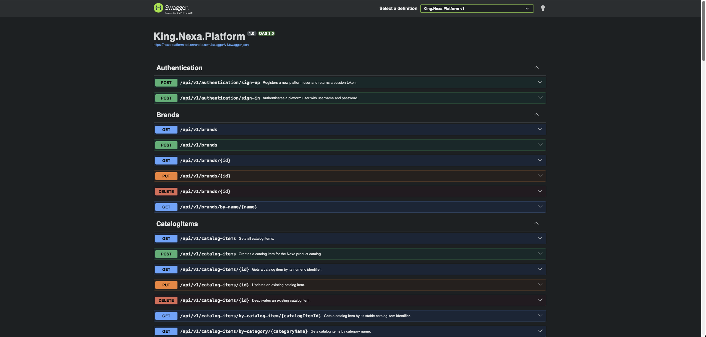

> *Nota:* La captura muestra la documentación Swagger/OpenAPI general de la Platform API correspondiente al corte TB2. Elaboración propia.

**Endpoints de autenticación en Swagger/OpenAPI.**

La imagen presenta los endpoints asociados a la autenticación e identidad del sistema. Esta evidencia respalda el cierre del módulo IAM en el Sprint 4, confirmando que las operaciones de sign-in y sign-up se encuentran completamente implementadas, asegurando el control de acceso inicial y la protección de datos en toda la Web Application y en los servicios backend en producción.

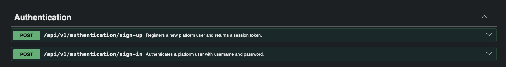

> *Nota:* La captura muestra los endpoints de autenticación documentados en Swagger/OpenAPI como parte del cierre definitivo del módulo IAM en el backend. Elaboración propia.

**Endpoints de Catalog Items en Swagger/OpenAPI.**

La imagen presenta los endpoints del recurso `Catalog Items`. Esta evidencia se vincula con el bounded context Catalog Management, encargado de exponer operaciones para consultar y gestionar productos refrigerados dentro de la Platform API.

> *Nota:* La captura muestra los endpoints de Catalog Items documentados en Swagger/OpenAPI para el bounded context Catalog Management. Elaboración propia.

**Endpoints de Inventory Items en Swagger/OpenAPI.**

La imagen muestra los endpoints definitivos del recurso Inventory Items. Esta evidencia se relaciona con el cierre del bounded context Warehouse, encargado de gestionar en producción la disponibilidad, inventario, reservas y liberaciones de stock para los flujos operativos finales del Sprint 4.

> *Nota:* La captura muestra los endpoints de Inventory Items documentados en Swagger/OpenAPI para el bounded context Warehouse. Elaboración propia.

**Endpoints de Orders en Swagger/OpenAPI.**

La imagen presenta los endpoints del recurso `Orders`. Esta evidencia se relaciona con el bounded context Sales, responsable de soportar solicitudes, confirmaciones, rechazos, cancelaciones y seguimiento de órdenes comerciales B2B.

> *Nota:* La captura muestra los endpoints de Orders documentados en Swagger/OpenAPI para el bounded context Sales. Elaboración propia.

#### 5.2.4.7. Software Deployment Evidence for Sprint Review

El Sprint 4 documenta la evidencia de despliegue definitivo y el release final para el hito TB2, incluyendo nexa-platform v1.0.0, nexa-website v3.0.0 y nexa-webapp v2.0.0 como la solución técnica e integrada lista para producción. Esta sección declara la operación productiva real y registra los artefactos estables que respaldan la sustentación y la auditoría académica final de todo el ecosistema frontend y backend.

El backend se sustenta con la captura real del release consolidado nexa-platform v2.0.0, que registra la versión oficial de los Web Services en producción. La Web Application se sustenta con el release final nexa-webapp v2.0.0, correspondiente a la experiencia frontend integrada al 100%. Por su parte, la Landing Page se sustenta con el release definitivo nexa-website v3.0.0, utilizado como la versión pública de cierre para el hito TB2. La guía README y release notes definitivas complementan el despliegue al detallar la arquitectura, la configuración de producción y el flujo de despliegue continuo implementado.

El despliegue controlado incluye la Web Application publicada en Render, la Platform API publicada en Render y la base PostgreSQL preparada para el backend. Como referencias de revisión se mantienen los entornos `https://nexa-webapp.onrender.com` para la WebApp y `https://nexa-platform-api.onrender.com` para la Platform API. La evidencia de Swagger/OpenAPI se considera parte del despliegue porque permite validar documentación de endpoints desde la API preparada para revisión.

Esta cobertura formaliza la entrega final, la ejecución en la nube y la conformidad absoluta del proyecto. Se declara con éxito la integración total de la Web Application con el backend, el reemplazo absoluto de los servicios simulados por endpoints reales, la autenticación e identidad productiva de extremo a extremo, y el cumplimiento completo del roadmap trazado para la solución de software.

**Vista general del dashboard de Render.**

La imagen muestra el dashboard general de Render usado para revisar los servicios desplegados durante el Sprint 4. Esta evidencia permite sustentar que el equipo configuró un entorno cloud para la revisión académica del corte TB2.

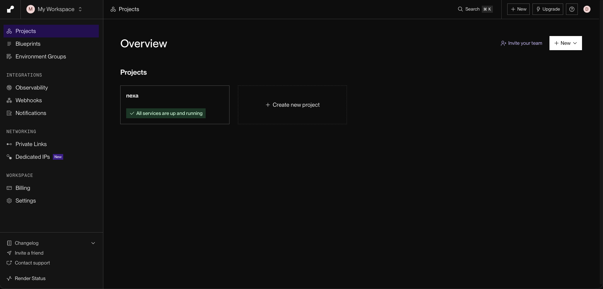

> *Nota:* La captura muestra la vista general del dashboard de Render utilizado para revisar los servicios desplegados de Nexa durante TB2. Elaboración propia.

**Servicios Nexa visibles en Render.**

La imagen presenta los servicios de Nexa registrados en Render. Esta evidencia permite identificar los componentes desplegados para WebApp, Platform API y base de datos, separando la ejecución controlada de la operación productiva final.

> *Nota:* La captura muestra los servicios Nexa visibles en Render para el despliegue académico del Sprint 4. Elaboración propia.

**Servicio Render de la Web Application.**

La imagen evidencia el servicio de Render asociado a la Web Application en su estado final. Esta captura permite verificar el despliegue exitoso y estable de nexa-webapp en producción como parte del cierre definitivo del hito TB2, confirmando su disponibilidad absoluta para la navegación e interacción en tiempo real de todos sus módulos.

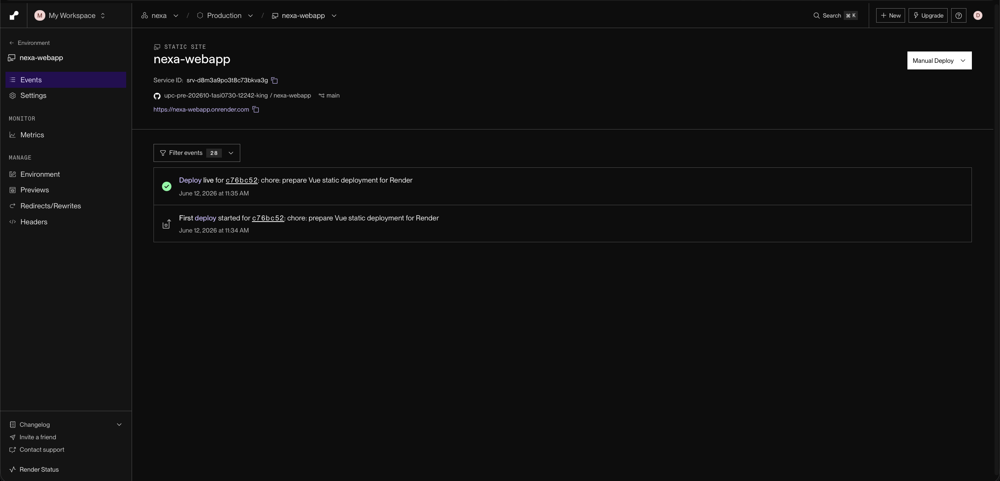

> *Nota:* La captura muestra el servicio Render de la Web Application desplegada de manera estable y definitiva para la revisión académica final del hito TB2. Elaboración propia.

**Configuración de entorno de la WebApp en Render.**

La imagen muestra la configuración de entorno asociada al servicio WebApp en Render. Esta evidencia sustenta la preparación de variables y parámetros de ejecución requeridos para mantener el despliegue controlado del frontend.

> *Nota:* La captura muestra la configuración de entorno del servicio WebApp en Render. Elaboración propia.

**Servicio Render de la Platform API.**

La imagen evidencia el servicio de Render asociado a la Platform API en su entorno de ejecución definitivo. Esta captura respalda que la versión final de los Web Services fue desplegada con éxito en la nube, garantizando la disponibilidad, escalabilidad y operación productiva del backend para la sustentación y revisión académica del hito TB2.

> *Nota:* La captura muestra el servicio Render de la Platform API desplegada para el corte TB2. Elaboración propia.

**Configuración de entorno de la Platform API en Render.**

La imagen muestra la configuración de entorno del servicio Platform API en Render. Esta evidencia se relaciona con la preparación de variables, conexión y parámetros necesarios para ejecutar la API backend.

> *Nota:* La captura muestra variables o configuración de entorno de la Platform API en Render. Elaboración propia.

**Servicio PostgreSQL en Render.**

La imagen presenta el servicio PostgreSQL configurado e inicializado en Render. Esta evidencia sustenta la base de datos relacional de producción para el Sprint 4, completamente conectada mediante EF Core y operando en tiempo real con el despliegue definitivo del backend.

> *Nota:* La captura muestra el servicio PostgreSQL en Render asociado al despliegue académico TB2. Elaboración propia.

**Landing Page desplegada en GitHub Pages.**

La imagen evidencia el despliegue definitivo de la Landing Page mediante GitHub Pages. Esta captura respalda la versión final y consolidada de nexa-website disponible para la sustentación del hito TB2, asegurando una transición fluida y una continuidad integral con la experiencia productiva de la Web Application.

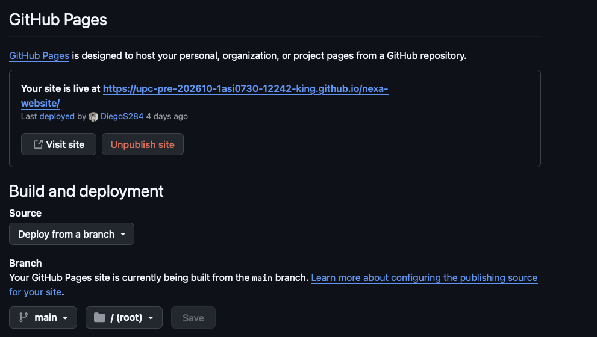

> *Nota:* La captura muestra el despliegue final de la Landing Page en GitHub Pages para el cierre definitivo del hito TB2. Elaboración propia.

**GitHub Release `nexa-webapp v2.0.0`.**

La imagen muestra el release de cierre definitivo de la Web Application en GitHub. Esta evidencia permite sustentar que el frontend cuenta con su versión final, formalmente etiquetada, estable y disponible en producción para la auditoría y entrega final del incremento de software del hito TB2.

> *Nota:* La captura muestra el release final nexa-webapp v2.0.0, utilizado como evidencia del cierre definitivo y entrega de la Web Application para el hito TB2. Elaboración propia.

**GitHub Release `nexa-website v3.0.0`.**

La imagen muestra el release de cierre definitivo de la Landing Page en GitHub. Esta evidencia sustenta que el sitio público cuenta con su versión final, formalmente etiquetada, estable y disponible en producción para la entrega e integración total del hito TB2.

> *Nota:* La captura muestra el release de cierre definitivo disponible para la entrega final de nexa-website v3.0.0 en el hito TB2. Elaboración propia.

**GitHub Release `nexa-platform v1.0.0`.**

La imagen muestra el release de cierre definitivo de la Platform API en GitHub. Esta evidencia permite sustentar que la versión consolidada y final de los Web Services cuenta con un empaquetado estable, formalmente etiquetado y desplegado para la producción y entrega final del hito TB2.

> *Nota:* La captura muestra el release de cierre definitivo disponible para la entrega final de nexa-platform v1.0.0 en el hito TB2. Elaboración propia.

#### 5.2.4.8. Team Collaboration Insights during Sprint

La colaboración del Sprint 4 se consolidó mediante la integración total de los bounded contexts, el despliegue productivo definitivo y la entrega unificada del ecosistema frontend/backend para el hito TB2. Esta distribución permitió acoplar de forma completa y robusta las operaciones de Catalog Management, Sales, Warehouse, IAM, Invoicing, Logistics y Shared Kernel, logrando la interoperabilidad absoluta entre la API en producción, la persistencia en la nube y las aplicaciones web.

El flujo de trabajo automatizado organizó la base de código backend a través de una estrategia de GitFlow madura, sincronizando las ramas main y develop con un pipeline de integración y despliegue continuo (CI/CD). Se consolidaron los commits de persistencia real en PostgreSQL, la documentación completa de la arquitectura y la seguridad de extremo a extremo, sellando el proceso con el tag definitivo v1.0.0 como el release oficial operativo en producción.

[En Catalog Management, el ownership principal de `R0obxdnt-bit` se concentró en `CatalogItem` y el recurso `/api/v1/catalog-items`, con el resultado esperado de habilitar un recurso inicial para el catálogo de productos refrigerados. En Sales, el liderazgo de `DiegoS284` se orientó al aggregate `Order`, el recurso `/api/v1/orders`, el bootstrapping de la API, la documentación backend y la higiene de release, con el resultado de sostener órdenes comerciales B2B y coordinación técnica transversal. En Warehouse, el ownership de `JoaquinVerde115` se vinculó con `InventoryItem` y `/api/v1/inventory-items`, produciendo un recurso inicial para disponibilidad e inventario.]

La foundation compartida e integrada unificó de manera definitiva el Shared Kernel, los repositorios genéricos, el patrón Unit of Work, la persistencia relacional con EF Core/PostgreSQL y la consola interactiva de Swagger/OpenAPI como la columna vertebral de la solución. El seguimiento estricto de GitFlow y el versionamiento permitieron unificar las ramas de trabajo y liberar con éxito los releases de producción nexa-platform v1.0.0, nexa-website v3.0.0 y nexa-webapp v2.0.0, declarando la conformidad absoluta del incremento de software.

**Tablero Sprint 4 en Jira.**

La imagen muestra el tablero de trabajo del Sprint 4 en Jira en su estado de cierre. Esta evidencia permite observar la culminación y distribución exitosa de todas las actividades planificadas por estado, facilitando el seguimiento del avance operativo final y validando el cumplimiento total de los compromisos del incremento de software para el hito TB2.

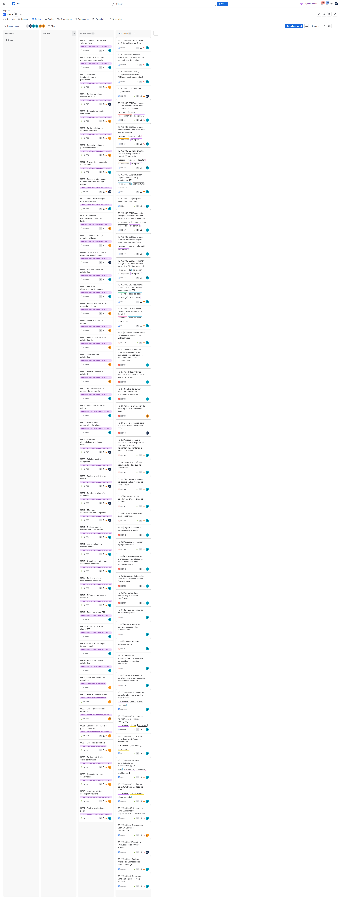

> *Nota:* El tablero de Jira muestra la distribución del trabajo del Sprint 4 por estados del flujo de trabajo, permitiendo observar el cierre operativo y cumplimiento total de las actividades del incremento para el hito TB2. Elaboración propia.

**Branches de `nexa-webapp` durante TB2.**

La imagen presenta las ramas visibles y consolidadas del repositorio nexa-webapp. Esta evidencia respalda la correcta gestión de versiones del frontend, el flujo de trabajo bajo GitFlow y la preparación del release final v2.0.0 para el cierre definitivo de la entrega.

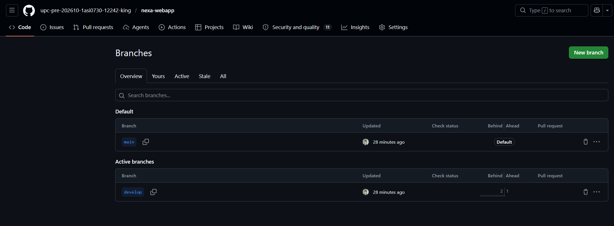

> *Nota:* La captura muestra las branches de `nexa-webapp` utilizadas durante el corte TB2. Elaboración propia.

**Commits recientes de `nexa-webapp` — parte 1.**

La imagen muestra una primera vista de los commits recientes del repositorio nexa-webapp. Esta evidencia permite relacionar los cambios del frontend, la maduración de los flujos de navegación y la estabilización de los componentes con la entrega final y el cierre definitivo del hito TB2.

> *Nota:* : La captura muestra commits recientes de nexa-webapp asociados al release v2.0.0 (parte 1), consolidando los cambios finales para el cierre definitivo del hito TB2. Elaboración propia.

**Commits recientes de `nexa-webapp` — parte 2.**

La imagen complementa la evidencia de los commits recientes de nexa-webapp. Permite observar la continuidad de los cambios realizados para estabilizar por completo la Web Application y asegurar su óptimo funcionamiento durante el cierre definitivo del hito TB2.

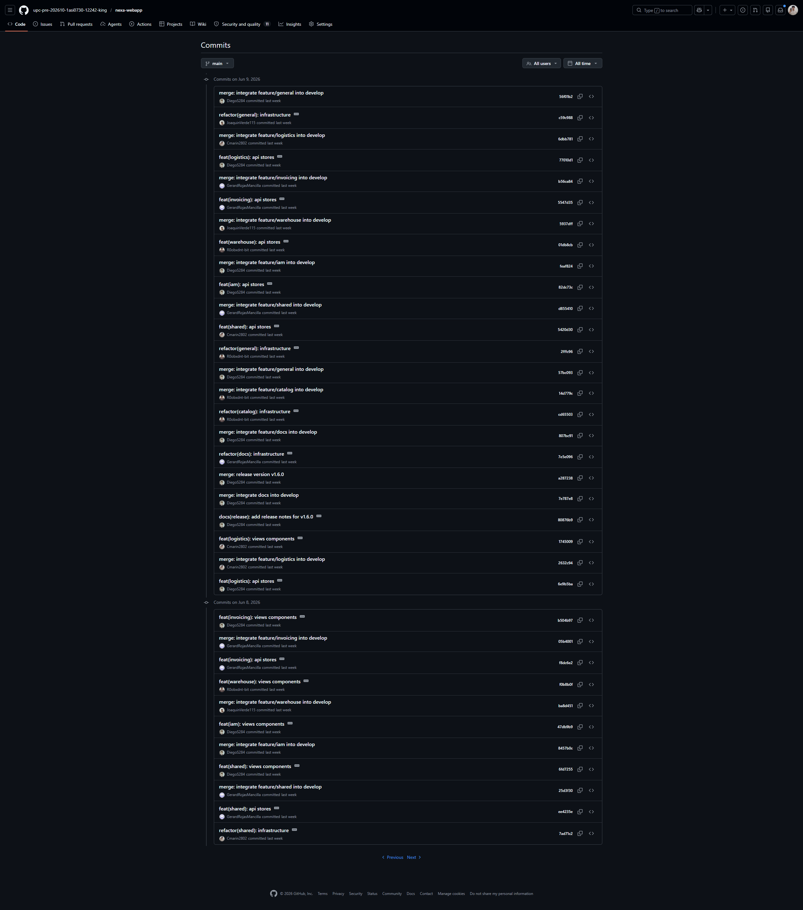

> *Nota:* La captura muestra commits recientes de nexa-webapp asociados al release v2.0.0 (parte 2), consolidando los cambios finales para el cierre definitivo del hito TB2. Elaboración propia.

El rastro de releases de la WebApp se interpreta de forma incremental: v1.7.1 queda como un patch previo de estabilización, v1.8.0 registra el cleanup y el layout polish, y v2.0.0 se consolida como el release oficial y definitivo de la WebApp para el hito TB2.

**Branches de `nexa-website` durante AV2.**

La imagen presenta las ramas visibles y consolidadas del repositorio nexa-website. Esta evidencia respalda la correcta gestión de versiones, el flujo de trabajo controlado y la evolución del Landing Page hacia su entrega definitiva para el hito TB2.

> *Nota:* La captura muestra las branches de `nexa-website` utilizadas durante el corte TB2. Elaboración propia.

**Commits recientes de `nexa-website`.**

La imagen muestra los commits recientes del repositorio nexa-website. Esta evidencia permite relacionar los ajustes finales de contenido, navegación, accesibilidad y experiencia pública con el cierre definitivo y despliegue de producción para el hito TB2.

> *Nota:* La captura muestra commits recientes de `nexa-website` asociados al corte TB2. Elaboración propia.

**Commits históricos de cierre TB2 de `nexa-website`.**

La imagen complementa la evidencia de colaboración en el repositorio nexa-website. Su propósito es mostrar la continuidad histórica y la trazabilidad del trabajo realizado sobre la Landing Page antes del cierre definitivo y despliegue para el hito TB2.

> *Nota:* La captura muestra commits históricos de cierre definitivo de nexa-website. Elaboración propia.

**Branches de `nexa-platform` durante TB2.**

La imagen presenta las ramas visibles y consolidadas del repositorio nexa-platform. Esta evidencia respalda la correcta separación de trabajo backend bajo la estrategia de GitFlow, incluyendo las ramas principales, de desarrollo y de integración utilizadas para consolidar la entrega final del hito TB2.

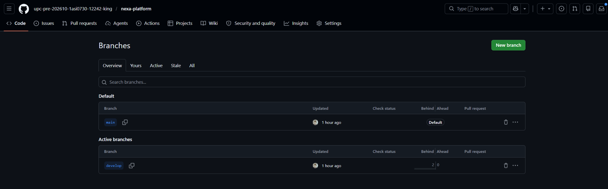

> *Nota:* La captura muestra las branches de nexa-platform utilizadas para la consolidación del backend durante el hito TB2. Elaboración propia.

**Commits recientes de `nexa-platform`.**

La imagen muestra los commits recientes del repositorio nexa-platform. Esta evidencia permite relacionar la implementación completa de Web Services, la persistencia en base de datos, la documentación integral de la arquitectura y la liberación del release backend con el cierre definitivo del hito TB2.

> *Nota:* La captura muestra commits recientes de nexa-platform asociados a la consolidación y cierre del hito TB2. Elaboración propia.

**Commits por bounded context de `nexa-platform`.**

La imagen evidencia commits organizados por bounded context o ramas de integración del backend. Esta captura se relaciona directamente con la matriz de Aspect Leaders and Collaborators, porque muestra la colaboración por Catalog Management, Sales, Warehouse, IAM, Invoicing, Logistics y Shared Kernel.

> *Nota:* La captura muestra commits por bounded context de nexa-platform, reforzando la trazabilidad de la colaboración modular y la integración total para el hito TB2. Elaboración propia.

La conclusión del Sprint 4 es que Nexa establece su entrega definitiva y cierre del hito TB2 a nivel de frontend, landing page y backend, consolidando servicios HTTP estructurados en C# y asegurando el funcionamiento completo de los flujos core de integración asociados a Catalog Management, Warehouse y Sales. El incremento final elimina la dependencia de servicios simulados en los flujos críticos, registra de forma estable la WebApp, el Landing Page y la Platform API en Render, y consolida la persistencia en PostgreSQL para el despliegue final controlado. .