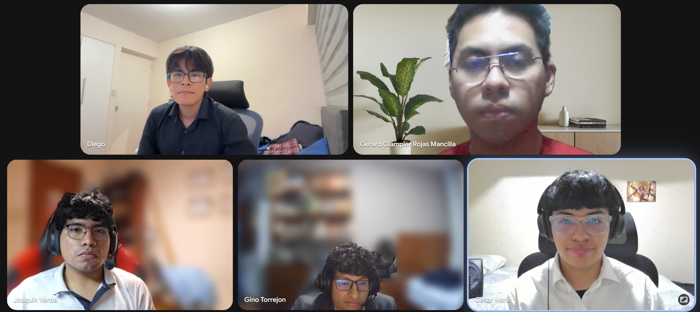

# Annex B: Video Evidence

## B.1. Registro de videos del proyecto

*Registro de videos según formato Anexo C*

| Sección | Características del video | Sobre el contenido | Integración y entrega                                                                                                                                                       |
|---|---|---|-----------------------------------------------------------------------------------------------------------------------------------------------------------------------------|
| Needfinding Interviews | Archivo audiovisual en formato `.mp4`, organizado como registro consolidado de entrevistas. Duración según grabación original de las sesiones. | Presenta entrevistas realizadas a los segmentos objetivo y conserva la evidencia usada para el análisis de requisitos del Capítulo 2. | **Video de entrevistas consolidadas (Stream):** https://cutt.ly/6t5gWEoG. También se referencia en la sección 2.2.                                                          |
| Prototype Navigation / Product Navigation | Video en formato `.mp4`, publicado en Microsoft Stream / SharePoint con duración `6:46`. | Muestra la continuidad de navegación del prototipo WebApp Sprint 3 entre S1, S2 y S3; también sirve como evidencia de navegación Sprint 3 / AV2. | **Video prototyping WebApp Sprint 3:** https://cutt.ly/st5gRScE.                                                                                                            |
| Sprint 1 | Archivo audiovisual en formato `.mp4`, correspondiente al Sprint 1. | Presentación sobre el resumen del desarrollo Sprint 1 por parte del equipo. | Video **Sprint 1 (Stream):** https://cutt.ly/Lt5gTqEg.                                                                                                                      |
| Exposición AV1 | Archivo audiovisual en formato `.mp4`, correspondiente a la exposición de AV1. | Video de exposición que presenta el desarrollo correspondiente a AV1. | **Video Exposición AV1 (Stream):** https://cutt.ly/6t5gTbId.                                                                                                                |
| Sprint 2 | Archivo audiovisual en formato `.mp4`, correspondiente al Sprint 2. | Presentación sobre el resumen del desarrollo Sprint 2 por parte del equipo. | Video **Sprint 2 (Stream):** https://cutt.ly/ct5gYdc7.                                                                                                                      |
| Exposición TB1 | Archivo audiovisual en formato `.mp4`, correspondiente a la exposición de TB1. | Video de exposición que presenta el desarrollo correspondiente a TB1. | **Video Exposición TB1 (Stream):** https://cutt.ly/Vt5gPjAA.                                                                                                                |
| Video de navegación Sprint 3 / AV2 | Archivo audiovisual en formato `.mp4`, publicado en Microsoft Stream / SharePoint con duración `6:46`. | Demuestra la navegación lograda durante Sprint 3 / AV2; inicia con S1, cambia a S2 en `1:44` y cambia a S3 en `3:49`. También sirve como evidencia de prototyping WebApp Sprint 3. | **Video de navegación Sprint 3 / AV2:** https://cutt.ly/jt5gDHYU. Captura: `report/assets/images/chapter-5/sprint-evidence/video/sprint-3-navigation-video-screenshot.png`. |
| Exposición AV2 | Archivo audiovisual en formato `.mp4`, correspondiente a la exposición de AV2. | Video de exposición que presenta el desarrollo correspondiente a AV2, incluyendo Sprint 3, Web Services, validación y evidencias audiovisuales. | **Video Exposición AV2 (Stream):** https://cutt.ly/Xt5gFaH6                                                                                                                 |
| Video About-the-Product AV2 — Microsoft Stream URL | Video en formato `.mp4`, publicado en Microsoft Stream / SharePoint, con duración `2:14` y fecha de publicación 18/06/2026. | Presenta el problema de búsqueda dispersa y gestión separada de información comercial; explica la propuesta de valor de Nexa, la Landing Page, la Web Application y los beneficios para compradores y proveedores dentro del alcance académico AV2. | **Microsoft Stream / SharePoint:** https://cutt.ly/6t5gFG03. Título: `upc-pre-202610-1asi0730-12242-King-about-the-product-sprint-3`.                                       |
| Video About-the-Product AV2 — YouTube URL | Video publicado en YouTube, con duración `2:14` y fecha de publicación 18/06/2026. | Proporciona una referencia pública complementaria del mismo contenido audiovisual presentado en Microsoft Stream / SharePoint. | **YouTube:** https://youtu.be/ypedAqjH19c?si=YKAWFK_y6Vo0jM5n                                                                                                               |
| Captura Video About-the-Product AV2 | Captura real del video publicado para el cierre AV2. | Respalda la publicación y documentación del Video About-the-Product en la sección 5.4. | `report/assets/images/chapter-5/video-about-the-product/nexa-about-the-product-av2-screenshot.png`                                                                          |
| Testimonios positivos incluidos en Video About-the-Product | Registro audiovisual de testimonios positivos de un usuario del segmento comprador y un usuario del segmento proveedor. | Comprador: “Me parece útil porque me ayudaría a encontrar opciones más rápido y comparar proveedores sin tener que buscar en muchos lugares diferentes”. Proveedor: “La plataforma puede ayudar a que más personas conozcan mi negocio y a organizar mejor la información que muestro a mis clientes”. Su inclusión no declara resultados concluyentes de Validation Interviews AV2. | <a href="../50-chapter-5-implementation-validation-deployment/5-4-video-about-the-product.md">5.4. Video About-the-Product</a>                                              |
| Video About-the-Team AV2 — Microsoft Stream URL | Video en formato `.mp4`, con testimonios de integrantes y resumen del proceso colaborativo. | Presenta a los integrantes de KING, sus roles, la organización general del trabajo, el logro de Student Outcome 5 y el proceso de colaboración. | **Microsoft Stream / SharePoint:** https://cutt.ly/5t5gH8kj. Título: `upc-pre-202610-1asi0730-12242-King-about-the-team-sprint3`. |
| Video About-the-Team AV2 — YouTube URL | Video publicado en YouTube, con duración aproximada `00:10:19`. | Proporciona una referencia pública complementaria del mismo contenido audiovisual presentado en Microsoft Stream / SharePoint y permite su futura integración en una sección adecuada de la Landing Page. | **YouTube:** https://youtu.be/bX1JmEOxp-k?si=VGuENMApII85dx47 |
| Captura Video About-the-Team AV2 | Captura o evidencia visual del video publicado. | Respalda la publicación del Video About-the-Team AV2 dentro de la evidencia audiovisual de AV2. |    |

> *Nota:* La tabla conserva los enlaces disponibles y las capturas incorporadas al reporte. No se agregan URLs, videos ni evidencias que no hayan sido publicados por el equipo.

## B.2. Captura de video disponible

| Evidencia | Referencia | Ruta |
|---|---|---|
| Captura Video de navegación Sprint 3 / AV2 | Captura real incorporada del video publicado; también respalda la evidencia de prototyping WebApp Sprint 3. | `report/assets/images/chapter-5/sprint-evidence/video/sprint-3-navigation-video-screenshot.png` |
| Captura Video About-the-Product AV2 | Captura real del video publicado para el cierre AV2. | `report/assets/images/chapter-5/video-about-the-product/nexa-about-the-product-av2-screenshot.png` |
| Captura Video About-the-Team AV2 | Captura real del video publicado para el cierre AV2. | `report/assets/images/front-matter/collaboration/nexa-about-the-team-av2-screenshot.png` |
